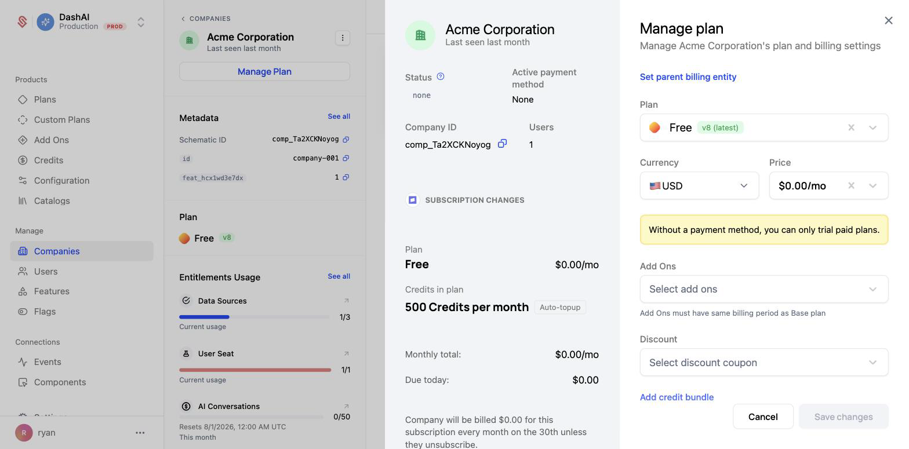
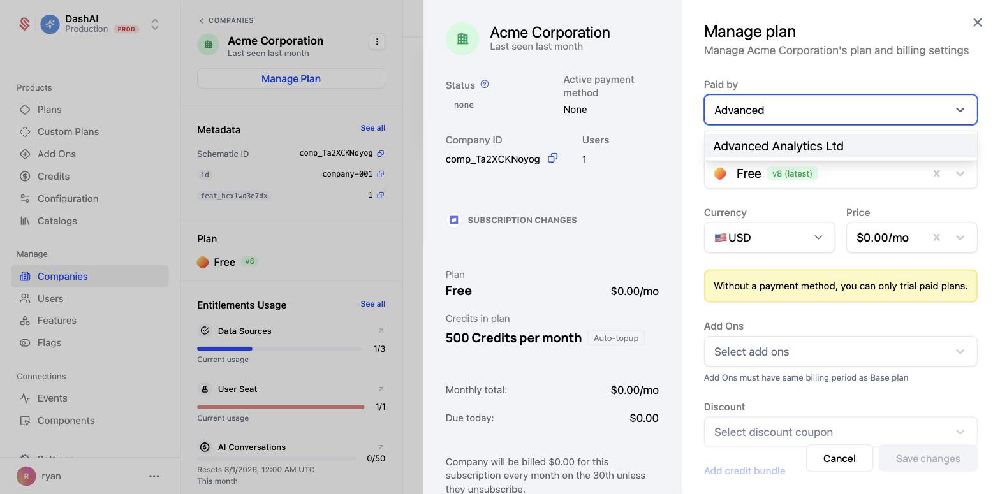
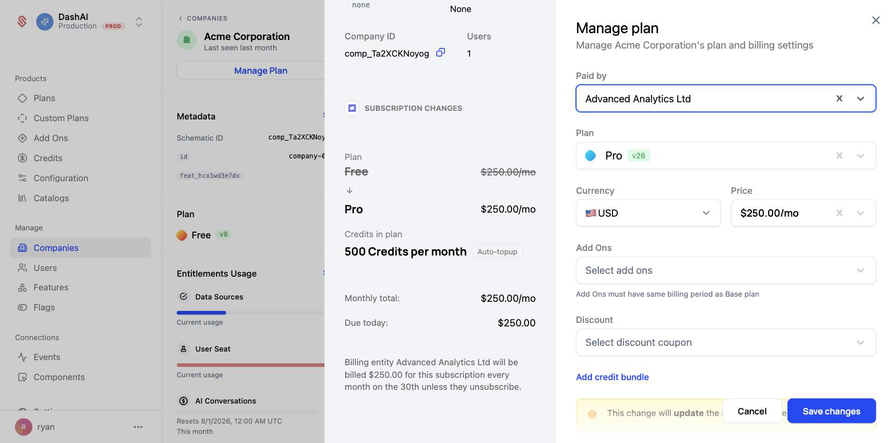
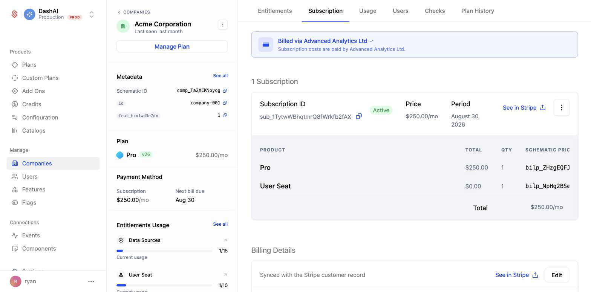
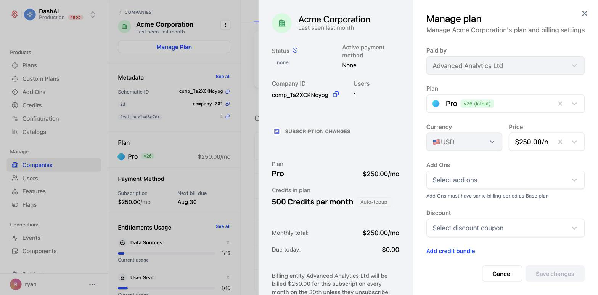
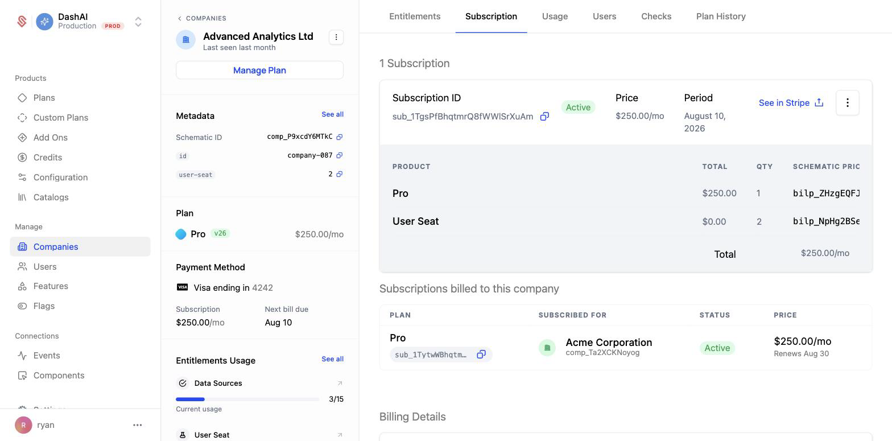
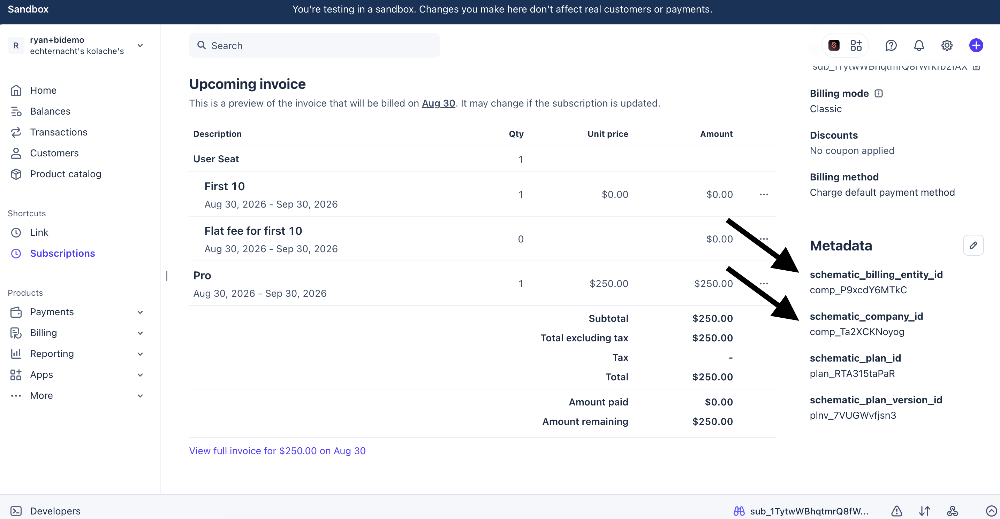

Billing entities let one company pay for another company's subscription. The company that receives the plan keeps its own Schematic record, its own entitlements, and its own usage data.

## When to use billing entities

Billing entities are most common in sales-led motions where the contract and the product footprint don't line up one-to-one:

- **Parent company rollups.** A holding company or corporate parent covers the tab for several divisions or subsidiaries, but each one needs its own Schematic account so plans, features, and usage stay separate.
- **Multiple products under one customer.** A company launches a second product that is distinct enough to warrant its own plans and features, so it gets its own company record, while the billing is handled by the original company.
- **Resellers and agencies.** An agency pays for the accounts it manages on behalf of its clients, and each client keeps an independent account.

In all of these cases the alternative is to collapse everyone into a single company record, which means giving up separate plans, separate entitlements, and separate usage reporting. Billing entities let you keep that separation while consolidating payment.

## How it works

When you assign a billing entity to a company:

- The subscription is created against the **billing entity's** Stripe customer, so the billing entity's payment method is charged.
- The plan, entitlements, feature access, and usage all continue to belong to the **subscribing company**. Feature checks, usage events, and entitlement limits are unaffected.
- The subscribing company does not need its own payment method. It never gets charged directly.

<Info>
Terminology: the company being billed on someone else's behalf is the **subscribing company** (also called the child). The company paying is the **billing entity** (also called the parent). Schematic's UI labels the billing entity as "Paid by" and as the "parent billing entity."
</Info>

### Requirements and limitations

<Warning>
A billing entity can only be set when a subscription is **started**. Once a subscription exists, the billing entity is locked and cannot be changed or removed on that subscription. To change who pays, cancel the existing subscription and start a new one.
</Warning>

- The billing entity must already have a Stripe customer record. In practice this means the company has been synced to Stripe, usually because it has a subscription or a payment method of its own.
- The billing entity needs a valid payment method, since it is the party that will be charged.
- The subscribing company must be moving onto a paid plan. Free plans don't create a subscription, so there is nothing to bill.

## Setting up a billing entity

In this example, Acme Corporation is moving onto the Pro plan, and Advanced Analytics Ltd will pay for it.

### 1. Open Manage Plan on the subscribing company

Navigate to the company that will receive the plan and click **Manage Plan**. This is the company whose entitlements and usage you want to keep separate, not the company paying the bill.



### 2. Click "Set parent billing entity"

The link at the top of the Manage plan panel reveals a **Paid by** field.

### 3. Choose the company that will pay

Search for and select the paying company. Only companies with an existing Stripe customer record appear in this list.



### 4. Select the plan and price

Choose the plan the subscribing company is moving onto, along with any add-ons, discounts, or credit bundles as you normally would.

The preview on the left confirms who is being charged. Instead of the usual "Company will be billed…" language, it names the billing entity directly:



### 5. Save changes

Click **Save changes**. Schematic creates the subscription against the billing entity's Stripe customer and applies the plan's entitlements to the subscribing company.

## Verifying the setup

### On the subscribing company

The subscribing company's **Subscription** tab shows a banner naming the payer, and the banner links directly to the billing entity's company page.



Reopening **Manage Plan** now shows the **Paid by** field greyed out, reflecting that the billing entity is locked for the life of the subscription.



### On the billing entity

The paying company's **Subscription** tab gains a **Subscriptions billed to this company** table listing every subscription it covers, which company each one is for, and what each one costs. The billing entity's own subscription, if it has one, is listed separately above.



## How billing entities appear in Stripe

The subscription lives on the **billing entity's** Stripe customer, so you will find it under the paying company in Stripe, not the subscribing company. Two pieces of metadata on the Stripe subscription tell you which company is which:

| Metadata field | Meaning |
|----------------|---------|
| `schematic_company_id` | The company the subscription is **for**. Always present on every Schematic subscription. |
| `schematic_billing_entity_id` | The company **paying** for the subscription. Present only when a billing entity is involved. |

In the example above, the subscription sits on Advanced Analytics Ltd's Stripe customer, and the metadata records both companies: `schematic_billing_entity_id` is Advanced Analytics Ltd (`comp_P9xcdY6MTkC`) and `schematic_company_id` is Acme Corporation (`comp_Ta2XCKNoyog`).



On an ordinary single-company subscription, `schematic_company_id` is present and `schematic_billing_entity_id` is absent. If you are writing reconciliation or reporting logic against Stripe, always resolve the subscribing company from `schematic_company_id`. Reading the Stripe customer on the subscription will give you the payer, which is not the same company in a billing entity setup.

## Working with billing entities via the API

### Setting a billing entity

Pass `billing_entity_id` to [`POST /manage-plan`](/developer_resources/manage-plan-api) when starting a subscription:

```json
{
  "company_id": "comp_Ta2XCKNoyog",
  "billing_entity_id": "comp_P9xcdY6MTkC",
  "base_plan_id": "plan_abc123",
  "base_plan_price_id": "bprice_def456"
}
```

`company_id` is the subscribing company and `billing_entity_id` is the company that pays. The field is only honored when starting a new subscription. Sending it against a company that already has an active subscription returns a `400` with the message `billing entity can only be set when starting a new subscription`.

### Reading a company's billing entity

`GET /company-billing-entity?company_id={company_id}` returns the billing entity for a company, along with `has_own_stripe_customer`, which tells you whether the company is set up to pay for itself.

### Listing what a billing entity pays for

`GET /company-billing-entity-subscriptions?company_id={company_id}` returns every subscription a company pays for on behalf of others. This is the data behind the **Subscriptions billed to this company** table in the app.

## Frequently asked questions

**Does the subscribing company still get its own entitlements?**
Yes. The plan is applied to the subscribing company, so feature checks, limits, and usage tracking all run against that company exactly as they would for a self-paying customer.

**Does the subscribing company need a payment method?**
No. Once a billing entity is set, the subscription is charged to the billing entity's payment method. The "Without a payment method, you can only trial paid plans" warning in the Manage plan panel disappears once a billing entity is selected.

**Can a billing entity pay for more than one company?**
Yes. A billing entity can cover any number of subscriptions, and all of them appear in the **Subscriptions billed to this company** table.

**Can I change who pays after the fact?**
Not on an existing subscription. Cancel the subscription and start a new one with the billing entity you want.

**Can a company be both a billing entity and have its own subscription?**
Yes. In the example above, Advanced Analytics Ltd is on the Pro plan itself and also pays for Acme Corporation's Pro subscription. The two are billed as separate Stripe subscriptions on the same Stripe customer.
