Recently, credit burndown models have become a popular form of Usage-based Billing. In credit burndown models, customers receive a credit balance that decreases as they consume product features. Customers can purchase additional credits at any time to exceed their plan's default usage limits - this flexibility is the model's primary design intent.

Credit burndown models are widely adopted across the software industry, from AI platforms like ChatGPT to developer tools such as Supabase and PostHog, as well as sales enrichment services like Apollo.io and Clearbit.

Credit burndown models typically follow a similar structure:

- Customers subscribe to a paid plan that includes an initial credit allocation per billing cycle (usually monthly).
  - *NOTE: Free tier plans can also use credit burndown, though they typically provide minimal or zero default credits.*
- Key features draw against the credit balance as they are used. Products usually offer multiple features with varying credit costs.
- If credits are depleted, customers can purchase additional credits immediately to maintain service. Many products include automatic top-up options to prevent usage interruptions.

Key advantages of credit burndown models include:

- Revenue scales directly with customer usage, similar to other usage-based billing approaches.
- Customers prepay for credits, eliminating billing surprises and unexpected charges.
- Multiple different features can be unified into a single pricing metric, simplifying pricing for customers. 
- Credit costs can vary, allowing for experiementation and bulk discounts (e.g. 100 credits for \$10, 1,000 credits for \$90, 10,000 credits for \$800, etc.)
- Likewise, individual feature costs can be adjusted independently without affecting credit pricing or other features, enabling cost management as operational expenses change.

## Video Tutorial

This video tutorial demonstrates how to set up a credit burndown billing model in Schematic, walking through the key steps of setting up credit types, plans, and credit based features.

<iframe width="560" height="315" src="https://www.youtube.com/embed/HMt57ROPSlw?si=v8w5WHWZcaOF-mFc" title="YouTube video player" frameborder="0" allow="accelerometer; autoplay; clipboard-write; encrypted-media; gyroscope; picture-in-picture; web-share" referrerpolicy="strict-origin-when-cross-origin" allowfullscreen></iframe>

## Implementing Credit Burndown in Schematic

In this guide, we'll show you how to implement a credit burndown billing model in Schematic. We'll start with a scenario where you have an existing Usage-Based plan that includes two features - "AI Assists" and "AI Experiments". Our goal is to create a new plan that offers these same features but uses credits as the billing mechanism instead of direct usage tracking.

By the end of this guide, you'll have a fully functional credit-based plan where customers can use their credits to access both features, and purchase additional credits when needed.

The steps we'll be taking are:

1. Create a Credit Type that can be applied to plans.
2. Create a new plan that will use our Credit Burndown model.
3. Add the Credit Type to this plan.
4. Add features to this plan and configure how they use credits.
5. Configure Credit Bundles that our customers can purchase to top up their balance.
6. Add this plan and our credit bundles to our Catalog so Customers can use it. 

### 1. Create a Credit Type

First, we'll create a Credit Type that can be applied to plans. While Schematic allows you to create multiple credit types and apply them to different plans, most companies use a single credit type across all their credit based plans for simplicity.

Mouse over `Catalog` and select `Credits` to open the Credit Type Page. 

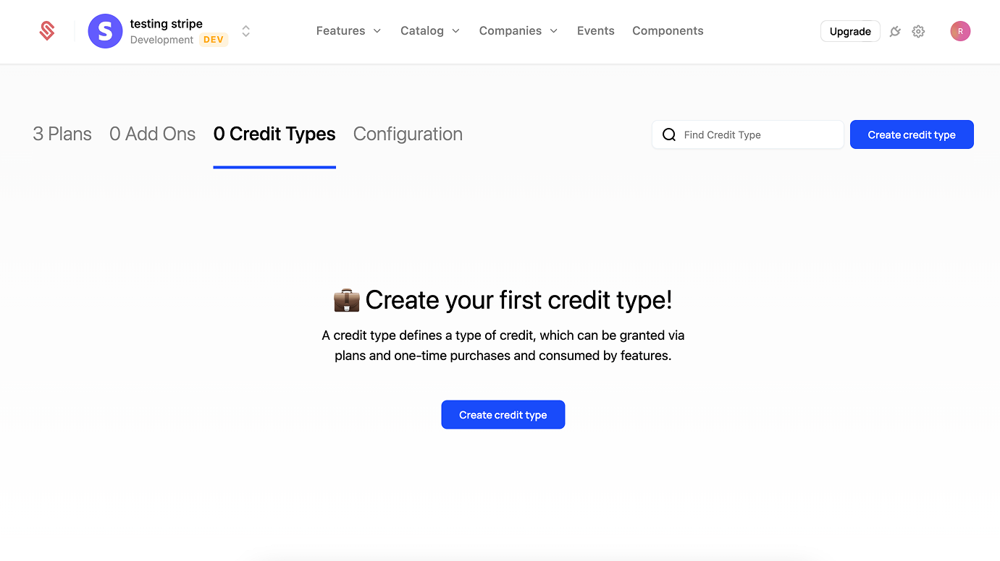

Click the **Create Credit Type** button to begin:

1. Provide a name for your credit type, we'll use "AI Tokens" for this example. If you have multiple credit types, we recommend usage-based names (e.g. "Data Credits", "API Tokens") or a tier-based names (e.g. "Premium Credits").
2. The description field (optional) is shown to users in the customer portal and checkout flow. 
3. Provide a singular and plural name for your credits. We're using "Ai Token" and "AI Tokens" for this example.
4. Cost Basis is to help you track the cost of credits throughout your product and finance workflows. This field doesn't directly control the costs of credits, but represents a guideline for future usage. We'll use \$0.01 for this example, but you can use fractional cents (e.g. \$0.00025) if you want
5. Click "Create Credit Type" to save your changes.

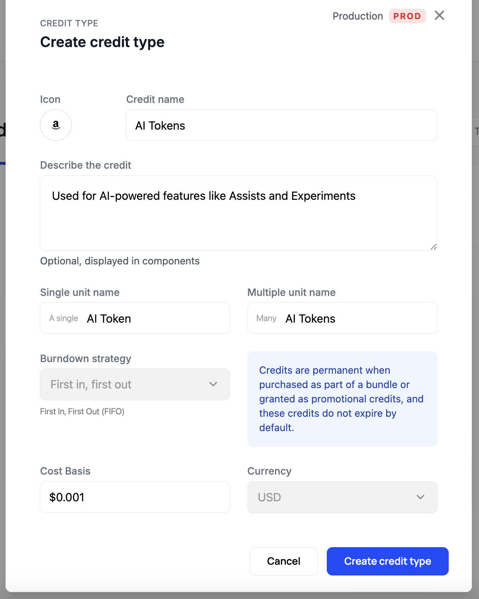

### 2. Create a new plan that will use our Credit Burndown model.

Now that we have a credit type, we'll create a new plan that will use it. Within Schematic, any plan can incorporate credit burndown, whether it's a new plan or an existing one. For this example, we'll create a dedicated credit-based plan to keep things simple and clear. This approach makes it easier to understand how credits work.

1. Navigate to the **Plans** tab and click the **Create Plan** button.
2. Provide a name for this plan. We'll use "Credit Based" for this example. Then click "Continue".
3. Next, step the plan to a "Paid" plan and provide a monthly ($5) and yearly ($50) price. 
4. Click "Save" to create the plan. 

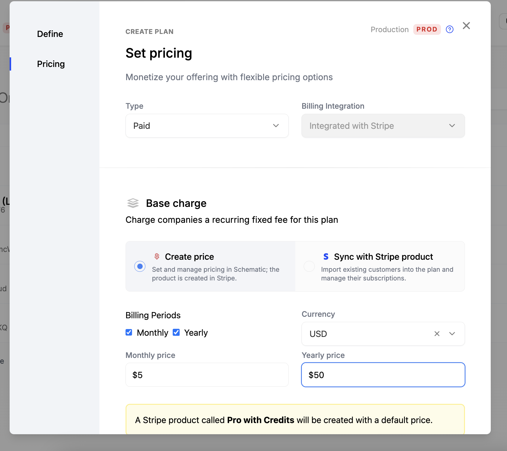

### 3. Add the Credit Type to this plan.

Now that we have a plan, we'll add the Credit Type to it. 

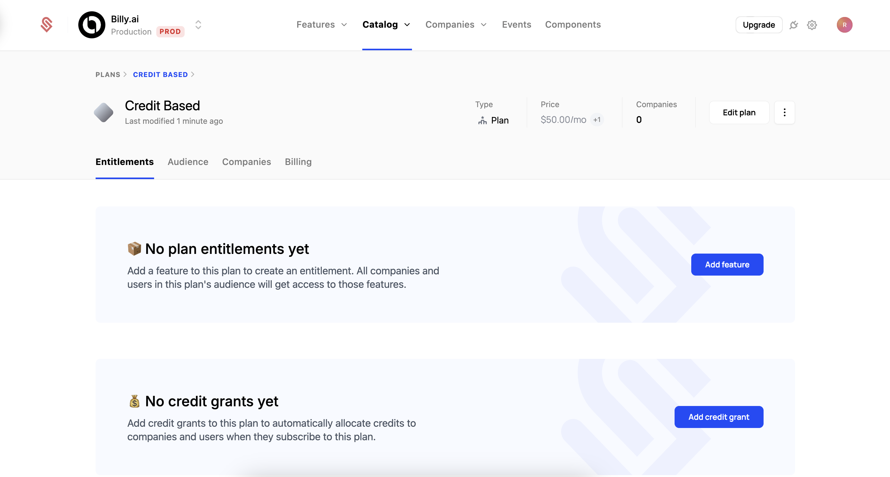

1. Click "Add credit grant" to begin the process.
2. Select the Credit Type we created earlier, "AI Tokens".
3. Set the number of credits the plan provides each period. Each new billing period, customers will receive this number or credits, and any unused credits from the prior period will expire. We'll use 5,000 for this example.
4. Click "Create plan grant" to save your changes.

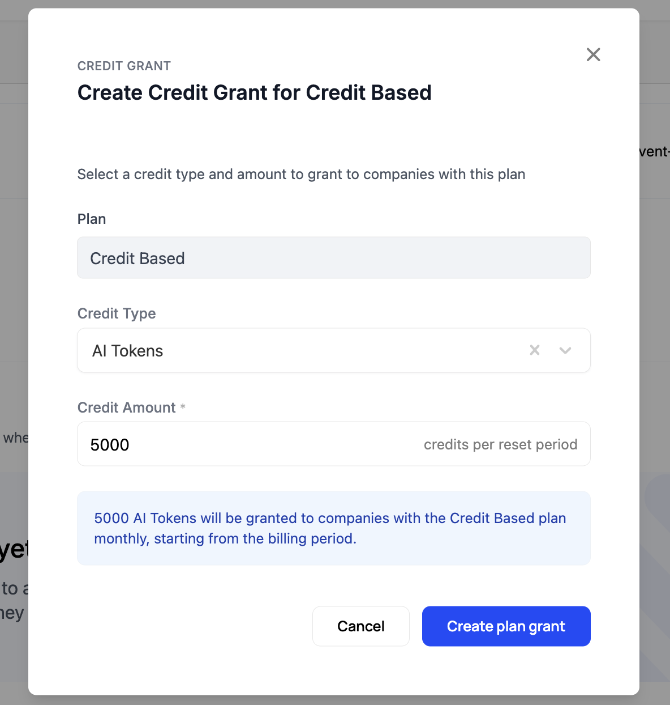

### 4. Add features to this plan and configure how they use credits.

Now that we have a plan with a credit grant, we'll add the credit-based features that will use these credits.

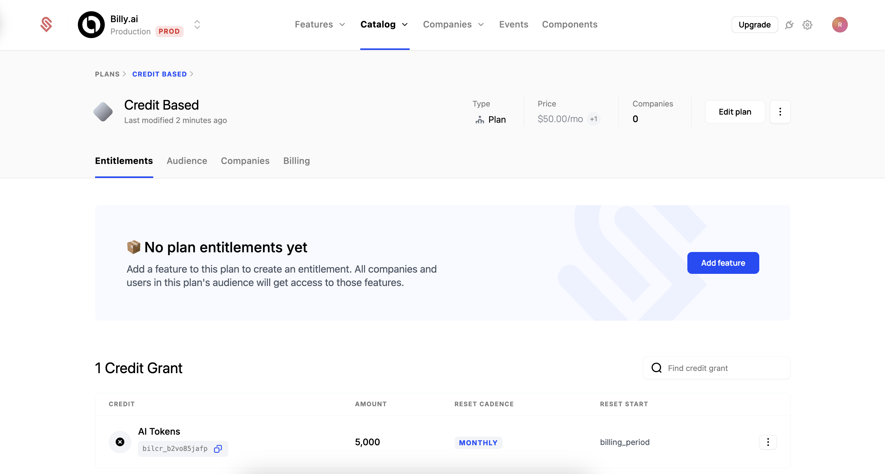

1. Click the "Add feature" button to begin the process.
2. Select the "AI Assists" feature and click "Continue".
3. Set the type to "Credit burndown".

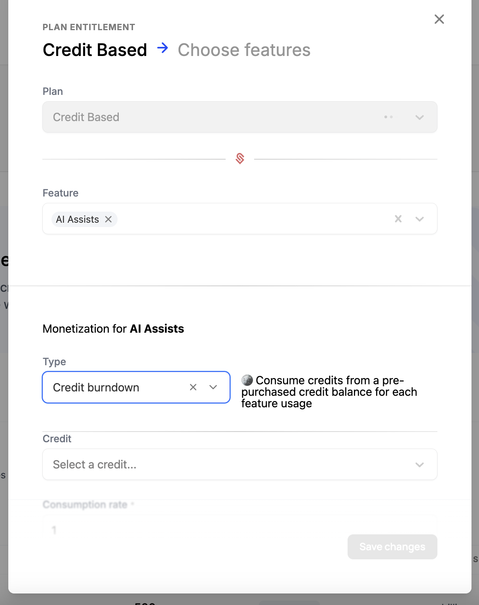

4. Select the credit type we created earlier, "AI Tokens".
5. The consumption rate is how many credits each action will consume from the credit pool. We'll use 5 for this example.
6. Click "Save Changes" to add this feature to the plan.

7. Repeat this process for the "AI Experiments" feature, setting the consumption rate to 10.

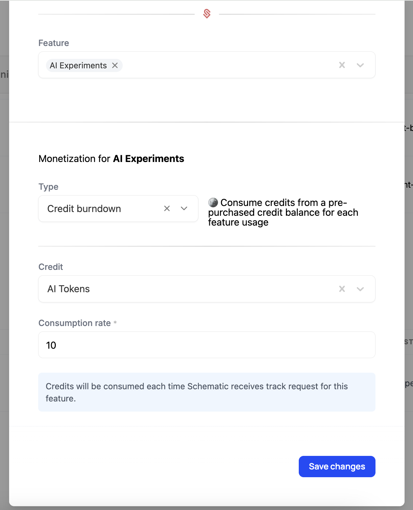

When you're finished, your plan should look like this:

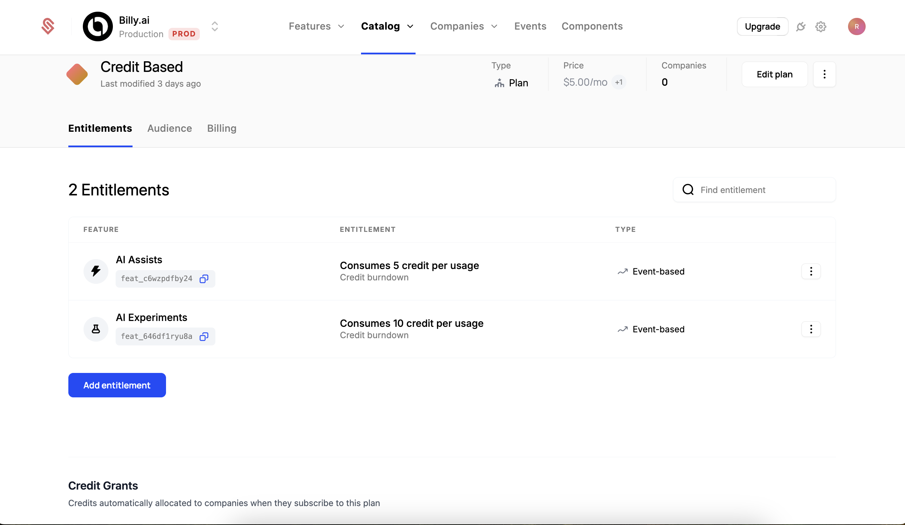

### 5. Configure Credit Bundles that our customers can purchase to top up their balance.

Finally, let's add credit bundles that customers can purchase to top up their balance. These bundles allow customers to purchase additional credits to continue using credit-based features once their plan's default balance is exhausted. These purchased credits never expire and roll over month to month.

When customers consume credits, they draw from the credit grant with the nearest expiration date. This means they'll typically use their monthly plan credits first before drawing from purchased credits, since monthly credits expire at the end of each billing period.

1. Navigate to the Credit Type page (Catalog > Credits > "AI Tokens").
2. Give your bundle a name. We'll use "Small Bundle" for this example.
3. Select the number of credits you want to include in the bundle. We'll use 5,000 for this example, which is the number of credits our plan provides by default.
4. Next, we set a cost for this bundle. We recommend this cost is inline with the cost basis of the credit type, but a discount can be applied for larger purchases. We'll use $5 for this example.
5. Click "Create Bundle" to save your changes.

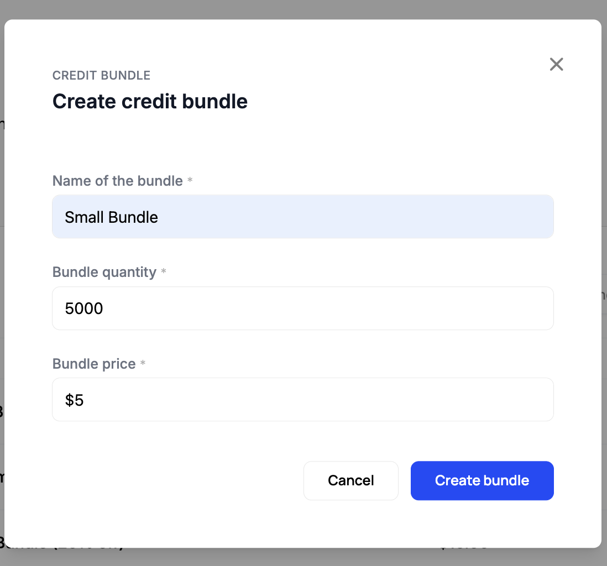

6. Repeat this process but add a "Medium Bundle (10% off)" with 10,000 credits and a cost of $9.
7. Repeat this process one more time for a "Large Bundle (20% off)" with 20,000 credits and a cost of $16.

When you're finished, your credit bundles should look like this:

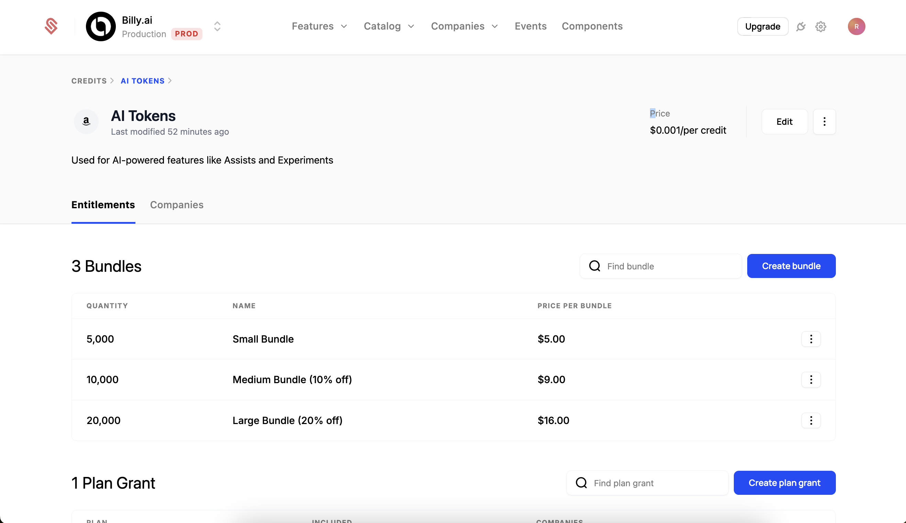

<Info>The cost you set for these bundles will be the basis for Recognizing the Revenue from these credits.</Info>

### 6. Add this plan and our credit bundles to our Catalog so Customers can use it. 

Now that we've finished setting up our plan and credit bundles, we'll add them to our Catalog so Customers can use them.

1. Navigate to the **Catalog** tab, and select "Configuration".
2. Click the "+" button on the far right side of the "Live Plans" section.
3. Add the plan you just created to the list.
4. Click "Save" to add the plan to the Catalog.

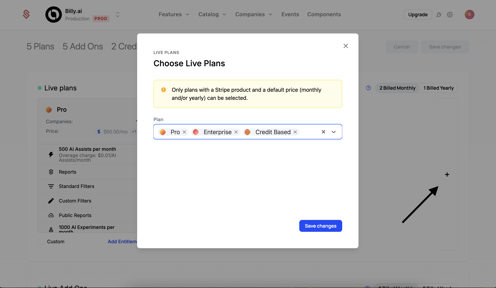

5. Scroll down to the "Credit Bundles" section and click the "+" button to add the credit bundles you just created.

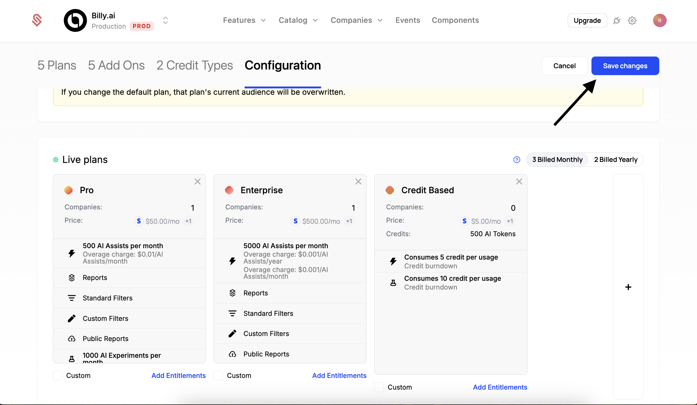

5. **IMPORTANT**: You'll need to save your changes, by clicking the "Save Changes" button in the top right of the screen.

When you're finished, you can see the credit bundles in your checkout flow: 

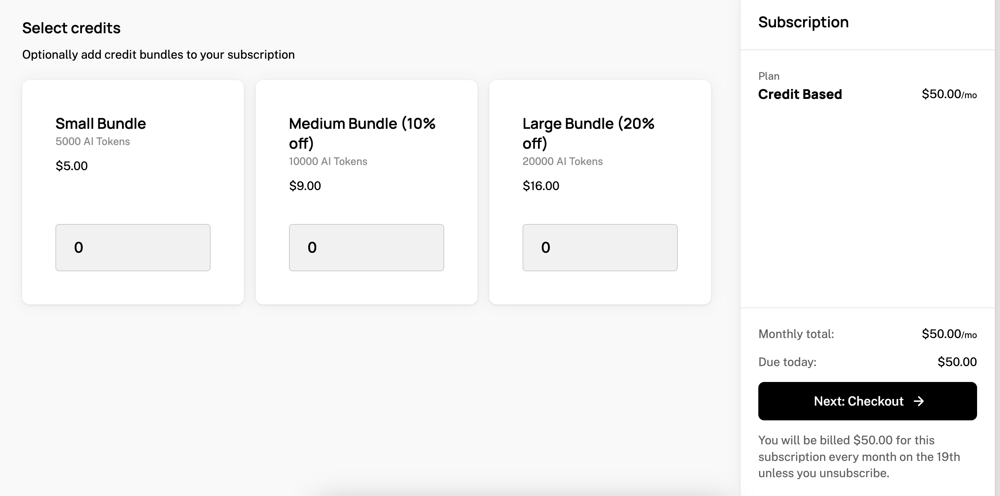

### Conclusion

Congratulations! You've now implemented a credit burndown model in Schematic. Credit burndown enables you to:

- Offer flexible usage-based billing with prepaid credits
- Let customers purchase additional credit bundles as needed
- Provide volume discounts through credit bundle pricing
- Track and manage credit usage across your product features

You can use this model with both new and existing plans to give your customers more control over their usage while maintaining predictable revenue for your business.
