In a credit burndown model, customers hold a prepaid credit balance that decreases as they use your product. When the balance runs low they buy more, which is the point of the model: usage is not capped, it is metered against something the customer has already paid for.

The pattern shows up across AI platforms, developer tools like Supabase and PostHog, and enrichment services like Apollo.io and Clearbit. Most implementations share a shape:

- A paid plan includes a credit allocation each billing cycle, usually monthly. Free plans can use credits too, typically with a small or zero allocation.
- Features draw against the balance as they are used, and different features can cost different numbers of credits.
- When credits run out, customers buy more immediately. Many products add automatic top-ups so service is never interrupted.

What this buys you:

- Revenue scales with usage, the same as other usage-based models.
- Customers prepay, so there are no surprise invoices.
- Several features share one pricing metric instead of each being metered separately.
- Credit pricing supports volume discounts, such as 100 credits for \$10 and 10,000 for \$800.
- Individual feature costs can change without touching credit pricing or any other feature, so you can adjust as your own costs move.

## Video Tutorial

This video walks through setting up a credit burndown model in Schematic, covering credit types, plans, and credit based features.

<iframe width="560" height="315" src="https://www.youtube.com/embed/HMt57ROPSlw?si=v8w5WHWZcaOF-mFc" title="YouTube video player" frameborder="0" allow="accelerometer; autoplay; clipboard-write; encrypted-media; gyroscope; picture-in-picture; web-share" referrerpolicy="strict-origin-when-cross-origin" allowfullscreen></iframe>

## Implementing Credit Burndown in Schematic

This guide starts from a scenario where you already have a usage-based plan with two features, "AI Assists" and "AI Experiments", and builds a new plan that bills the same features through credits instead of direct usage tracking.

By the end you'll have a credit-based plan where customers spend credits on both features and can buy more when they run out.

1. Create a Credit Type that can be applied to plans.
2. Create a new plan that will use the credit burndown model.
3. Add the Credit Type to that plan.
4. Add features and configure how they consume credits.
5. Configure Credit Bundles customers can buy to top up.
6. Add the plan and bundles to the Catalog.

### 1. Create a Credit Type

Schematic supports multiple credit types, but most companies use a single type across all their credit based plans. Start there unless you have a reason not to.

Mouse over `Catalog` and select `Credits` to open the Credit Type page.

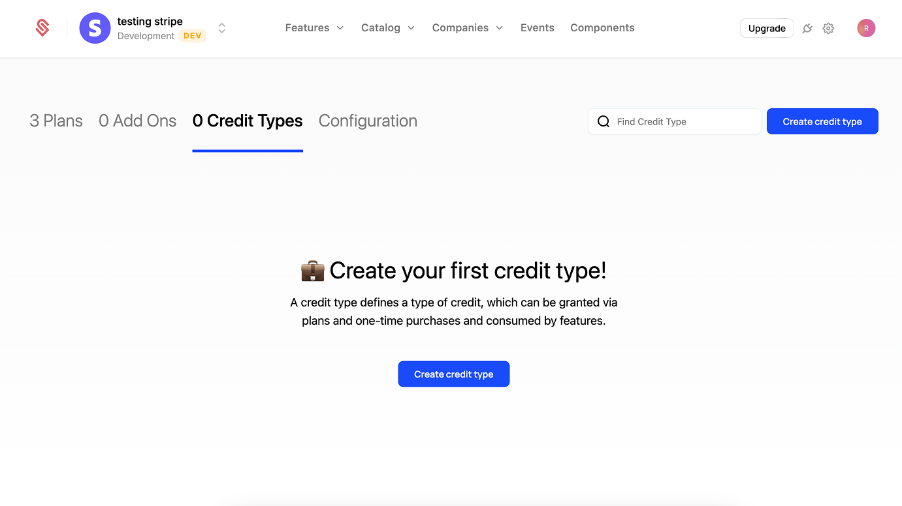

Click "Create Credit Type":

1. Name the credit type. We'll use "AI Tokens". With multiple types, usage-based names like "Data Credits" or "API Tokens" work better than tier-based ones.
2. The description is optional and appears to customers in the portal and checkout flow.
3. Give singular and plural names for the unit. We're using "AI Token" and "AI Tokens".
4. Cost basis tracks what a credit costs you, for your own finance workflows. It does not control what customers pay. We'll use \$0.01, though fractional cents like \$0.00025 are fine.
5. Click "Create Credit Type".

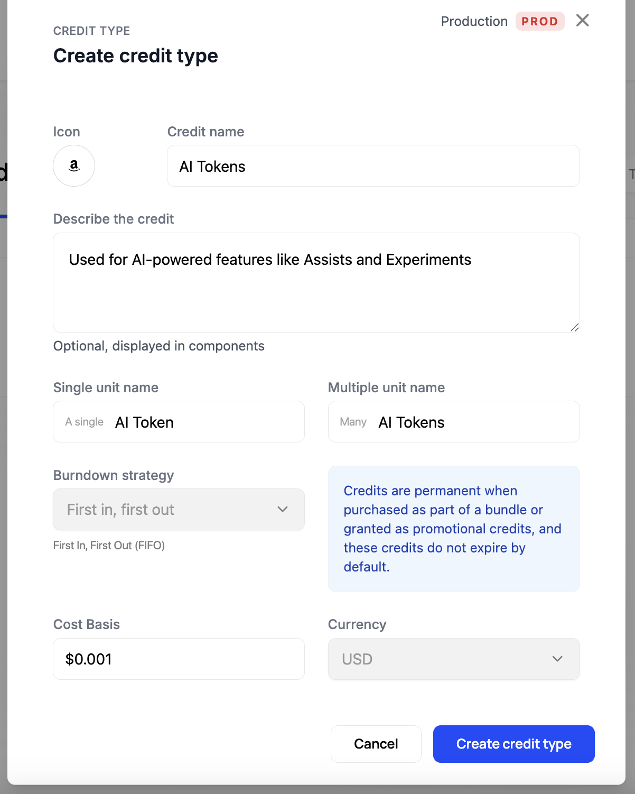

### 2. Create a new plan

Any plan can use credit burndown, new or existing. We'll create a dedicated one to keep the example clear.

1. Go to the "Plans" tab and click "Create Plan".
2. Name it. We'll use "Credit Based". Click "Continue".
3. Set it to "Paid" with a monthly price of \$5 and a yearly price of \$50.
4. Click "Save".

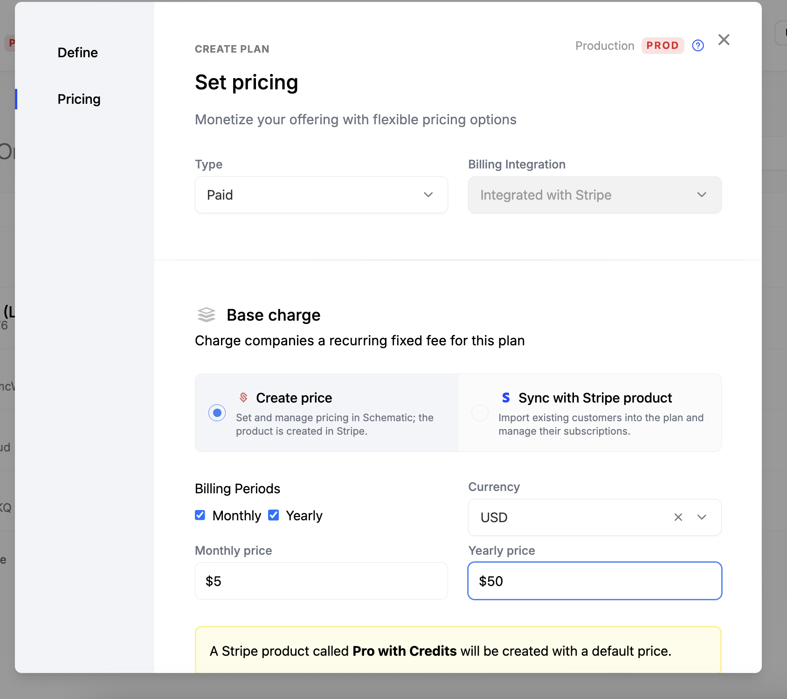

### 3. Add the Credit Type to the plan

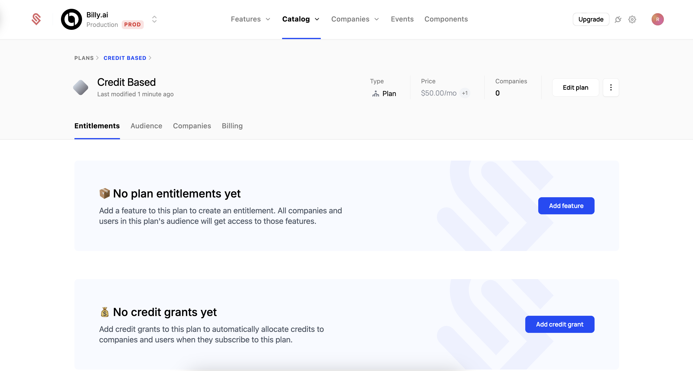

1. Click "Add credit grant".
2. Select "AI Tokens".
3. Set how many credits the plan provides each period. We'll use 5,000. Leave **Reset** on Monthly and **Rollover** at 0, which means unused credits are discarded when the grant resets. [Credit lifecycle](#credit-lifecycle) covers the alternatives.
4. Click "Create plan grant".

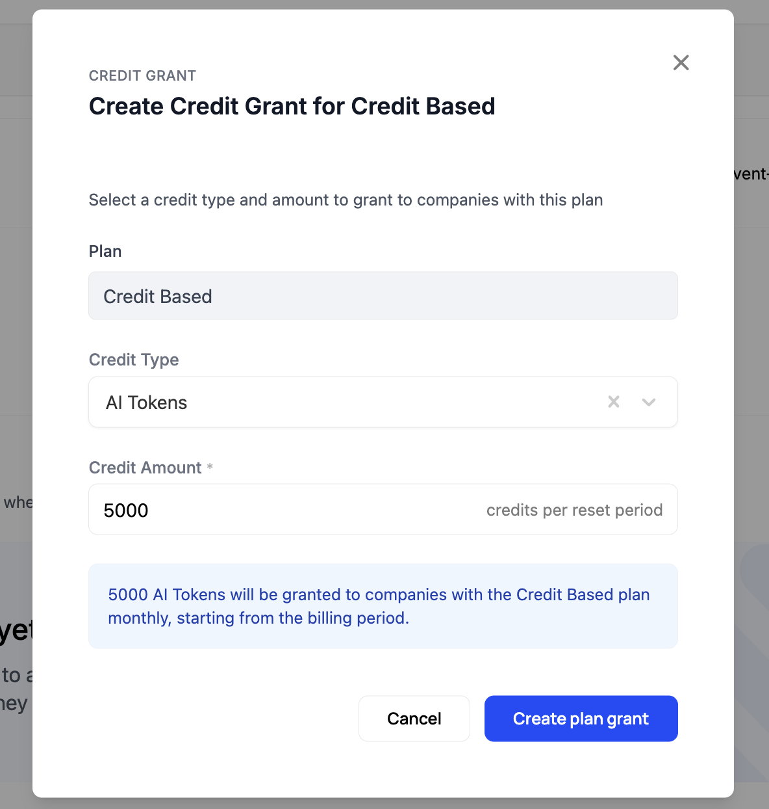

### 4. Add features and set their consumption rates

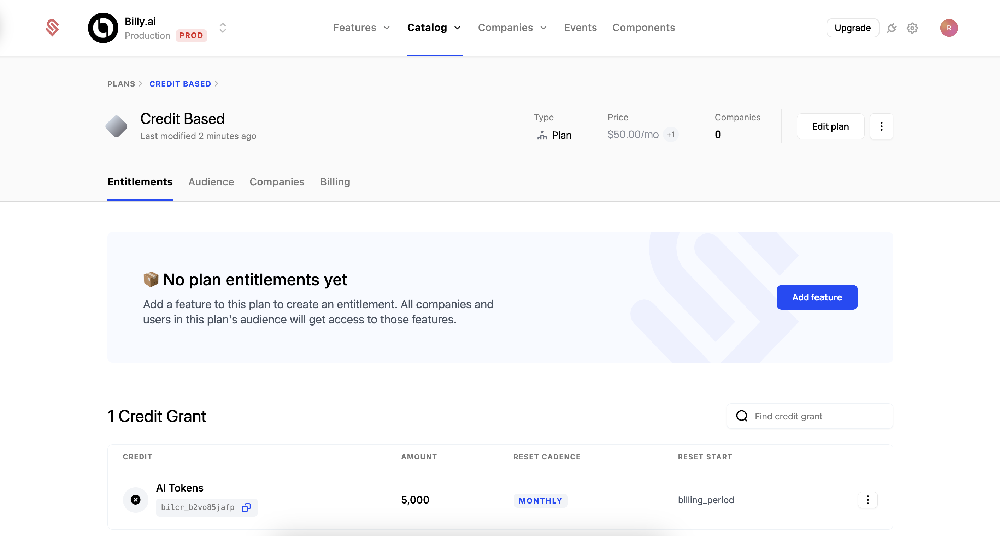

1. Click "Add feature".
2. Select "AI Assists" and click "Continue".
3. Set the type to "Credit burndown".

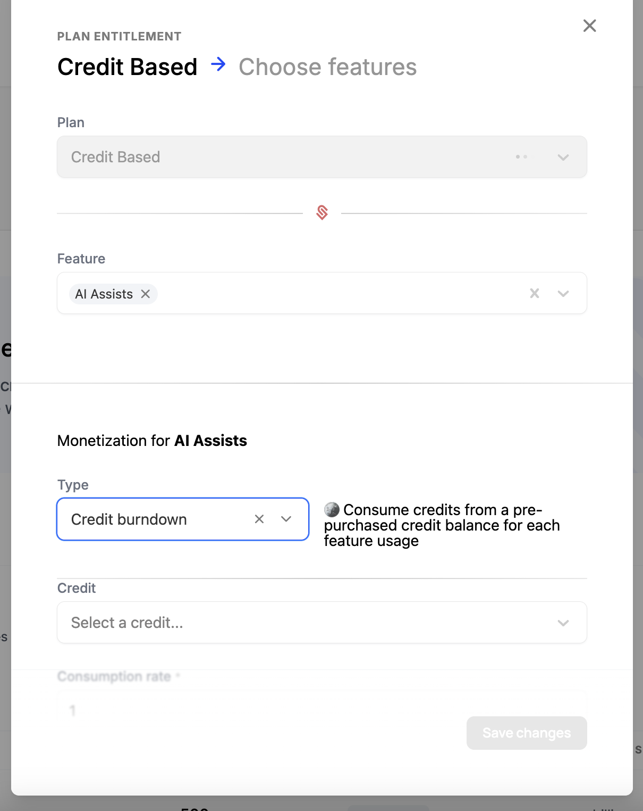

4. Select "AI Tokens".
5. Set the consumption rate, which is how many credits one use of the feature costs. We'll use 5.
6. Click "Save Changes".

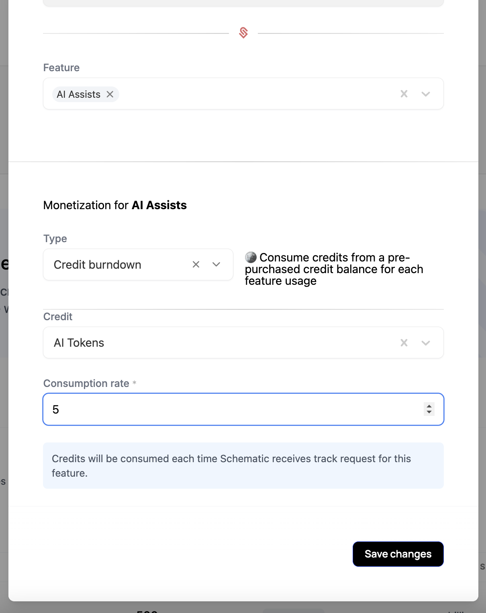

7. Repeat for "AI Experiments" with a consumption rate of 10.

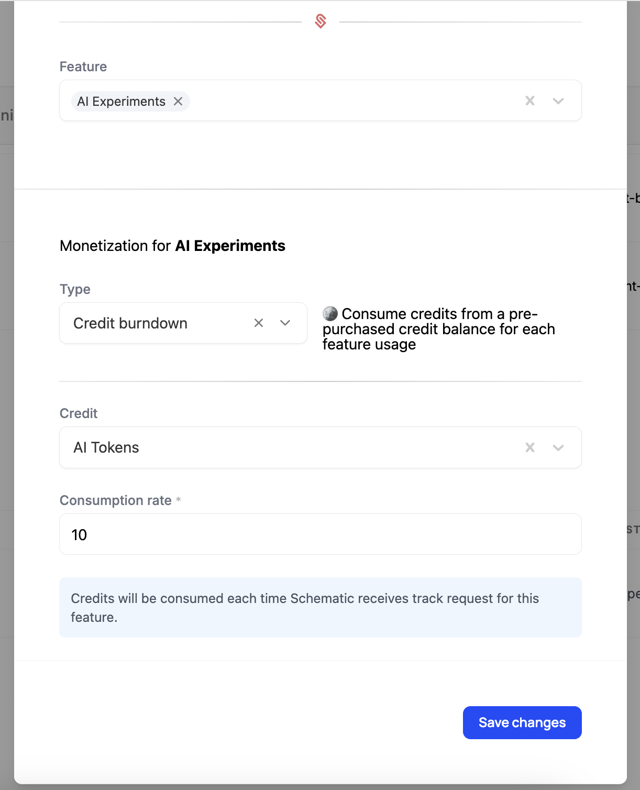

The finished plan:

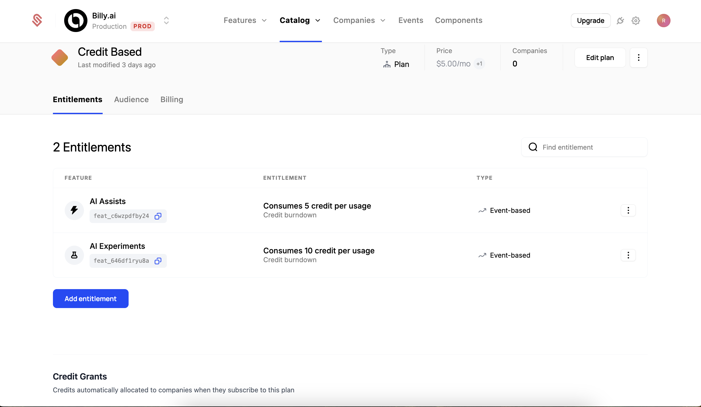

### 5. Configure Credit Bundles

Bundles are what customers buy when their plan allowance runs out. We'll set these to never expire so customers can keep using credit-based features after the plan balance is gone, though bundles can carry an expiry window instead.

Plan grants are spent before purchased bundles, so a bundle is only drawn from once the period's plan credits are exhausted. See [Consumption order](#consumption-order) for the full picture.

1. Go to the Credit Type page (Catalog > Credits > "AI Tokens").
2. Name the bundle. We'll use "Small Bundle".
3. Set the credit quantity. We'll use 5,000, matching what the plan provides.
4. Set a price, ideally in line with the credit type's cost basis. We'll use \$5.
5. Click "Create Bundle".

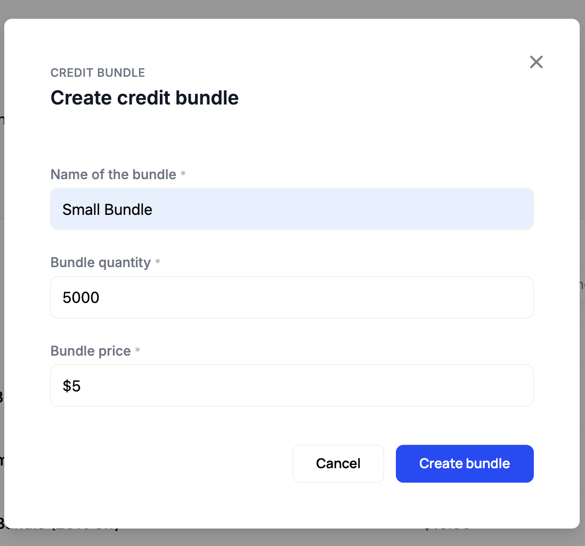

6. Repeat for a "Medium Bundle (10% off)" with 10,000 credits at \$9. Volume discounts on larger bundles encourage customers to buy more at once.
7. Repeat once more for a "Large Bundle (20% off)" with 20,000 credits at \$16.

The finished bundles:

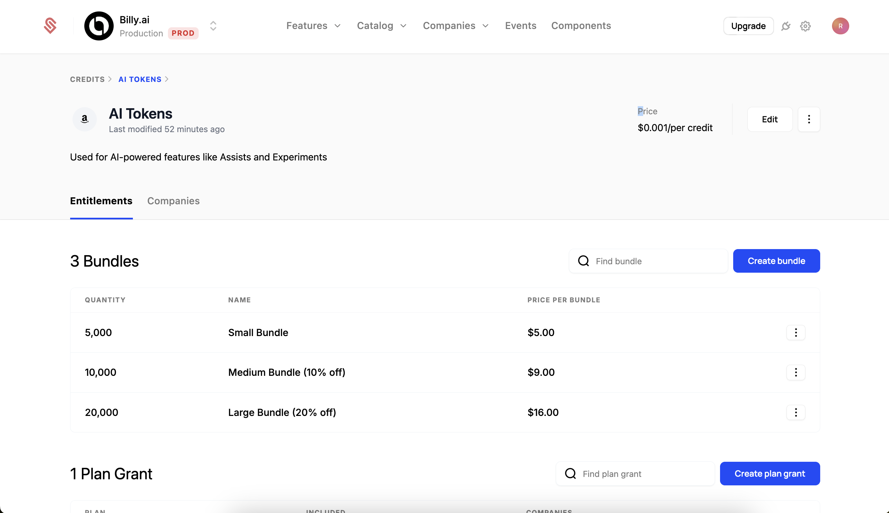

<Info>The price you set on a bundle is the basis for recognizing revenue from those credits.</Info>

<Info>Your new plan starts as an unpublished **draft** (version 1), and everything above edits that draft. Open the plan and click **Publish version** in the banner before customers can use it. This is the plan's first version, so there are no existing subscribers to migrate. See [Plan Versions](/catalog/plans#plan-versions).</Info>

### 6. Add the plan and bundles to the Catalog

1. Go to the "Catalog" tab and select "Configuration".
2. Click the "+" on the right of the "Live Plans" section.
3. Add the plan you created.
4. Click "Save".

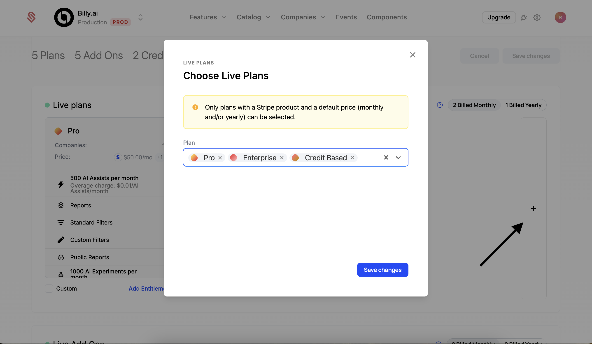

5. Scroll to "Credit Bundles" and click "+" to add the bundles.


6. **Save your changes** with the "Save Changes" button in the top right. This step is easy to miss.

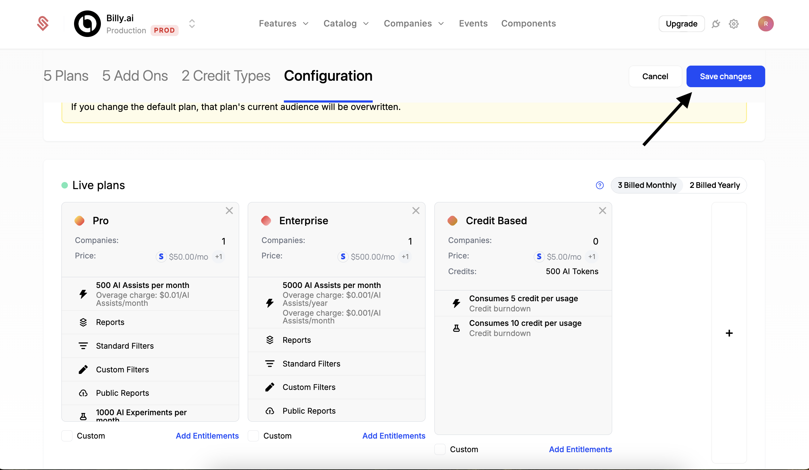

The bundles now appear in your checkout flow:

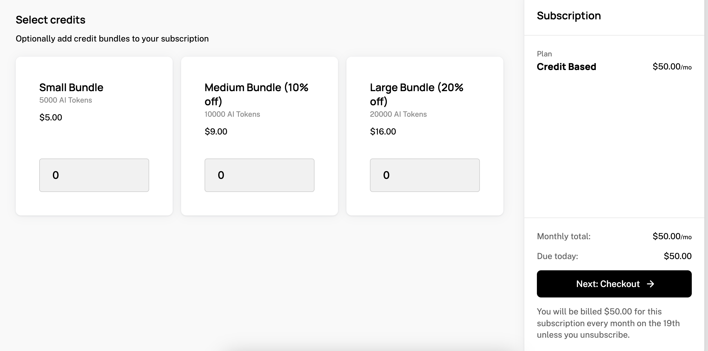

## Credit lifecycle

The walkthrough used the defaults. This section covers what else a credit grant can do.

**Reset** is the setting everything else hangs off. A grant either recurs or it doesn't, and that choice determines which other fields you see:

| Reset | You configure | What happens to an unused balance |
| --- | --- | --- |
| Monthly, Quarterly, or Yearly | **Rollover** | A percentage carries into the next period, the rest is discarded |
| Daily or Weekly | Nothing further | The balance is discarded at each reset |
| No reset | **Grant Expiration** | Credits stay in the balance until they expire |

Rollover and expiration are alternatives, not independent settings. A recurring grant has no expiration date of its own, and a one-time grant has nothing to roll over.

You'll find these by opening a credit grant on a plan, or any row in the Plan Grants table on a credit type page.

### Reset and rollover

Pick a cadence and the grant refreshes on that schedule. For Monthly, Quarterly, and Yearly you also choose when the cycle starts: **According to billing period start date**, which follows the company's own billing anniversary, or the calendar equivalent (**First of month**, **First of quarter**, or **First of year**). Daily and weekly grants always run from plan enrollment.

**Rollover** is the percentage of unused credits that survive a reset. At 0 the customer loses whatever they didn't spend, which is what the walkthrough does. At 100 the full remainder carries forward. Values in between give customers partial credit for what they didn't use without letting balances compound.

<Note>
Rolled-over credits expire at the next reset. They carry forward one period, not indefinitely, so a customer who consistently underuses does not accumulate an unbounded balance.
</Note>

Rollover is only offered for monthly, quarterly, and yearly grants. Daily and weekly grants reset too often for it to be meaningful.

### Grant expiration

Set **Reset** to "No reset" and the grant becomes one-time. **Grant Expiration** then controls how long the credits last:

| Grant Expiration | Behavior |
| --- | --- |
| Duration | Credits expire a fixed number of days after being granted |
| End of Billing Period | Credits expire when a billing period closes, either the current one or the next |
| No Expiry | Credits never expire |

Choosing **Duration** gives you quick-select buttons for 30 days, 90 days, and 1 year, plus a custom value in days. Choosing **End of Billing Period** adds a **Billing Period** selector for **Current** or **Next**.

On a free plan there is no billing period, so "End of Billing Period" is not offered.

Credit bundles have the same three options under a field labeled **Expiry Type**. The bundles in step 5 are set to No Expiry, but that is the example's configuration, not a property of purchased credits.

### Consumption order

A company usually holds several grants at once. Each consumption event draws its full amount from one grant and moves to the next once that one is empty, in this order:

1. **Adjustment grants**, meaning credits returned by a refund
2. **Rollover grants**, so last period's leftovers go before the fresh grant they came from
3. **Plan grants**, oldest first
4. **Everything else**, oldest first, which in practice means purchased bundles and promotional credits

Rollover grants sitting ahead of the new period's grant is what makes rollover useful. Because they also expire at the next reset, putting them last would mean they usually lapse unspent.

### Where credits come from

Every grant records its source. The **Companies** tab on a credit type lists each grant a company holds along with its status, source, usage, and expiration.

| Source | Origin |
| --- | --- |
| Plan | Included with the company's plan |
| Bundle | Purchased directly or by [auto top-up](#auto-top-up) |
| Free, promotional credit | Granted manually |
| Rollover | Carried forward from a previous period |
| Adjustment | Returned by a refund |

## App settings and their API fields

Everything above is configurable through the API as well. The dashboard uses friendlier labels than the underlying fields, and in a few places one control maps to more than one field, so this table is the translation.

### Credit grant on a plan

These live on `BillingPlanCreditGrantResponseData`.

| App control | API field | Values |
| --- | --- | --- |
| Reset (a cadence) | `reset_type`, `reset_cadence` | `reset_type` is `plan_period`; `reset_cadence` is `daily`, `weekly`, `monthly`, `quarterly`, or `yearly` |
| Reset: "No reset" | `reset_type` | `no_reset`, with `reset_cadence` unset |
| According to billing period start date | `reset_start` | `billing_period` |
| First of month / quarter / year | `reset_start` | `first_of_month` |
| Rollover | `rollover_percentage` | Integer 0 to 100. Only meaningful when `reset_type` is `plan_period` |
| Grant Expiration: Duration | `expiry_type`, `expiry_unit`, `expiry_unit_count` | `duration`, with `days` and the day count |
| Grant Expiration: End of Billing Period, Current | `expiry_type` | `end_of_billing_period` |
| Grant Expiration: End of Billing Period, Next | `expiry_type` | `end_of_next_billing_period` |
| Grant Expiration: No Expiry | `expiry_type` | `no_expiry` |
| Credit Amount | `credit_amount` | Integer |
| Buyers can purchase credit bundles | `can_buy_bundles` | Boolean |

Two things the API exposes that the dashboard does not:

- `expiry_type` also accepts `end_of_trial`, which expires credits when the company's trial ends. There is no dashboard control for it.
- `expiry_unit` also accepts `billing_periods`, so a duration can be counted in billing periods rather than days. The dashboard only offers days.

### Credit bundle

These live on `BillingCreditBundleResponseData`.

| App control | API field |
| --- | --- |
| Name of the credit bundle | `name` |
| Amount of credits | `quantity` |
| Credit bundle price | `price`, `currency_prices` |
| Expiry Type | `expiry_type`, `expiry_unit`, `expiry_unit_count` |

### Credit type

These live on `BillingCreditResponseData`.

| App control | API field |
| --- | --- |
| Credit name | `name` |
| Describe the credit | `description` |
| Single and multiple unit name | `singular_name`, `plural_name` |
| Cost basis | `price` |
| Currencies | `currency_prices` |
| Burndown strategy | `burn_strategy` |

The credit type also carries `default_expiry_unit`, `default_expiry_unit_count`, and `default_rollover_policy`, which set defaults new grants can inherit. The dashboard has no controls for them and clears them when you save the credit type, so they are only usable through the API.

<Warning>
The **Burndown strategy** field on the credit type is displayed but disabled in the dashboard, and it always renders the label "First In, First Out (FIFO)" regardless of the value stored on the credit type. Treat the API as the source of truth for this field.

`burn_strategy` accepts `plan_first_then_credit_bundles_first_in_first_out` (the default), `first_in_first_out`, `last_in_first_out`, and `expiration_priority`. The [Consumption order](#consumption-order) above describes the default. Adjustment and rollover grants are consumed first under every strategy.
</Warning>

### Grant sources

The `grant_reason` field on a credit grant carries the source shown in the dashboard.

| Dashboard label | `grant_reason` |
| --- | --- |
| Plan | `plan` |
| Bundle | `purchased`, or `billing_credit_auto_topup` when bought by auto top-up |
| Free, promotional credit | `free` |
| Rollover | `rollover` |
| Adjustment | `adjustment` |

Rollover grants also carry `source_grant_id`, pointing back to the grant they came from, so a carried-forward balance is traceable to its origin.

## Credit Refunds via Negative Quantities

Submitting a track event with a **negative quantity** for a credit burndown feature reverses the consumption and returns credits to the company's balance. Use it when a request failed, was retried, or needs correcting.

### How it works

1. Submit a negative quantity event using a **secret API key**. Publishable keys cannot submit negative quantities.
2. Schematic multiplies the negative quantity by the feature's consumption rate to get the number of credits to refund.
3. The credits go into an **adjustment grant**, created automatically per company per credit type.
4. Adjustment grant credits are consumed before anything else on the next draw.

### Example

"AI Assists" costs 5 credits per use and a company has used 10 of them, consuming 50 credits. To reverse 2 of those uses:

```ts
await client.track({
  event: "ai-assist",
  company: { "company-key": "acme-corp" },
  quantity: -2,
});
```

That returns 10 credits to the balance through an adjustment grant, and those 10 are spent first the next time the company uses any credit-consuming feature.

### Key details

- **Adjustment grants accumulate.** Repeated refunds for the same company and credit type add to the existing adjustment grant rather than creating new ones.
- **Adjustment grants are consumed first.** This holds under every burn strategy, ahead of plan grants, purchased credits, and promotional credits.
- **Adjustment grants do not expire quickly.** They carry a rolling 1-year expiration that extends with each refund, so they will not lapse while in active use.
- **Negative events create negative usage records.** Each refund writes a corresponding negative record to the credit usage ledger for auditing.

## Auto Top-Up

Auto top-up buys credits automatically when a customer's balance falls below a threshold, so they never run out mid-workflow. It is configured on the plan's credit grant.

1. Open the credit burndown plan you want to configure.
2. Click "Add credit grant".
3. Select the Credit Type and Credit Amount.
4. Enable "Auto Top-Up".

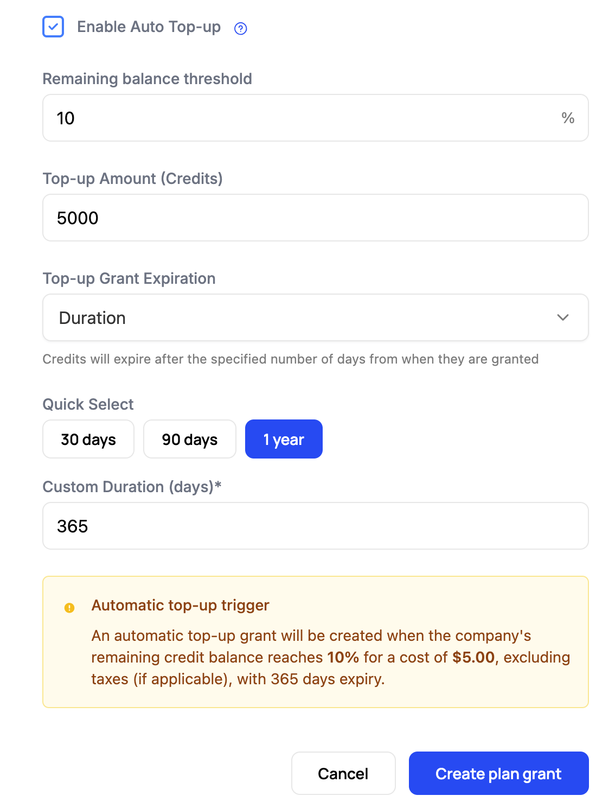

5. **Remaining balance threshold** is the percentage of credits remaining that triggers a purchase. We'll use 10%. The remaining balance counts all plan grants, purchased grants, and promotional grants.
6. **Top-up amount** is how many credits get bought. The cost follows the credit type's cost basis and appears in the confirmation below.
7. **Top-up Grant Expiration** sets the expiry policy for the purchased grant. A 1 year duration is a good default: long enough for customers to use the credits, short enough to keep revenue recognition simple. Auto top-up grants support Duration and No Expiry only, not the billing period options.
8. Review the confirmation showing final cost, threshold, and expiration, then click "Create plan grant".

### Triggering an Auto Top-Up

An auto top-up fires while processing an event that draws from a credit balance, when that balance is at or below the threshold. If several events arrive close together, only one top-up is purchased.

If a top-up purchase fails, Schematic retries the next time the balance is drawn from.

## Accessing Credit Information via API

### List Company Credit Grants

[List Company Credit Grants](/api-reference/billing-credits/list-company-grants) returns every grant a company holds, including its reason, quantity, remaining balance, and expiration, which is how you reconstruct the composition of a balance.

### Grant Billing Credits to Company

[Grant Billing Credits to Company](/api-reference/billing-credits/grant-billing-credits-to-company) adds credits outside the normal plan or purchase flow, for promotional grants, manual refunds, or administrative corrections.

### Zero Out Grant

[Zero Out Grant](/api-reference/billing-credits/zero-out-grant) sets a specific grant's remaining balance to zero, for when a grant needs cancelling.

### List Feature Usage

[List Feature Usage](/api-reference/entitlements/list-feature-usage) supports filtering and pagination, and with the `include_usage_aggregation` parameter it returns a `credit_usage_aggregation` object with time-bucketed data:

- `usage_this_billing_period`: credits used in the current billing period
- `usage_this_calendar_month`: credits used in the current calendar month
- `usage_this_week`: credits used in the current week
- `usage_today`: credits used today

Use this to show customers their consumption patterns over time.

## Conclusion

You now have a credit burndown model that lets customers prepay for usage, buy more when they run out, and receive volume discounts on larger purchases, while you meter several features against a single pricing metric. The same setup works on existing plans as well as new ones.
