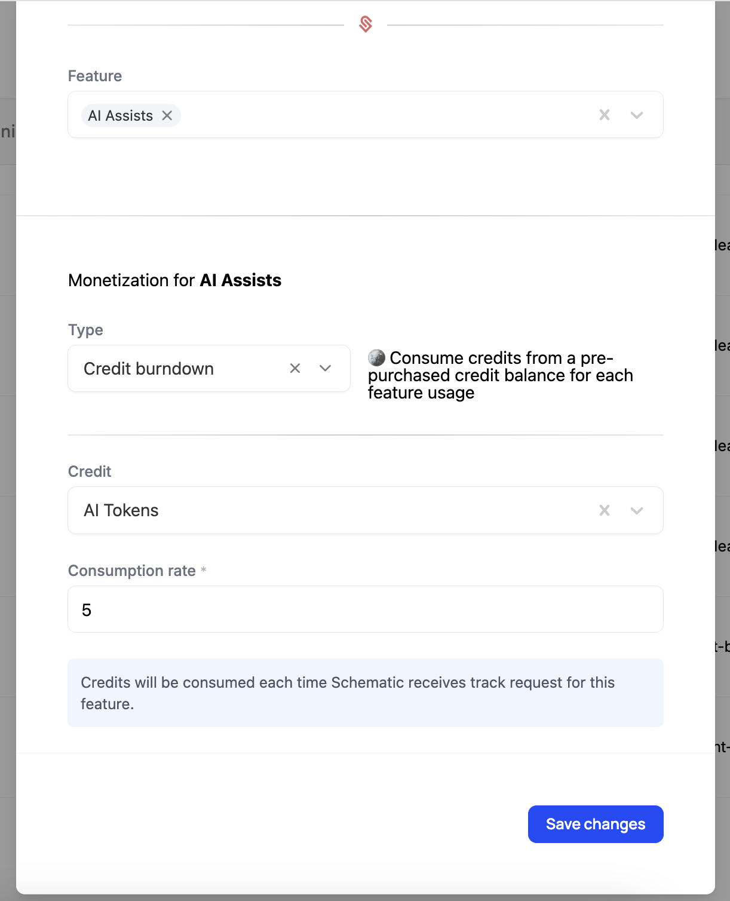
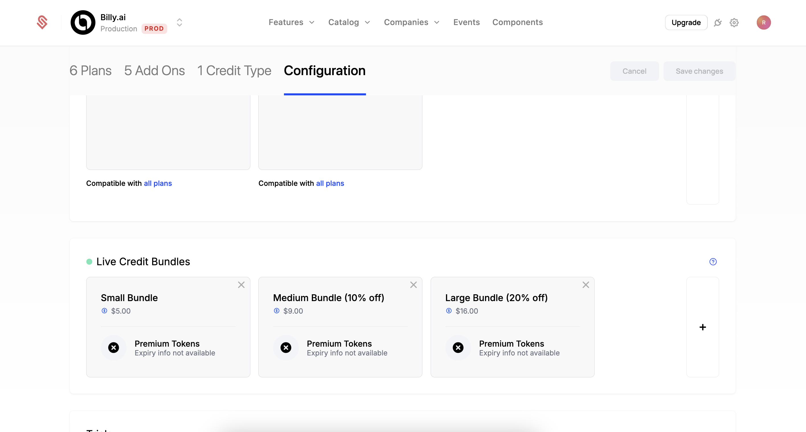

Recently, credit burndown models have become a popular form of Usage-based Billing. In credit burndown models, customers are given a balance of credits that get expended as they use different features in a product. They typically can buy additional credits at any time to use more of the product than their plan allows by default -- this is the intended usage pattern.

This is common in AI companies like ChatGPT, but SaaS companies from developer tools (e.g. Supabase, PostHog) to sales enrichment (e.g. Apollo.io, Clearbit) use credit burndown models.

Credit burndown models typically follow a similar structure:

- Customers are on a paid plan which provides an initial balance of credits per pay period (typically monthly).
  a. *NOTE: While less common, Credit Burndown can also be used with a free tier plan, where very few (or zero) credits are provided by default.*
- Key features draw against the credit balance each time they are used. Typically, multiple different features will be available to customers, and each will have a different credit cost.
- If customers run out of credits, they can buy additional credits at any time to continue using the product. Often, products will offer automatic "top-ups" when the balance gets low to avoid service disruptions.

The main benefits of a credit burndown model are:

- Cost to the customer (and Revenue to you) scales with usage, similar to other Usage-Based Billing models.
- Customers have to actively pre-pay for credits, so they are never surprised at the end of the month with an unexpectedly high bill.
- Multiple different features can be condensed into a single pricing metric, which can simplify pricing for customers. 
- You can experiment with the cost of buying credits independently of the cost of using credits. Often companies will offer bulk discounts (e.g. 100 credits for \$10, 1,000 credits for \$90, 10,000 credits for \$800, etc.)
- Likewise, you can adjust the cost of each feature using credits independently of each other and of buying credits. If a feature is becoming more expensive for you to provide, you can easily increase just the cost of that feature. 

{/* ## Video Tutorial

Below is a video tutorial that walks you through the process of implementing a credit burndown model in Schematic. The rest of this page provides a text based version of the same process.

// TODO this link is wrong, but keeping it here for reference on link shape

<iframe width="560" height="315" src="https://www.youtube.com/embed/dQw4w9WgXcQ?si=1234567890" title="YouTube video player" frameborder="0" allow="accelerometer; autoplay; clipboard-write; encrypted-media; gyroscope; picture-in-picture; web-share" referrerpolicy="strict-origin-when-cross-origin" allowfullscreen></iframe> */}

## Implementing Credit Burndown in Schematic

Here, we'll walk you through the process of setting up a credit burndown model in Schematic. For this example, we'll assume you have an existing Usage-Based plan with 2 features ("AI Assists" and "AI Experiments"), and now we want to roll out a new plan that supports these through a Credit Burndown model. 

The steps we'll be taking are:

1. Create a Credit Type that can be applied to plans.
2. Create a new plan that will use our Credit Burndown model.
3. Add the Credit Type to this plan.
4. Add features to this plan and configure how they use credits.
5. Add this plan to our Catalog so Customers can use it. 
6. Configure Credit Bundles that our customers can purchase to top up their balance.

### 1. Create a Credit Type

First, we'll create a Credit Type that can be applied to plans. Schematic allows you to create multiple credit types and apply them to the same plan or different plans. That said, normally you'll only need one credit type and that type can be applied to each of your credit-based plans. 

Mouse over `Catalog` and select `Credits` to open the Credit Type Page. 

Click the **Create Credit Type** button to begin:

1. Provide a name for your credit type, we'll use "AI Tokens" for this example. If you have multiple credit types, we recommend usage-based names (e.g. "Data Credits", "API Tokens") or a tier-based names (e.g. "Premium Credits").
2. The description field (optional) is shown to users in the customer portal and checkout flow. 
3. Provide a singular and plural name for your credits. We're using "Ai Token" and "AI Tokens" for this example.
4. Cost Basis is to help you track the cost of credits throughout your product and finance workflows. This field doesn't directly control the costs of credits, but represents a guideline for future usage. We'll use \$0.01 for this example, but you can use fractional cents (e.g. \$0.00025) if you want
5. Click "Create Credit Type" to save your changes.

### 2. Create a new plan that will use our Credit Burndown model.

Now that we have a credit type, we'll create a new plan that will use it. Within Schematic, any plan can incorporate credit burndown. For this example, we're choosing to create a new plan for simplicity, but we could instead add our credit type to existing plans if that fits our use case better.

1. Navigate to the **Plans** tab and click the **Create Plan** button.
2. Provide a name for this plan. We'll use "Credit Based" for this example. Then click "Continue".
3. Next, step the plan to a "Paid" plan and provide a monthly ($5) and yearly ($50) price. 
4. Click "Save" to create the plan. 

### 3. Add the Credit Type to this plan.

Now that we have a plan, we'll add the Credit Type to it. 

1. Click "Add credit grant" to begin the process.
2. Select the Credit Type we created earlier, "AI Tokens".
3. Set the number of credits the plan provides each period. Each new billing period, customers will receive this number or credits, and any unused credits from the prior period will expire. We'll use 5,000 for this example.
4. Click "Create plan grant" to save your changes.

### 4. Add features to this plan and configure how they use credits.

Now that we have a plan with a credit grant, we'll add the credit-based features that will use these credits.

1. Click the "Add feature" button to begin the process.
2. Select the "AI Assists" feature and click "Continue".
3. Set the type to "Credit burndown".

4. Select the credit type we created earlier, "AI Tokens".
5. The consumption rate is how many credits each action will consume from the credit pool. We'll use 5 for this example.
6. Click "Save Changes" to add this feature to the plan.

7. Repeat this process for the "AI Experiments" feature, setting the consumption rate to 10.

When you're finished, your plan should look like this:

### 5. Add this plan to our Catalog so Customers can use it. 

Now that we have a plan with features, we'll add it to our Catalog so Customers can use it.

1. Navigate to the **Catalog** tab, and select "Configuration".
2. Click the "+" button on the far right side of the "Live Plans" section.
3. Add the plan you just created to the list.
4. Click "Save" to add the plan to the Catalog.

5. **IMPORTANT**: You'll need to save your changes, by clicking the "Save Changes" button in the top right of the screen.

### 6. Configure Credit Bundles that our customers can purchase to top up their balance.

Finally, let's add credit bundles that customers can purchase to top up their balance. These bundles allow customers to purchase additional credits to continue using credit-based features once their plan's default balance is exhausted. These credits free rollover and never expire.

When customers consume credits, they draw from the credit grant with the nearest expiration date. Typically, this is their plan's monthly credit grant.

1. Navigate to the Credit Type page (Catalog > Credits > "AI Tokens").
2. Give your bundle a name. We'll use "Small Bundle" for this example.
3. Select the number of credits you want to include in the bundle. We'll use 5,000 for this example, which is the number of credits our plan provides by default.
4. Next, we set a cost for this bundle. We recommend this cost is inline with the cost basis of the credit type, but a discount can be applied for larger purchases. We'll use $5 for this example.
5. Click "Create Bundle" to save your changes.

6. Repeat this process but add a "Medium Bundle (10% off)" with 10,000 credits and a cost of $9.
7. Repeat this process one more time for a "Large Bundle (20% off)" with 20,000 credits and a cost of $16.

When you're finished, your credit bundles should look like this:

<Info>The cost you set for these bundles will be the basis for Recognizing the Revenue from these credits.</Info>

{/* When you're finished, you can see the credit bundles in your checkout flow: 

 */}

### Conclusion

Congratulations! You've now implemented a credit burndown model in Schematic. Credit Burndown is a powerful tool that you can use with new and existing plans to offer flexible and scalable usage-based billing. 
