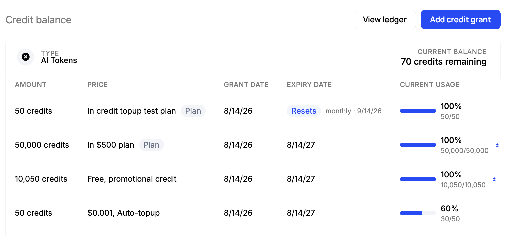
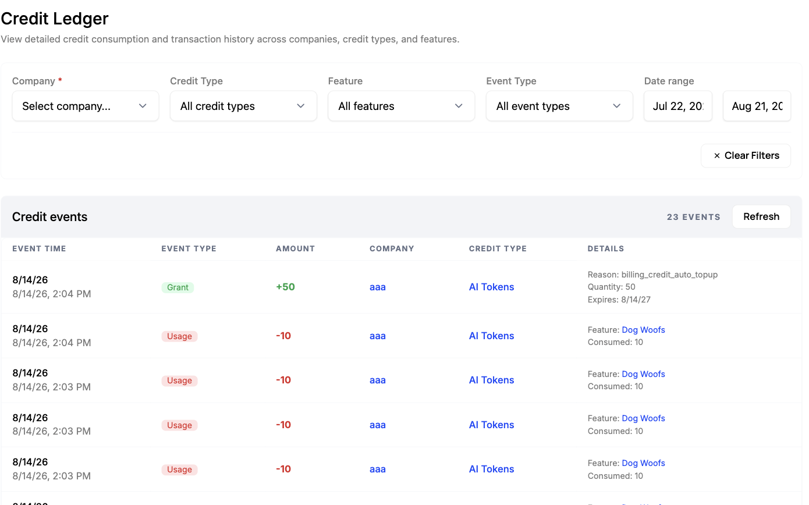

Under credit-based pricing, cash arrives before delivery. A customer who buys 10,000 credits has paid for consumption that has not happened yet, so the payment is not revenue on the day it lands. Revenue recognition, rev rec, is the accounting process that determines when it becomes revenue, and under US GAAP it is governed by ASC 606.

Rev rec is not a reporting feature you should design on your own. Its output lands in audited financial statements, and it is examined again in diligence during a fundraise or an acquisition. An error is a misstatement rather than a rounding difference, it repeats every period until someone catches it, and correcting it can mean restating periods that are already closed. Credit pricing makes this harder than a flat subscription does, because delivery is spread across thousands of small draws and some of the credits are never drawn at all. Which treatment applies to your contracts is a determination for your accountants and auditors, and this page does not attempt to make it for you.

What they need from engineering is measurement: a record of every grant, draw, hold, and expiry, with its price and timestamp attached, at a granularity their policy can be applied to. Schematic's credit ledger is that record. This page summarizes what ASC 606 asks for, documents what the ledger contains, states where the boundary with Stripe and your accounting system sits, and shows how to read the data out.

## What ASC 606 requires

ASC 606, *Revenue from Contracts with Customers*, is the FASB standard governing when revenue is recognized under US GAAP. It replaced a body of industry-specific rules with a single model, and has been effective for public companies since 2018 and for private companies since 2019. IFRS 15 is the equivalent standard under IFRS and was developed jointly with it, so the model is substantially the same under both.

The model has five steps: identify the contract with the customer, identify the performance obligations in it, determine the transaction price, allocate that price across the obligations, and recognize revenue as each obligation is satisfied.

- FASB's [ASC 606 page](https://www.fasb.org/page/PageContent?pageId=%2Fstandards%2Fasc-606.html) collects the standard, the amendments to it, and the implementation guidance.
- The IFRS Foundation's [IFRS 15 page](https://www.ifrs.org/issued-standards/list-of-standards/ifrs-15-revenue-from-contracts-with-customers/) states the same five-step model and is freely readable.

Revenue follows satisfaction of the obligation rather than receipt of cash. Under credit-based pricing the two are separated in time: the customer pays when the bundle is purchased, and the obligation is satisfied as credits are consumed over the period that follows. The unconsumed portion is deferred revenue until it is drawn. Credits that are never consumed fall under the standard's guidance on unexercised customer rights, and are generally recognized as breakage.

The first four steps are properties of the contract and its price, which live in the Schematic catalog and in Stripe. The fifth is a measurement question about what has actually been delivered, and that is what the credit ledger records.

The five steps are short to state and full of judgment in application, which is why the treatment is your accountants' call rather than a schema decision. What follows is the data available to support whichever call they make.

## System boundaries

| Concern | System |
| --- | --- |
| What a customer bought, at what price | Schematic catalog, synced to Stripe |
| The invoice, the payment, the tax | [Stripe](/integrations/stripe) |
| Every grant, draw, expiry, and transfer, with price and timestamp | Schematic credit ledger |
| Journal entries, deferred revenue schedules, and the ASC 606 policy | Your accounting or rev-rec system |

Schematic is the measurement layer. It holds consumption data at the granularity recognition requires and can report how much of a given grant had been delivered as of a given date. It does not post journal entries, produce deferred revenue schedules, or determine an accounting treatment. Compliance is a property of an accounting policy and its application, not of a ledger.

## Ledger event types

Credits are granted, consumed, and written off. Each corresponds to a different part of recognition.

### Grants

A grant records an obligation. Its `grant_reason` indicates whether consideration was received:

| `grant_reason` | What it means | Consideration received |
| --- | --- | --- |
| `purchased` | The customer bought a bundle | Yes |
| `billing_credit_auto_topup` | An automatic top-up charged the customer | Yes |
| `plan` | Included with the subscription | Allocated from the subscription price |
| `rollover` | Carried over from a prior period | Already recognized as deferred |
| `free` | Promotional or onboarding credits | No |
| `adjustment` | A manual correction | No |

Credits granted as `free` or `adjustment` carry no consideration, so their consumption produces no revenue. Aggregating them with the others into a single consumed figure will overstate recognized revenue, and since the promotional mix changes from month to month, the overstatement is not a constant that can be backed out afterwards.

### Usage

A `usage` entry records delivery against an obligation. It carries the quantity, the feature that caused the draw, the grant it was drawn from, and the timestamp.

Usage entries also carry a `usage_reason`. Ordinary consumption is `track`. Where [credit holds](/billing/credit-holds) are in use, `lease_hold` and `lease_release` entries record credits reserved and returned. A hold is an authorization rather than delivery, so credits reserved and released without being consumed are not revenue. Counting them as consumption recognizes revenue against work that was never performed.

### Write-offs

A `zero_out` entry records credits removed without being consumed, with a reason:

| `zeroed_out_reason` | What happened |
| --- | --- |
| `expired` | The grant reached its expiry date |
| `plan_period_reset` | A period reset cleared the prior period's balance |
| `plan_change` | The company moved to a different plan |
| `license_retired` | A license the grant was scaled to went away |
| `customer_archived` | The company was archived |
| `integration_uninstalled` | A billing integration was removed |
| `manual` | Someone zeroed it out deliberately |
| `reconciled` | A reconciliation corrected the balance |

These reasons are not equivalent for accounting purposes. Expiry on a purchased grant is breakage; a write-off following a plan change may be a contract modification. Preserve the reason rather than aggregating all write-offs together.

## Grant fields

Each grant carries the fields a deferred revenue schedule line requires:

| Field | Use |
| --- | --- |
| `price`, `currency` | What the customer paid for this grant |
| `quantity` | Credits granted |
| `quantity_used` | Delivered to date |
| `quantity_remaining` | Undelivered, still an obligation |
| `settled` | The balance net of actual consumption, excluding open holds |
| `grant_reason` | Whether consideration came with it |
| `valid_from`, `expires_at` | The window the obligation lives in |
| `zeroed_out_date`, `zeroed_out_reason` | When and why it ended early |

On a ratable approach, a purchased grant of 10,000 credits at \$800 with `quantity_used` of 3,200 represents \$256 delivered and \$544 deferred. Whether a ratable approach is appropriate for a given product is an accounting determination and outside the scope of these docs. The relevant point is that the inputs are recorded per grant rather than aggregated into a balance.

Credits purchased as a bundle also carry `billing_invoice_id`, which links the grant to the Stripe invoice the payment was recorded on.

## The ledger in the app

The ledger is visible in the app as well as through the API. The app view is the faster way to check a single company, or to see what an entry looks like before writing code against it.

`Catalog` > `Credits` lists the credit types with the cost basis on each, and carries a **View ledger** button in the top right. The ledger requires a company, the same constraint the API has, so the most direct route in is from the company itself.

Open a company under `Manage` > `Companies` and scroll to **Credit balance** on the Entitlements tab. It lists that company's grants with the price attached, when each was granted, when it expires or resets, and how much of it has been consumed.



The rows above cover three different recognition cases: credits included in a plan, a promotional grant carrying no consideration, and an auto top-up the customer was charged for. **View ledger** opens the ledger filtered to that company.



Each entry carries its event type, the signed amount, the credit type, and details, which for a grant is the grant reason, quantity, and expiry, and for a draw is the feature and the quantity consumed. The filters cover credit type, feature, event type, and a date range.

This view is for inspection rather than for closing a period. It pages a screen at a time and has no export, so period-end numbers come from the API.

## Reading the data

Read the ledger through [Get credit ledger](/api-reference/billing-credits/get-credit-ledger), filterable by credit type, event type, feature, and time window:

```bash
curl -G https://api.schematichq.com/billing/credits/ledger \
  -H "X-Schematic-Api-Key: $SCHEMATIC_API_KEY" \
  --data-urlencode "company_id=comp_EXAMPLE0123456789" \
  --data-urlencode "start_time=2026-07-01T00:00:00Z" \
  --data-urlencode "end_time=2026-08-01T00:00:00Z" \
  --data-urlencode "limit=250"
```

Two constraints apply. `company_id` is required, so no single call returns an entire environment's ledger for a period; a close process iterates companies. Pages are capped at 250 entries, so use `offset` to page through them, and set `end_time` to the period boundary so that pagination is not affected by entries written while the job runs.

Grants are available separately through [List credit grants](/api-reference/billing-credits/list-credit-grants). For a period-end schedule this is usually the better starting point, because one row already summarizes granted, used, and remaining amounts.

Bundle purchases, plan charges, and the invoices behind them come from [Stripe](/integrations/stripe).

## Not currently available

There is no ASC 606 report, deferred revenue schedule, or journal entry export. Schematic's data exports cover audit logs, events, and company feature usage; the credit ledger is not among the export types, so it is read through the API.

Teams closing the books on credit-based pricing read the ledger and the grant list into their accounting system or warehouse on a schedule, and apply their policy there with their accountants, rather than encoding a treatment in application code where it is hard to see and harder to correct.

## Related

- [Credit Burndown Billing Model](/billing/credit-burndown) - grant expiry, rollover, and consumption order, all of which change the recognition pattern.
- [Meter on a real-time credit ledger](/use-cases/credit-ledger) - why the ledger is transactional rather than a warehouse snapshot.
- [Credit Holds](/billing/credit-holds) - why a reserved credit is not a delivered one.
- [Stripe integration](/integrations/stripe) - what syncs to Stripe and what comes back.
