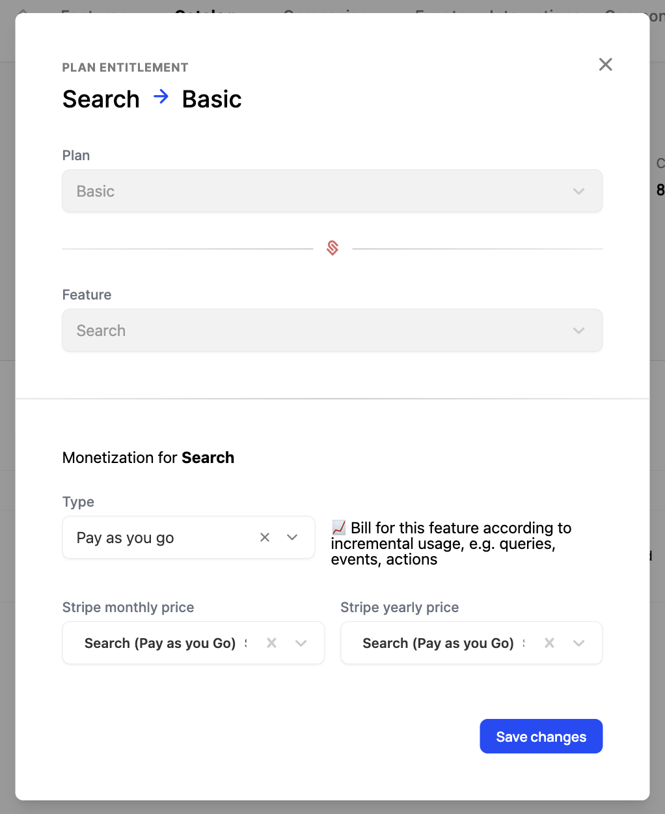
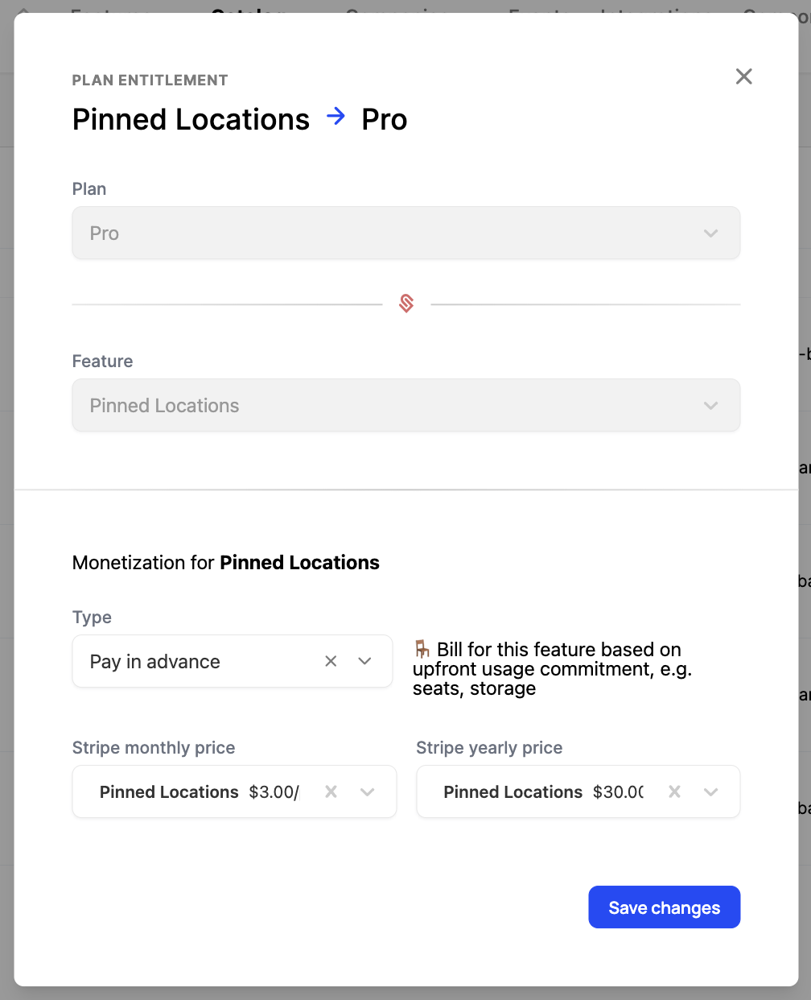

Schematic enables you to implement usage-based billing models quickly, and enforce any associated limits within your product as your customers reach them using Schematic's feature management capabilities.

For instance if you have a pay in advance model, when a customer reaches the credit limit, you can prevent them from using more.

While base charges (e.g. a subscription fee) are defined at the plan level, as described [here](/catalog/create-catalog#creating-a-plan-or-add-on), usage-based billing is defined at the individual entitlement level.

## What is usage based billing?

Usage-based billing is a pricing model where customers are charged based on their usage of a particular feature. This model is useful for businesses offering variable or consumption-based products, such as APIs, cloud services, or subscription tiers with metered features.

## Supported Billing Models

Schematic supports a number of usage-based models. If the one you care about is missing, please send us a note at `hi@schematichq.com`.

### Pay as you go

Charge customers based on their usage of a feature without a preset fee or limit.

This is ideal for **event-based features** in Schematic such API calls or SMS usage.

#### Configuring pay as you go
1. Navigate to a plan with a metered entitlement.
2. Click on the entitlement that you'd like to monetize.
3. Select "Pay as you go" and the corresponding product from Stripe to aggregate usage against.

### Pay in advance

Charge customers up front for pre-defined usage.

This is ideal for scenarios where customers prefer buying usage in pre-determined chunks, and is supported for **trait-based features** in Schematic such as Seats or Projects.

#### Configuring pay in advance
1. Navigate to a plan with a metered entitlement.
2. Click on the entitlement that you'd like to monetize.
3. Select "Pay in advance" and the corresponding product from Stripe to aggregate usage against.

### Fixed fee with overage

Coming soon.

### Credit burndown

Coming soon.