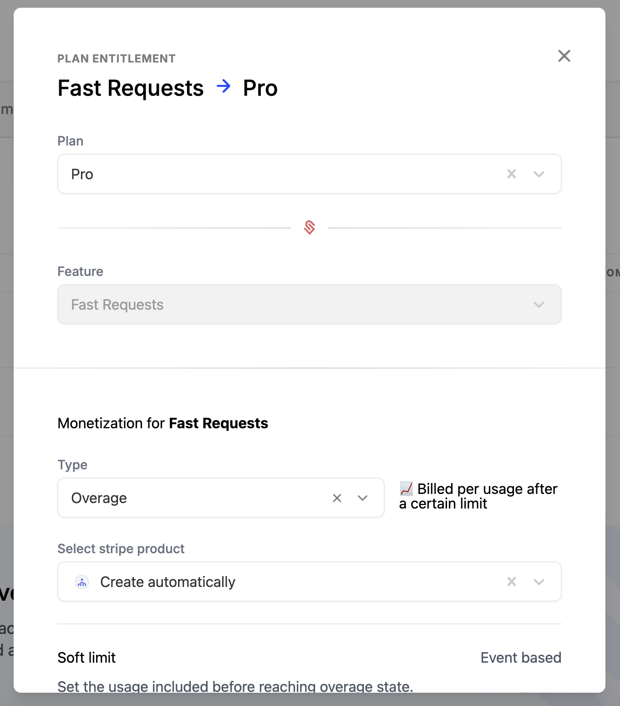
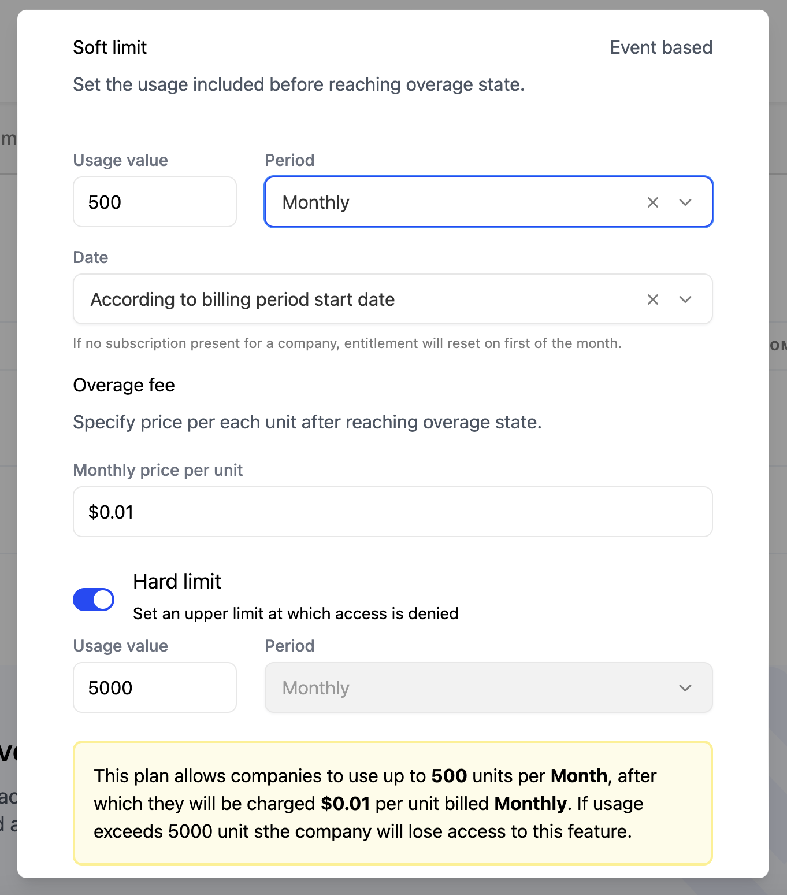

Schematic enables you to implement usage-based billing models quickly, and enforce any associated limits within your product as your customers reach them using Schematic's feature management capabilities.

For instance if you have a pay in advance model, when a customer reaches the credit limit, you can prevent them from using more.

While base charges (e.g. a subscription fee) are defined at the plan level, as described [here](/catalog/create-catalog#creating-a-plan-or-add-on), usage-based billing is defined at the individual entitlement level.

## What is usage based billing?

Usage-based billing is a pricing model where customers are charged based on their usage of a particular feature. This model is useful for businesses offering variable or consumption-based products, such as APIs, cloud services, or subscription tiers with metered features.

## Supported Billing Models

Schematic supports a number of usage-based models. If the one you care about is missing, please send us a note at `hi@schematichq.com`.

### Pay as you go

Charge customers based on their usage of a feature without a preset fee or limit.

This is ideal for **event-based features** in Schematic such API calls or SMS usage.

#### Configuring pay as you go
1. Navigate to a plan with a metered entitlement.
2. Click on the entitlement that you'd like to monetize.
3. Select "Pay as you go" and the corresponding product from Stripe to aggregate usage against.

### Pay in advance

Charge customers up front for pre-defined usage.

This is ideal for scenarios where customers prefer buying usage in pre-determined chunks, and is supported for **trait-based features** in Schematic such as Seats or Projects.

#### Configuring pay in advance
1. Navigate to a plan with a metered entitlement.
2. Click on the entitlement that you'd like to monetize.
3. Select "Pay in advance" and the corresponding product from Stripe to aggregate usage against.

### Fixed fee with overage

Include some amount of usage for a fixed fee, and then charge customers for any additional usage.

This is ideal for scenarios where many customers will fall into the plan's quota, but you want to allow (and benefit from) customers with heavy usage.

#### Configuring fixed fee with overage
1. Navigate to a plan with a metered entitlement.
2. Click on the entitlement that you'd like to monetize.
3. For Type, select "Overage"
4. You can either choose to have Schematic create the product in Stripe for you, or use one already created in Stripe. (If you're not sure, we recommend letting Schematic create the product for you.)

5. The Soft Limit represents the amount of usage included in the plan. Below this is set to 500, which means the first 500 fast requests are included.
6. Next, select the duration of the period to track usage. Monthly is by far the most common, and Schematic also supports daily and yearly.
7. If monthly is selected (as is done here), you will need to determine if the period should reset at the beginning of the month or based off of the billing period of the subscription (e.g. if the customer signed up on the 15th, the period would be measured 15th-14th of next month). Basing it off of the billing period is the most common choice. 
8. The Overage price is the amount to charge for each unit of usage over the soft limit. Here, we set that to $.01 (1 cent) per usage.
9. Finally, you can optionally configure a Hard Limit (here 5,000) -- this represents the maximum amount of usage, at which Schematic will always turn off the flag. Hard Limits can be helpful if there are global resource limits you're trying to manage or you want to force conversion into a higher plan at a specific usage threshold. 

### Credit burndown

Checkout our [Credit Burndown Docs](/billing/credit-burndown). 
