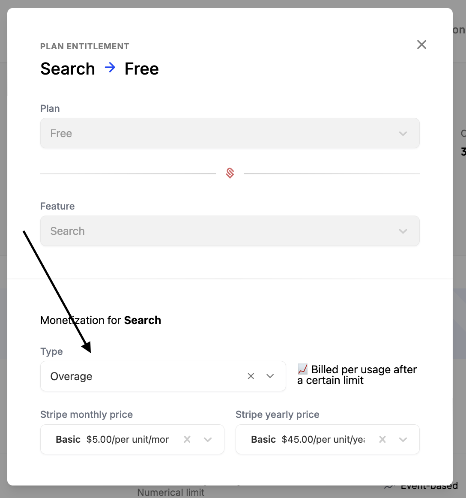
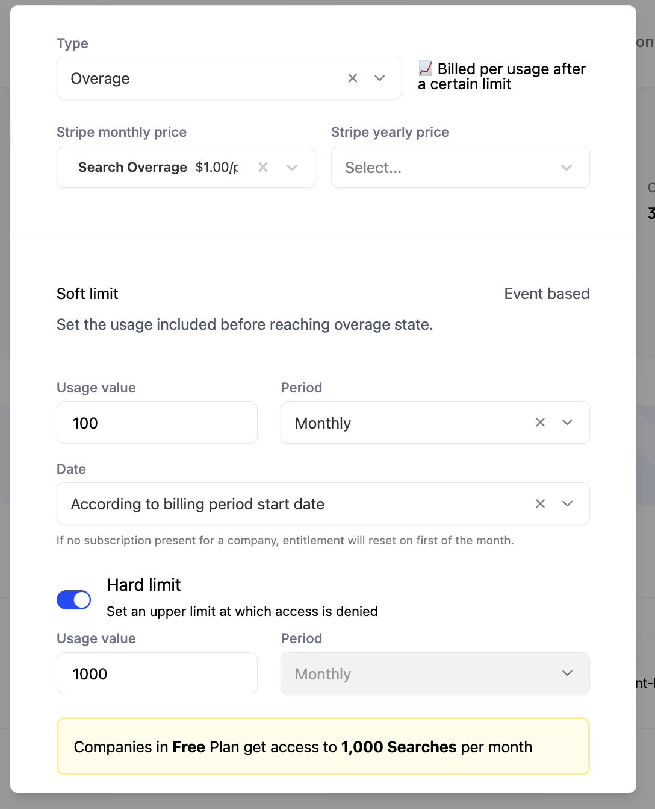

Schematic enables you to implement usage-based billing models quickly, and enforce any associated limits within your product as your customers reach them using Schematic's feature management capabilities.

For instance if you have a pay in advance model, when a customer reaches the credit limit, you can prevent them from using more.

While base charges (e.g. a subscription fee) are defined at the plan level, as described [here](/catalog/create-catalog#creating-a-plan-or-add-on), usage-based billing is defined at the individual entitlement level.

## What is usage based billing?

Usage-based billing is a pricing model where customers are charged based on their usage of a particular feature. This model is useful for businesses offering variable or consumption-based products, such as APIs, cloud services, or subscription tiers with metered features.

## Supported Billing Models

Schematic supports a number of usage-based models. If the one you care about is missing, please send us a note at `hi@schematichq.com`.

### Pay as you go

Charge customers based on their usage of a feature without a preset fee or limit.

This is ideal for **event-based features** in Schematic such API calls or SMS usage.

#### Configuring pay as you go
1. Navigate to a plan with a metered entitlement.
2. Click on the entitlement that you'd like to monetize.
3. Select "Pay as you go" and the corresponding product from Stripe to aggregate usage against.

### Pay in advance

Charge customers up front for pre-defined usage.

This is ideal for scenarios where customers prefer buying usage in pre-determined chunks, and is supported for **trait-based features** in Schematic such as Seats or Projects.

#### Configuring pay in advance
1. Navigate to a plan with a metered entitlement.
2. Click on the entitlement that you'd like to monetize.
3. Select "Pay in advance" and the corresponding product from Stripe to aggregate usage against.

### Fixed fee with overage

Include some amount of usage for a fixed fee, and then charge customers for any additional usage.

This is ideal for scenarios where many customers will fall into the plan's quota, but you want to allow (and benefit from) customers with heavy usage.

#### Configuring fixed fee with overage
1. Navigate to a plan with a metered entitlement.
2. Click on the entitlement that you'd like to monetize.
3. Select "Overage" and the corresponding product from Stripe to aggregate usage against.

#### Options in details

The above example would create a monetization system as follows:
1. 100 Usages/mo included in the plan (Soft limit)
2. Never more than 1000 Usages/mo (Hard limit). This is optional, but can be helpful if there are resource limits you're trying to manage or you want to force conversion into a higher plan at a specific usage threshold.
3. Usages 101-1000 will cost $1 per 10 usages for customers paying monthly. These map directly to stripe products and cost and unit size should be configured in Stripe.

### Credit burndown

Coming soon.
