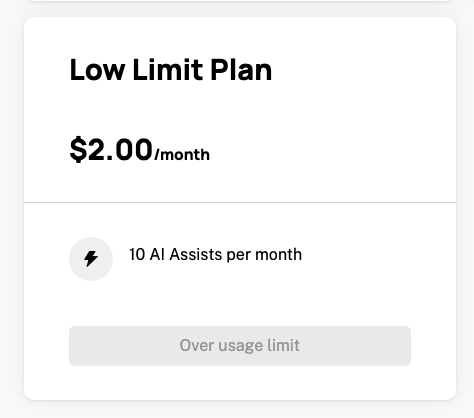
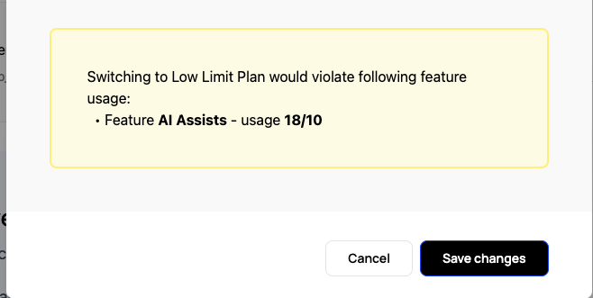

When a company changes plans, whether an upgrade or a downgrade, Schematic automatically updates the company's entitlements, usage limits, and billing status in Stripe (if applicable). Plan changes can occur from a few different sources -- in all cases, the steps Schematic takes are the same. The possible reasons for a plan change are:

- The customer goes through a checkout flow via the Schematic Customer Portal Component
- You update a company's plan via the Schematic App using the "Manage Plan" button
- A customer's trial period ends, and they are converted to the default plan
- A customer fails to pay their bill, their subscription is marked `unpaid` in Stripe, and they are downgraded to the default plan

## Plan Change Basics

Whenever a plan changes, Schematic will automatically update the company's entitlements and usage limits. Accrued usage is fully preserved. All company overrides are preserved and re-applied. If a company override is less generous than the current plan entitlement, the more generous amount will be applied. 

Schematic prevents companies from downgrading to a plan if they will be over the usage limits of the new plan. 

Using the "Manage Plan" button in the Schematic App, you are able to downgrade a company to a plan even if they are over the usage limits of the new plan. This will display a warning:

## Stripe-Linked Plans

Stripe-linked plans have additional considerations concerning how usage based charges are synced to Stripe. 

### Upgrade vs. Downgrades

For Stripe-linked plans, Schematic handles upgrades and downgrades differently. A plan change is considered an upgrade if the new plan has a higher base price (or the same base price) as the current plan. A downgrade is considered a plan change to a plan with a lower base price.

### Upgrades

When a Stripe-linked plan is upgraded, Schematic will update the current subscription. All accrued usage is preserved and is reapplied to the new plan. For example, imagine the user has accrued 100 units of usage at $1/per unit on the current plan. Below would be the price for the current plan and the new price for hypothetical plans the user could upgrade to. 

| Plan | Usage Charge | End of Month Usage Cost |
| --- | --- | --- |
| Current Plan | \$1/per | \$100 |
| Lower usage cost PAYG Plan | \$0.50/per | \$50 |
| Overage Plan | 50 included, then \$0.50/per | \$25 |
| Tiered Plan | 1-50 = \$10 51-200 = \$20 201+ = \$30 | \$20 |
| Unlimited Use Plan | - | \$0 |

Additionally, when upgrading a plan, Schematic will use Stripe's proration logic to refund the remaining **base** cost of the current plan and the **base** cost of the new plan. These costs are presented to the user during the checkout flow or to you while using the "Manage Plan" button in the Schematic App.

**NOTE:** For usage-based features, if the new plan doesn't have an entitlement for the feature, the charges associated with the usage will be dropped.

### Downgrades

When a Stripe-linked plan is downgraded, Schematic will cancel the current subscription and create a new subscription for the new plan. In this case, all accrued usage costs are lost and will not be reapplied to the new plan. This will create a discrepancy between the accrued usage displayed in Schematic and the usage billed in Stripe. 
