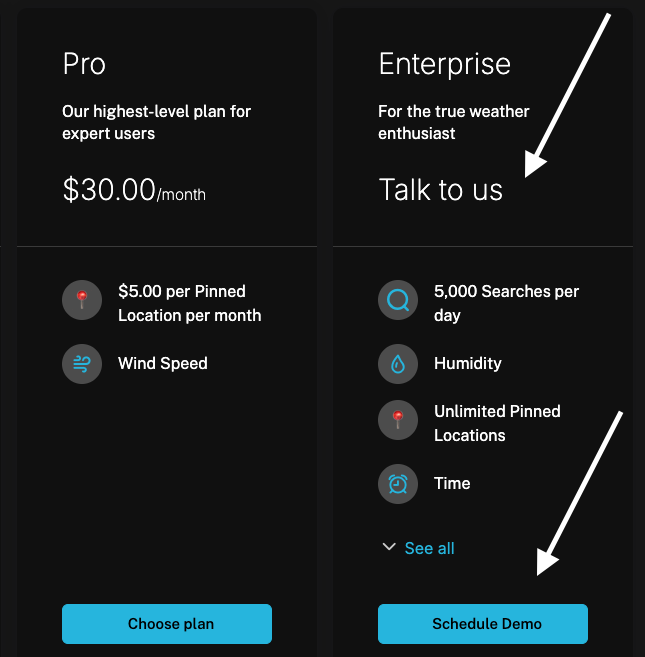

The Configuration tab in the Catalog serves two purposes:

1. To define subscription lifecycle rules when subscriptions change
2. To define what plans or add ons should be user-facing and accessible via Schematic Components

Live Plans, Live Add Ons, and Plan Change Rules are only relevant if you are using Schematic with Stripe. In that case, selected plans and add ons will appear in Schematic Components and users will be able to manage their subscription directly. In all other cases, that configuration can be skipped and user-facing components will simply be read only with no option to manage subscriptions.

## Options

### Default Plan

This is the plan that will be assigned to companies that are not associated with any plans already in Schematic. For instance, this might be your freemium or trial plan that a new user is automatically assigned to prior to conversion into a paid plan.

### Live Plans

The plans that your end users can choose to downgrade from or upgrade to. If enabled, each plan included in Live Plans will appear as an option in the checkout flow.

Companies in Schematic may be assigned plans that are not included here, but there will be no option to independently subscribe to them using Schematic Components.

### Custom Plans

Often, an enterprise plan will have custom pricing that cannot easily be displayed. In these cases, you can mark a plan as "Custom" and then provide a message like "Talk to us" to display instead of a price. 

### Live Add Ons

The add ons that your end users can select. If enabled, each add on included in Live Add Ons will appear as an option in the checkout flow.

Companies in Schematic may be assigned add ons that are not included here, but there will be no option to independently subscribe to them using Schematic Components.

<Info>Live Add Ons are limited to features that can be turned on or turned off (Boolean entitlements), but metered Add Ons are coming soon.</Info>

### Trial Rules

The default trial behavior that will apply to trials when configured at the plan level.

### Plan Change Rules

The rules Schematic will validate subscription changes against (e.g. upgrade rules, downgrade rules).

## **Configuring the Catalog**

1. Navigate to **Catalog > Configuration**
2. Choose a default plan that all companies will be assigned if they do not currently have a subscription (optional)
3. Choose “Live Plans” and “Live Add Ons”
4. Save changes

<Info>Plans and Add Ons must be associated with Stripe Products to be added to Live Plans or Live Add Ons.</Info>

Trials Rules can be modified to require a credit card to start a trial. At the end of the trial, companies will automaticaly convert into the corresponding paid plan.

Currently, Plan Change Rules cannot be modified; however, we will be introducing more optionality here in the future.

