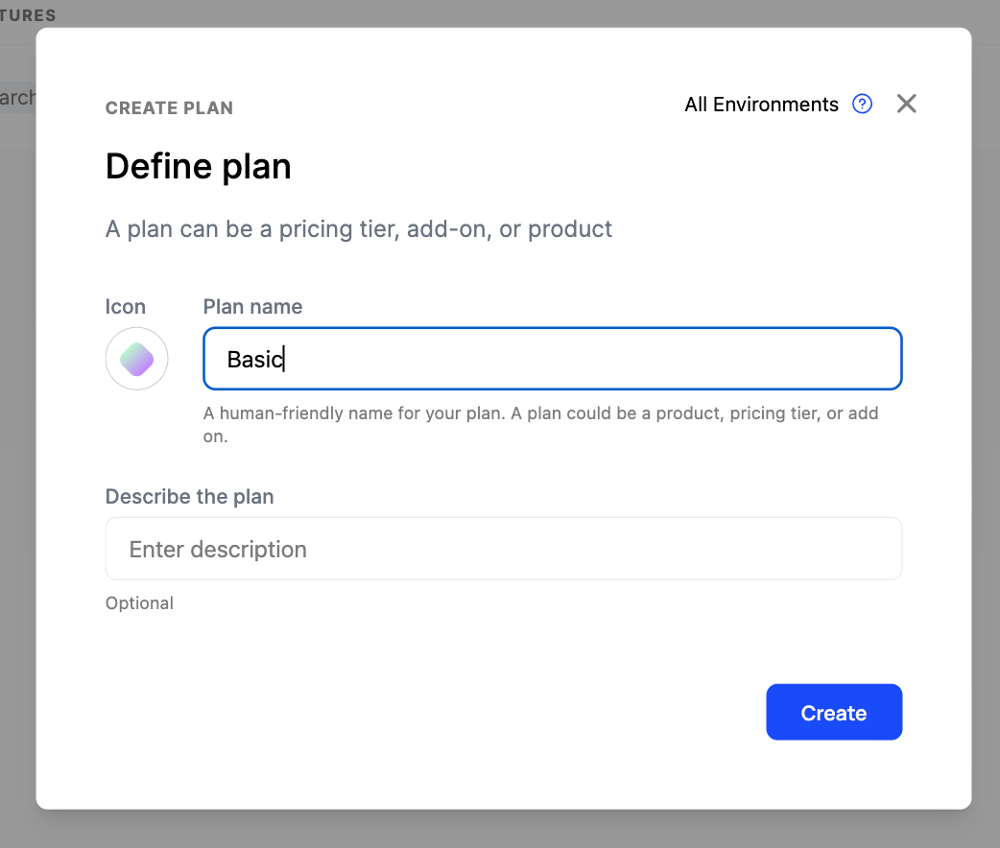
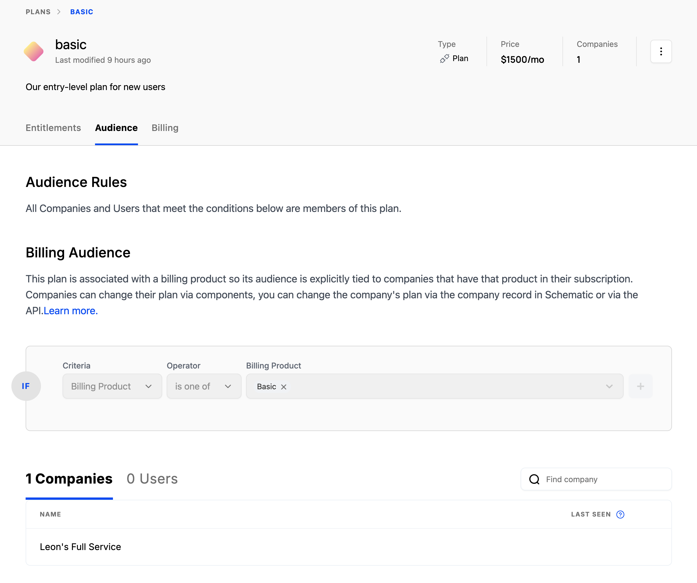

Your catalog should reflect the plans and add ons that you offer your customers, including the corresponding entitlements. Below, we'll walk through creating plans and add ons, mapping them to Stripe products, and assigning an entitlement to a plan.

## Creating a Plan or Add on

The following steps are the same for both Plans and Add ons.

1. Navigate to **Catalog** and click “Create”
2. Add name and a description

3. In the Billing step, choose whether the plan is Free or Paid

4. Link the Schematic plan to a Stripe product
    a. Companies that have active Stripe subscriptions with the mapped product will automatically become a member of the Schematic plan.

4. Once the plan is created, click the Audience tab and verify the Audience rule and corresponding Companies that have been associated to the plan.

<Info>Linking Schematic plans to Stripe products is optional, but allows Schematic to ensure both products are synchronized with respect to billing configuration and company assignment. Alternatively, you can set up your own targeting rules based on company attributes or usage. Here’s an [**example**](https://docs.schematichq.com/playbooks/rollout).</Info>

### **Setting up Entitlements**

Let’s add one feature to Schematic and entitle it to the above plan. For additional features, use the same steps.

1. Navigate to **Features** and click “Create”.
2. In the modal, add a name, description, and pick the event-based feature type. Click “Continue”.

You can choose between Boolean, Event-based, or Trait-based feature types.

3. Define a flag key.
    a. You’ll use this `key` in your application to reference this feature.

4. Attach an event to the feature. Add the `query` event to meter the feature and measure feature usage (if it doesn’t exist already, create it).

5. Once the feature is created, click ”Add plan entitlement” to add an entitlement and specify the limit for Search Query for a given plan.

<Info>Event-based features can have no limit, some numerical limit that is static within a period, or a limit that is dynamic based on traits that exist at the company level. Read more [**here**](https://docs.schematichq.com/playbooks/metering#entitlement-options).</Info>

<Info>You’ll need to make sure to send usage events to Schematic to track feature utilization as it occurs. Read more [**here**](https://docs.schematichq.com/playbooks/metering#setting-up-an-event-based-metered-feature).</Info>