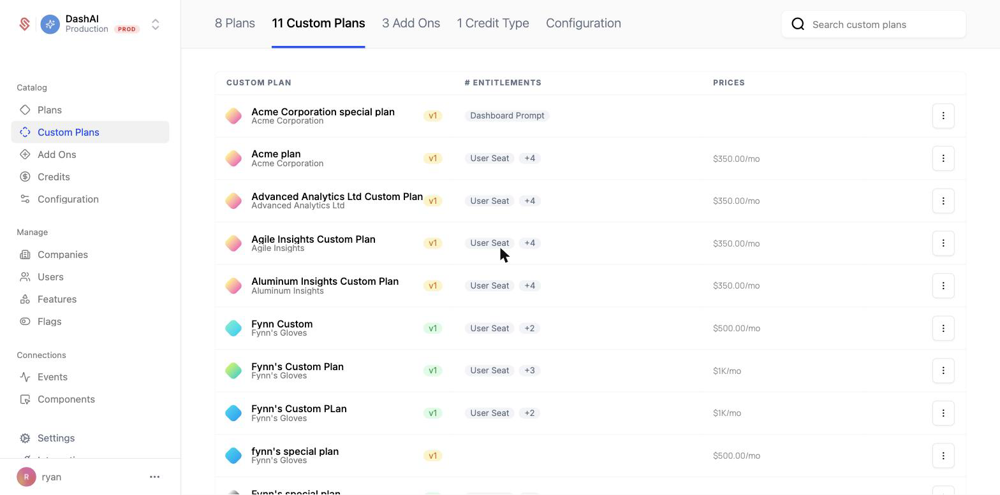

A custom plan is a plan scoped to a single company. It is built for sales-led, invoice-based deals, where a customer negotiates their own pricing and packaging and you bill them by invoice rather than through self-service checkout.

Unlike a standard [plan](/catalog/plans), a custom plan is only ever assigned to one company. It never appears in your [Components](/components/overview) checkout flow, and no other company is moved onto it. The company stays on its custom plan until you move it to another plan.

### When to use a custom plan

Reach for a custom plan when a single company needs terms that differ from your standard catalog and you are closing the deal through sales rather than self-service. Common cases include negotiated enterprise pricing, a bespoke bundle of entitlements, or a one-off contract billed by invoice.

For other situations:

- To change a plan for everyone, publish a [new plan version](/catalog/plans#creating-a-new-plan-version) instead.
- To grant a single entitlement exception on top of a company's existing plan, use a [company override](/feature-management/overrides).

## Creating a custom plan

You create a custom plan from the company it is for. On the company's profile page, open the 3-dot menu near the company name and choose **Create custom plan**.

This creates a draft custom plan assigned only to that company. From there you set up its entitlements and pricing. You can start from scratch or use **Duplicate from plan** to copy the entitlements of an existing standard plan and then adjust them for this deal.

For a step-by-step walkthrough, see [Creating a Custom Plan](/catalog/guides/custom-plans).

## Invoice-based activation

Custom plans are designed for an invoiced sales motion. While the plan is a draft, you review its entitlements and then **finalize** it to start billing. Finalizing generates a custom plan invoice for the company.

When you finalize, you choose an activation strategy that controls when the company gets access:

- **On payment** — the company becomes active on the custom plan once the invoice is paid, within the configured due window (for example, 30 days). Until then, the plan stays pending.
- **Immediately** — the company gets access to the plan right away, before paying. If they do not pay within the payment terms, access is removed.

## Versions and migrations

Like standard plans, custom plans are versioned. Editing a finalized custom plan creates a new draft version that you can review and publish, and you can track changes on the plan's **Migrations** tab. Because a custom plan only ever applies to one company, publishing a new version updates that single company. See [Plan Versions](/catalog/plans#plan-versions) for how versioning works.

## Learn more

- [Creating a Custom Plan](/catalog/guides/custom-plans) for the full walkthrough
- [Plans](/catalog/plans) for standard, catalog-wide plans
- [Managing Company Plans](/catalog/managing-company-plans) for the other ways to change a company's plan
