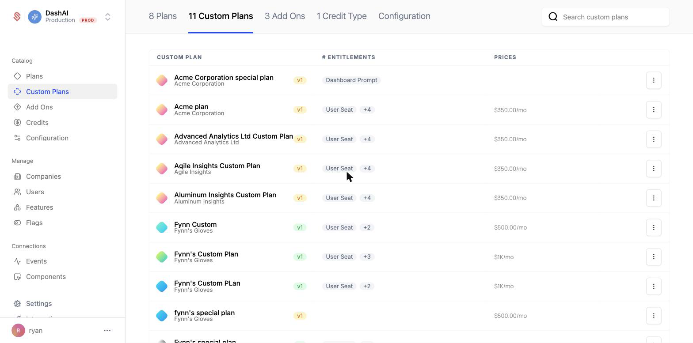
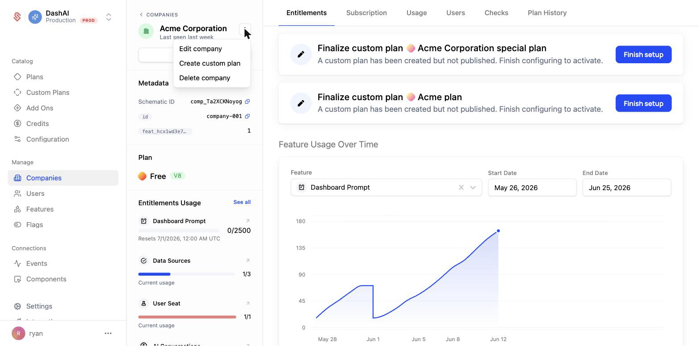
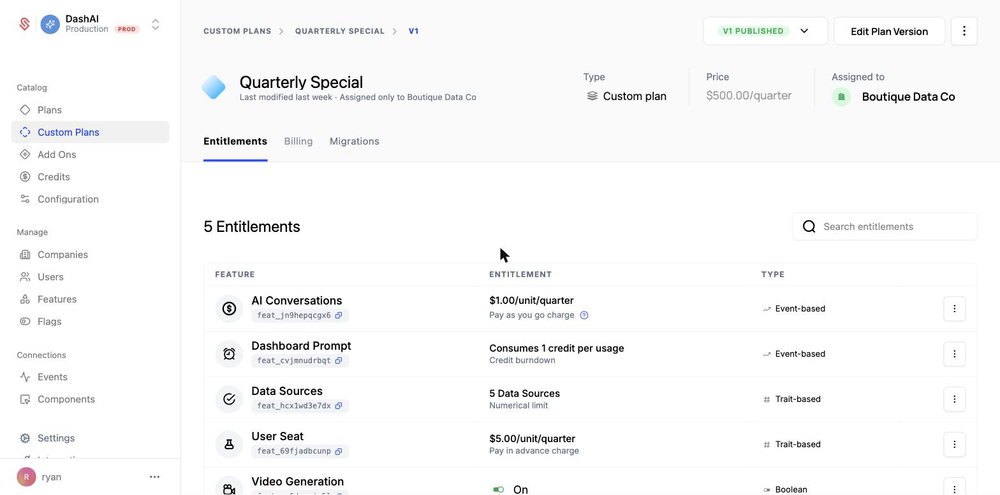
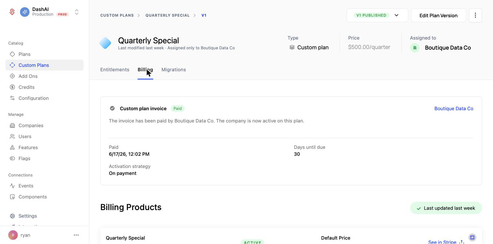

A custom plan is a plan scoped to a single company. It is built for sales-led, invoice-based deals, where a customer negotiates their own pricing and packaging and you bill them by invoice rather than through self-service checkout.

Unlike a standard [plan](/catalog/plans), a custom plan is only ever assigned to one company. It never appears in your [Components](/components/overview) checkout flow, and no other company is moved onto it. The company stays on its custom plan until you move it to another plan.

### When to use a custom plan

Reach for a custom plan when a single company needs terms that differ from your standard catalog and you are closing the deal through sales rather than self-service. Common cases include negotiated enterprise pricing, a bespoke bundle of entitlements, or a one-off contract billed by invoice.

For other situations:

- To change a plan for everyone, publish a [new plan version](/catalog/plans#creating-a-new-plan-version) instead.
- To grant a single entitlement exception on top of a company's existing plan, use a [company override](/feature-management/overrides).

## Creating a custom plan

You create a custom plan from the company it is for. On the company's profile page, open the 3-dot menu near the company name and choose **Create custom plan**.

This creates a draft custom plan assigned only to that company. From there you set up its entitlements and pricing. You can start from scratch or use **Duplicate from plan** to copy the entitlements of an existing standard plan and then adjust them for this deal.

For a step-by-step walkthrough, see [Creating a Custom Plan](/catalog/guides/custom-plans). If you would rather generate custom plans from your CRM or an internal tool, the same flow is available over the API. See the [Custom Plans API](/developer_resources/custom-plans-api).

## Invoice-based activation

Custom plans are designed for an invoiced sales motion. While the plan is a draft, you review its entitlements and then **finalize** it to start billing. Finalizing generates a custom plan invoice for the company.

When you finalize, you choose an activation strategy that controls when the company gets access:

- **On payment** activates the company on the custom plan once the invoice is paid, within the configured due window (for example, 30 days). Until then, the plan stays pending.
- **Immediately** gives the company access to the plan right away, before paying. If they do not pay within the payment terms, access is removed.

### Getting the invoice to the customer

The invoice itself is issued through Stripe, which is what gives the customer a way to pay it without you building one. Two settings control how it reaches them:

- **Send invoice** decides whether Stripe emails the invoice to the customer when it is finalized. Leave it off when your team would rather deliver it through the deal thread or a procurement portal.
- **Days until due** sets the payment window, and it is the same window the **On payment** activation strategy waits on.

Either way the invoice has a Stripe-hosted page where the customer can pay by card or by whatever methods you have enabled in Stripe, so you can pass that link along yourself rather than relying on the email.

Schematic tracks the result. The plan's **Billing** tab shows the invoice status, and when it is paid the company activates on the plan without anyone assigning it. A failed or expired invoice can be retried against the same plan, so a payment problem does not mean rebuilding the deal.

<Info>In sandbox environments, Stripe does not send invoice emails by default. See [Configuring the Catalog](/catalog/configuration) and the [Stripe FAQ](/integrations/stripe-troubleshooting) if an expected invoice email does not arrive.</Info>

## Versions and migrations

Like standard plans, custom plans are versioned. Editing a finalized custom plan creates a new draft version that you can review and publish, and you can track changes on the plan's **Migrations** tab. Because a custom plan only ever applies to one company, publishing a new version updates that single company. See [Plan Versions](/catalog/plans#plan-versions) for how versioning works.

## Learn more

- [Creating a Custom Plan](/catalog/guides/custom-plans) for the full walkthrough
- [Custom Plans API](/developer_resources/custom-plans-api) for building custom plans programmatically
- [Plans](/catalog/plans) for standard, catalog-wide plans
- [Managing Company Plans](/catalog/managing-company-plans) for the other ways to change a company's plan
