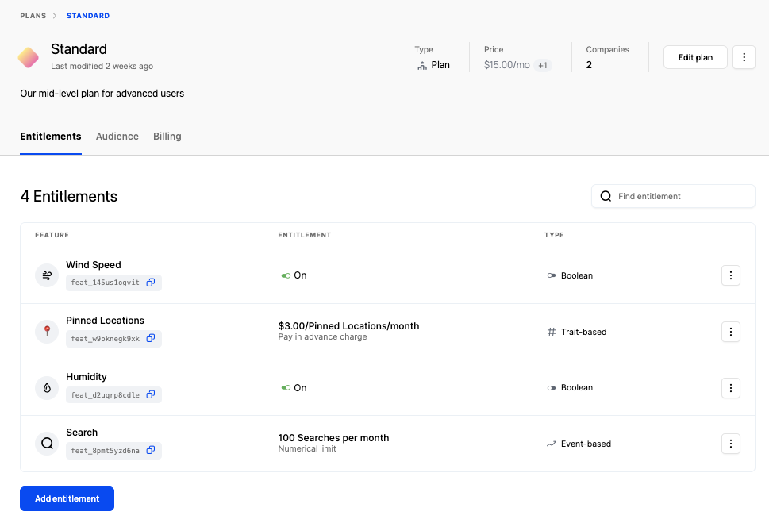

Entitlements represent the unique relationship between a plan (or add on) and a feature. Depending on what entitlements a company has and, in the case of a metered feature, their usage relative to a given limit, you can use Schematic's feature management capabilities to grant or revoke functionality in your application.

<Info>Read more about feature management in Schematic [here](/feature_management/overview)</Info>

Entitlements may be boolean or be metered, and there is no limit to the number entitlements in any given plan.

<Info>To learn more about how to set up metered features, refer to his [playbook](/playbooks/metering).</Info>

