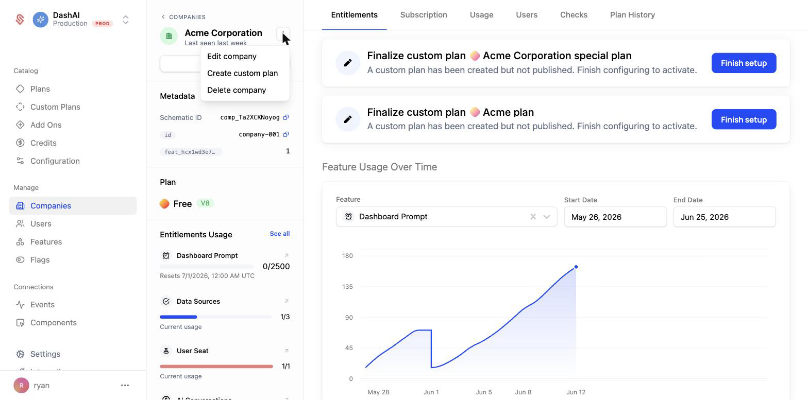
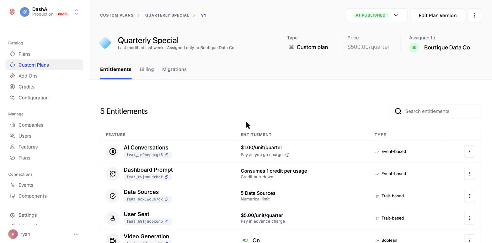
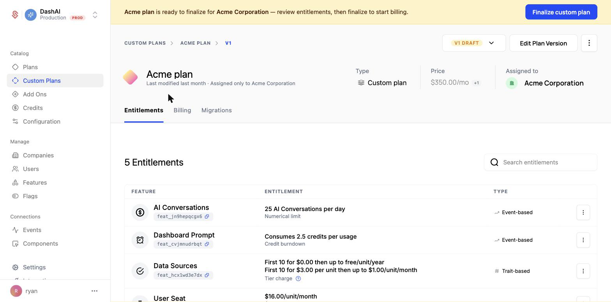
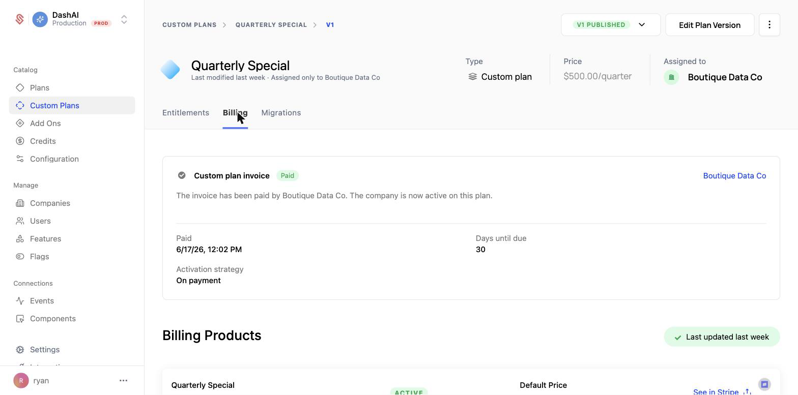

This guide walks through creating a [custom plan](/catalog/custom-plans) for a single company, the typical flow for a sales-led, invoiced deal. By the end, the company will have its own negotiated plan that activates once they pay the invoice.

Custom plans are best when one company needs pricing or packaging that differs from your standard catalog. If a change should apply to everyone, publish a [new plan version](/catalog/guides/plan-versions) instead. If you only need to adjust a single entitlement on top of a company's existing plan, use a [company override](/feature-management/overrides).

## Start a custom plan from the company

Open the company's profile page in Schematic. Near the company name, click the 3-dot menu and choose **Create custom plan**.

This creates a draft custom plan assigned only to this company. It does not affect any of your standard plans or other companies.

## Set up entitlements and pricing

With the draft open, build out the plan for this deal. You can add entitlements one at a time, or click **Duplicate from plan** to copy the entitlements from an existing standard plan and adjust them.

For each entitlement, choose the feature, how it is monetized, and the limits or price for this company. Set the plan's price to the negotiated amount.

## Finalize to start billing

While the plan is a draft, a banner reminds you that it is ready to finalize. Review the entitlements, then click **Finalize custom plan** to start billing.

Finalizing generates a custom plan invoice for the company. When you finalize, you choose an activation strategy that controls when the company gets access:

- **On payment** — the company becomes active on the plan once the invoice is paid, within the due window you set (for example, 30 days). Until then, the plan stays pending.
- **Immediately** — the company gets access to the plan right away, before paying. If they do not pay within the payment terms, access is removed.

Choose **On payment** when you want payment secured before granting access, and **Immediately** when you want the customer using the plan while the invoice is outstanding.

<Info>You can track the invoice status on the plan's **Billing** tab.</Info>

## Confirm activation

Once the customer pays, the **Billing** tab shows the invoice as paid and the company as active on the custom plan.

## Learn more

- [Custom Plans](/catalog/custom-plans) for how custom plans fit into the catalog
- [Managing Company Plans](/catalog/managing-company-plans) for the full set of ways to change a company's plan
