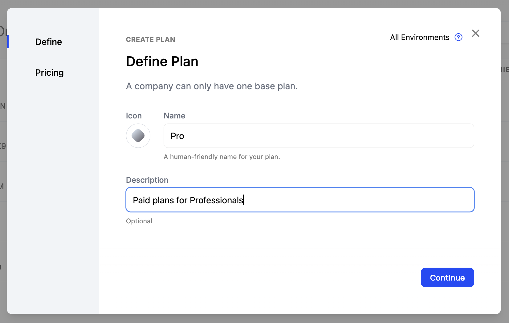
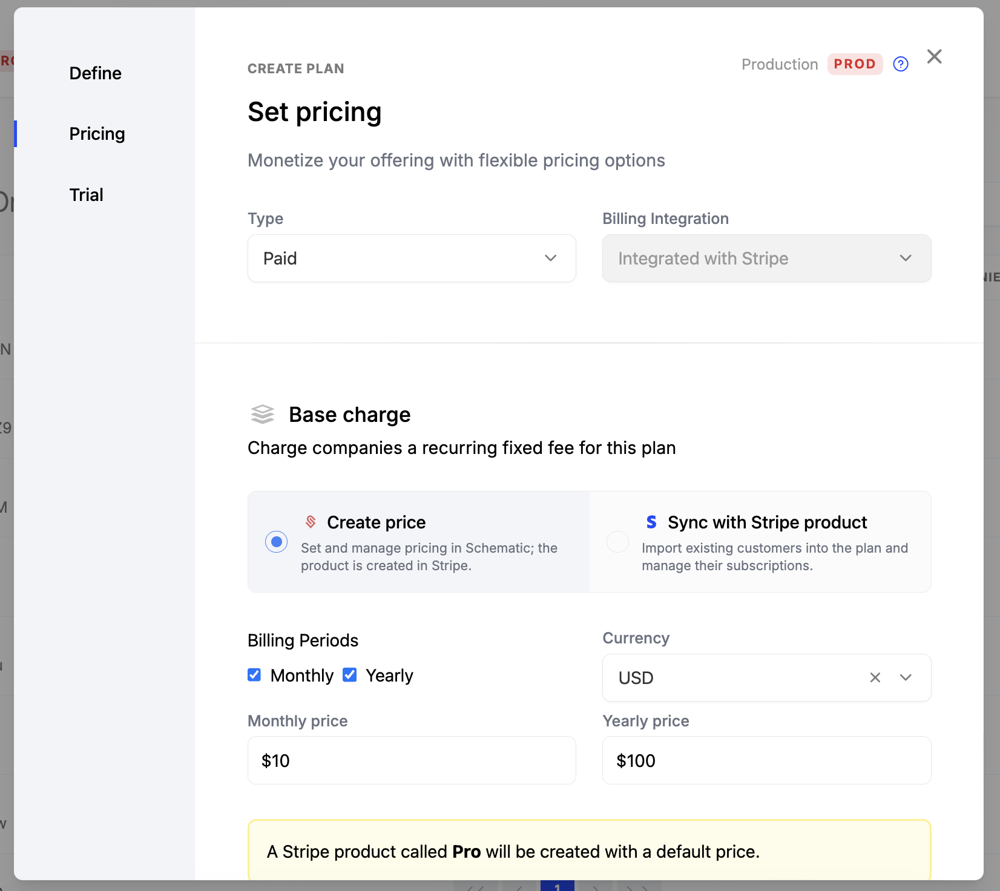
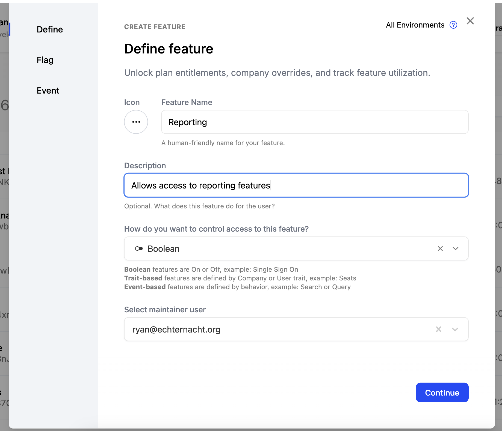
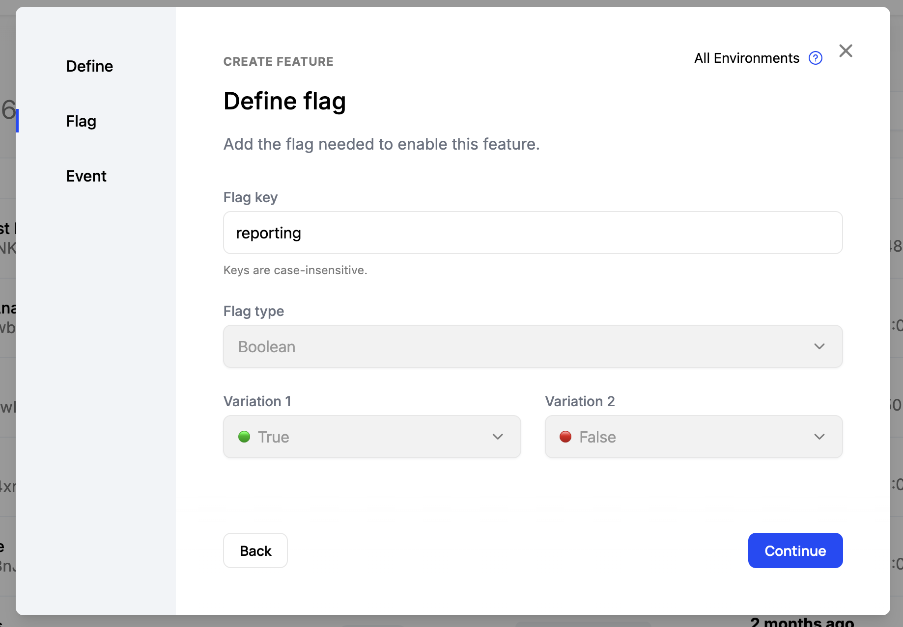
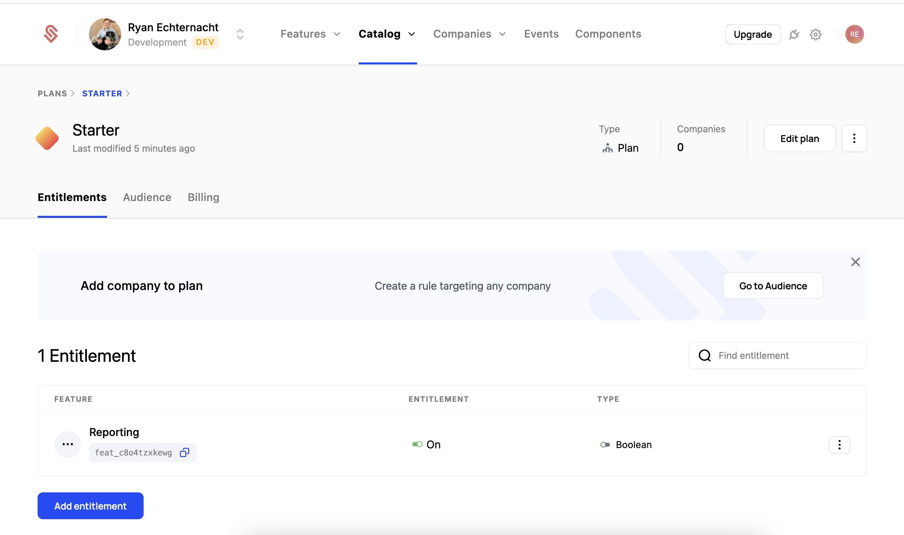
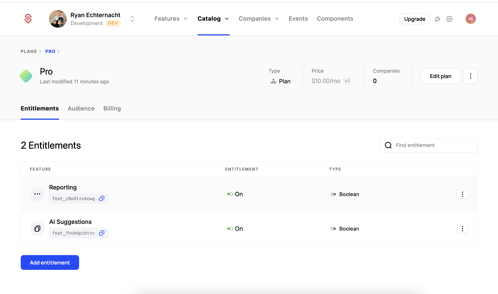

{/* 
video tutorial:
0. have stripe setup
1. create 2 plans
2. Add 2 features
- both boolean
3. Entitle those features to the plans
4. create component
5. show it not working
6. show company w/o plan
7. Add default plan
8. show company w/ default plan
9. show component working
10. add live plans
11. show component has "change plan" button and show checkout flow works */}

Schematic is able to support many different types of pricing models. This guide will walk through the process of setting up a basic pricing model with 2 plans (free and paid) and a few features. The goal is to walk through the process of setting up a basic pricing model in Schematic ending with a working checkout flow that your users can use. 

## Getting Started: Stripe

Before we get started, you should link your Stripe account to the Schematic environment. We recommend starting with a Sandbox Stripe account connected to your Dev Schematic environment for testing. 

For more details, see our [Stripe Integration Guide](/integrations/stripe-integration-guide).

## Setting up your Plans

Let's first setup 2 plans:

1. A free plan we'll call "Starter" which all new customers will start on. This will have access to some, but not all of the features we'll be creating. 
2. A paid plan we'll call "Pro" which will have access to all of the features we'll be creating.

### Creating the Starter Plan

To create a plan, navigate to the **Plans** tab in the Catalog and click the **Create Plan** button.

Set the name of the plan to "Starter", and click Continue.

Next, we'll leave this as a "Free" plan that is not integrated with Stripe. Click save to create the plan.

### Creating the Pro Plan

To create a plan, navigate to the **Plans** tab in the Catalog and click the **Create Plan** button.

Set the name of the plan to "Pro", and click Continue.

Next, we'll make this a "Paid" plan and link this it to Stripe. For this example, we'll create a new product in Stripe and new prices for monthly and yearly. 

<Info>You can also link this plan to an existing product and price in Stripe. For more info see our [Stripe Integration Guide](/integrations/stripe-integration-guide).</Info>

We'll skip setuping up a Trial for now. Click save to create the plan.

### Creating Features and Adding them to your plans

We'll create 2 features: 

1. A "Boolean" feature that we'll call "Reporting" which will allow our users to access reporting features. Both plans will have access to this feature.
2. A "Boolean" feature that we'll call "AI Suggestions" which will allow our users to access AI suggestions. Only the Pro plan will have access to this feature.

To create a feature, navigate to the **Features** tab in the Catalog and click the **Create Feature** button.

Set the name of the feature to "Reporting", and leave the feature type as "Boolean" and click Continue. A boolean feature is a feature that is either on or off.

Next, we'll set the flag key to "reporting" and then click "Continue". This is the key that will be used to reference this feature in your code. This value is prefilled using the name of the feature.

Finally, we don't need an event, so click "Save" to create the feature.

Now make a second feature called "AI Suggestions" and set the flag key to "ai-suggestions".

### Entitle Features to Plans

Next, we'll "entitle" these features to our plans. An "Entitlement" is the billing term for the features that a plan allows it's customers access to. 

First, go to the Starter plan and click the "Add Feature" button.

In the modal, select the "Reporting" feature and click "Continue". This will add the feature to the plan.

You're plan should now should the "Reporting" entitlement. 

Next, go to the "Pro" plan page and follow the same steps to add the "Reporting" and "AI Suggestions" features. It should look like this when you're finished.

### Configuring our Catalog

There are 2 step we want to take to make these plans available to our customers.

1. Set the "Starter" plan as the default plan for new customers. This will affect any customer without a plan currently (new and old). 
2. Add the "Pro" plan as a live plan. This will make it available to customers to upgrade to.

To start, open the Configuration tab of the plans section (Plans > Configuration). Set the Default Plan to be "Starter" near the top of the page. Next, add the "Pro" plan to the Live Plans list. Finally, you'll need to click "Save" in the top right of the screen to apply the changes.

### Confirming with a component

If you have the customer portal setup in your application, you can confirm that the plans are working by navigating to the customer portal and checking the plan you're on. It should look like this, with the "Starter" plan selected and the "Change Plan" button visible.

If you haven't set components yet, you can also see this in the compoennt builder. Make sure to select one of your Starter plan companies from the dropdown at the top. 

<Info>You can learn more about the customer portal in our [Customer Portal](/components/customer-portal) guide.</Info>
