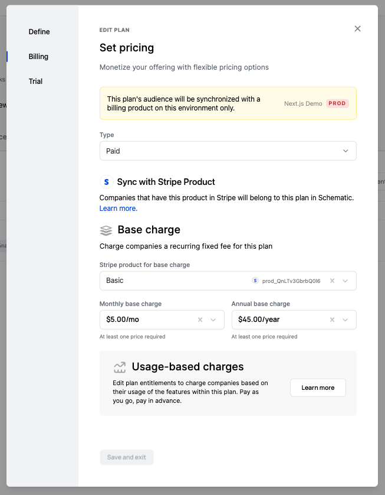
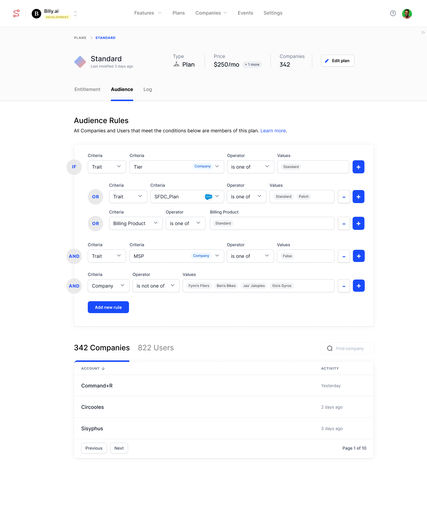
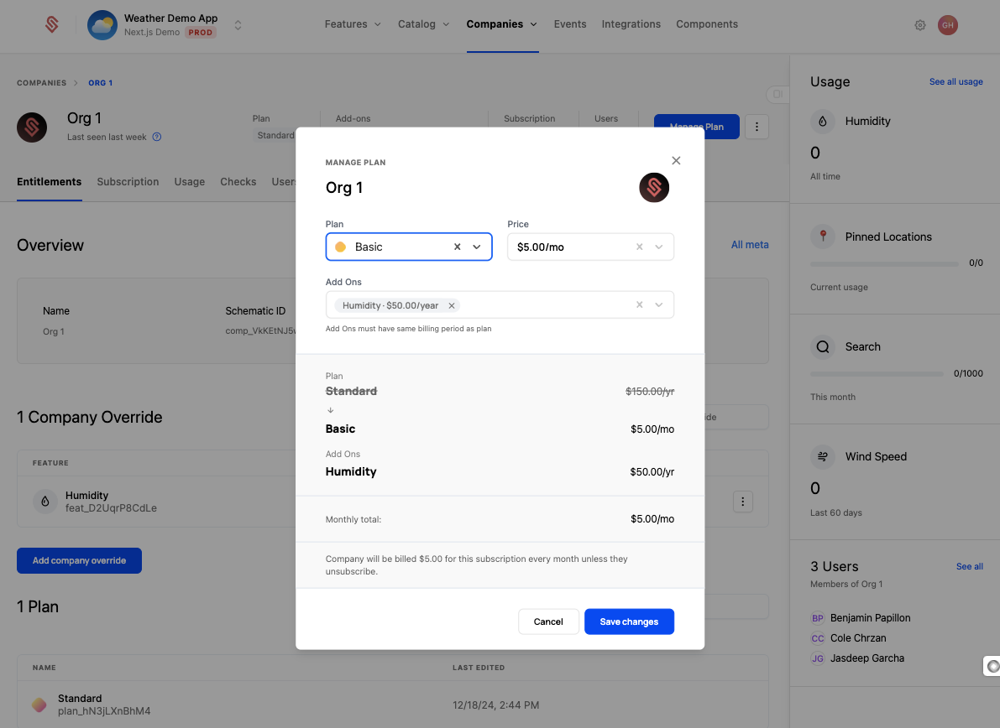
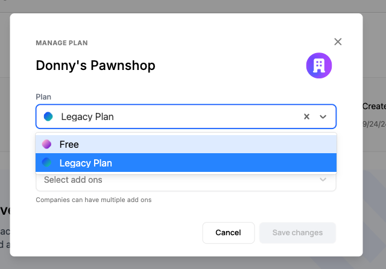
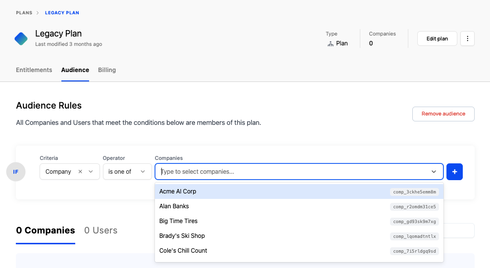
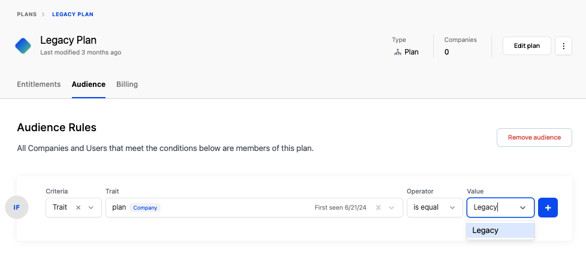

Assigning company plans in Schematic allows you to define the features, limits, and pricing available to each of your customers. 

This guide walks you through the ways to assign plans to companies, manage plan changes, and ensure your customers have the right access at the right time.

## Ways to assign plans to companies

### Stripe integration (recommended)

When integrated with Stripe, Schematic automatically syncs products and subscriptions for each of your customers (read more [here](/integrations/stripe)). This allows you to:
- Link Stripe subscriptions directly to Schematic plans.
- Automatically update company access based on subscription changes in Stripe.
- Use Stripe’s billing capabilities while leveraging Schematic for subscription and feature management.

Simply mapping a Stripe product to a Schematic plan will ensure that those that have a subscription with the mapped product will be assigned the corresponding plan in Schematic.

### Plan audiences (advanced)

Plan audiences allow you to assign plans to companies based on specific rules. Those rules can be based on explicit targeting (e.g. a specific company) or implicit targeting (e.g. based on traits, usage, or billing products).

We offer this option if you have a billing set up that does not include Stripe, or one that includes multiple systems and more complex state management. Examples where plan audiences may be appropriate include:
- A legacy plan that is a catch-all of products.
- Offering different versions of a plan based on sales channel (e.g. sold via a reseller), geography, or other traits.
- Multiple billing or GTM systems supply subscription information

## Changing Plans

How plans are managed in Schematic depends on whether you've integrated Stripe or not.

### Using Stripe

If you've integrated Stripe, Schematic offers several ways to handle plan changes:

**On the company profile page in Schematic**

You can manage a company's plan directly on the company profile page in Scehmatic. These changes automatically sync with Stripe to update a company's subscsription.

<Info>You currently are not able to move a company from a Stripe-associated plan to a plan that is not associated with a Stripe product.</Info>

**Self-service components**

By embedding Schematic components in your application, you can allow your users to manage plans and add ons independently. Read more about components [here](/components/overview). Any changes made via a component will automatically sync with Stripe.

Components allow users to:
- Upgrade or downgrade plans
- Add or remove add-ons
- Manage quantity for usage-based features

**Within Stripe**

If you prefer to make changes directly in Stripe, Schematic will automatically sync those updates and update plans, add ons, and entitlements.

### Not using Stripe

If you’re not using Stripe or are otherwise using plan audiences, there are a few options.

**On the company profile page in Schematic**

You can manage a company's plan directly on the company profile page in Scehmatic. 

<Info>You currently are not able to move a company from a plan that is not associated with a Stripe product to a Stripe-associated plan.</Info>

**Explicit company assignment using plan audience rules**

Manually update plan audience rules to assign a new plan to a company. This is ideal for:
- Testing
- Managing exceptions or unique customer requirements

**Updating company traits to match audience rules**

You can uses traits to explicitly assign companies to plans. If you update those traits, you can add or remove a company from a plan. 

For example:
- Adding custom attributes that correspond to explicit plan assigments (e.g. a Plan trait that has values for legacy, basic, standard, and pro)
- Updating a company's usage or attributes so they move into a new plan based on that attribute (e.g. a Geography trait)
