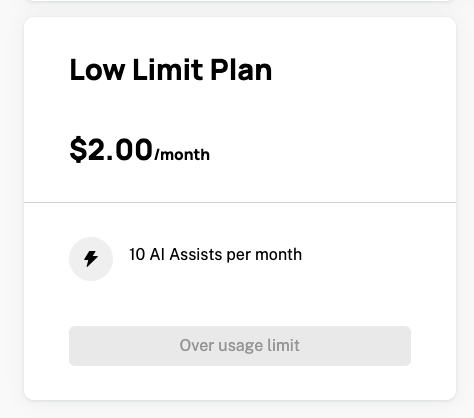
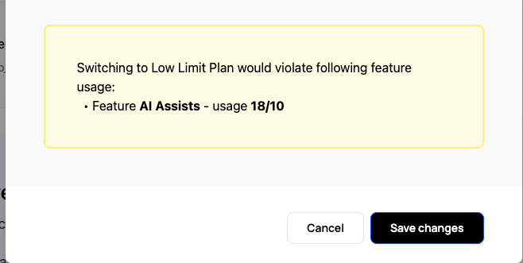
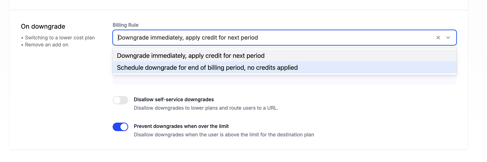
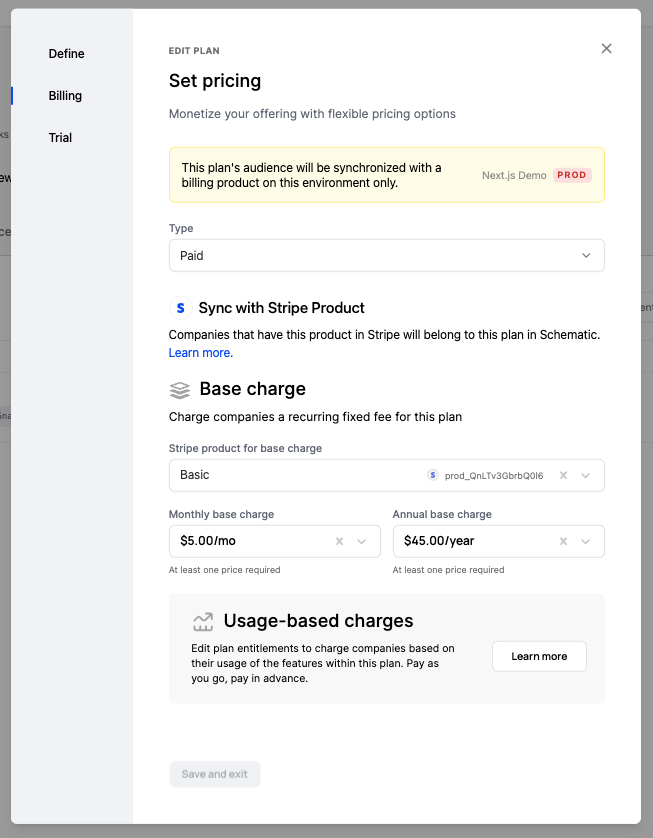
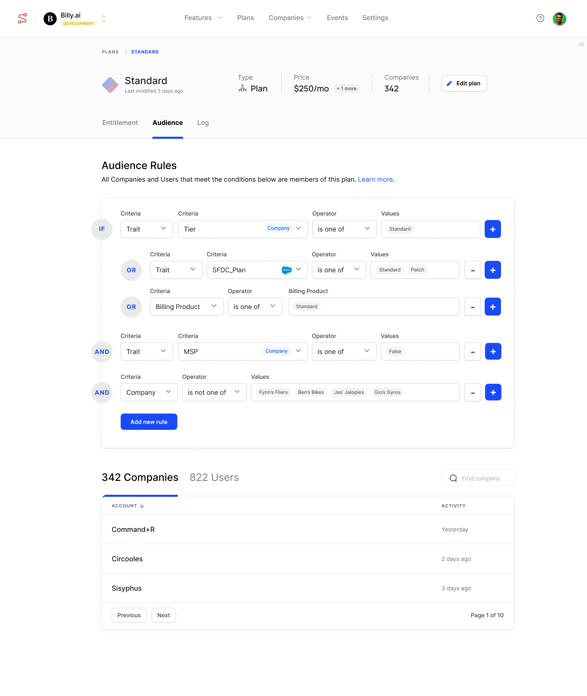
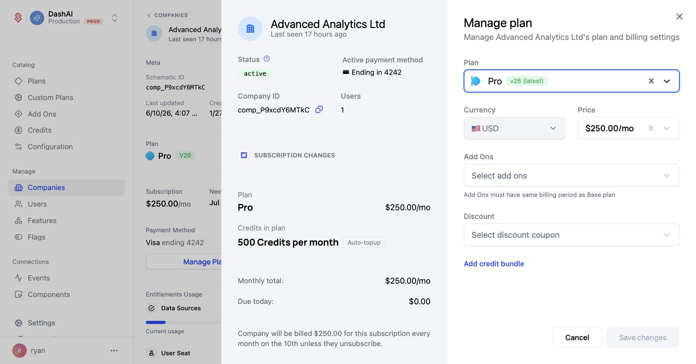
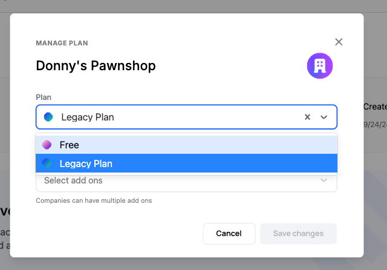
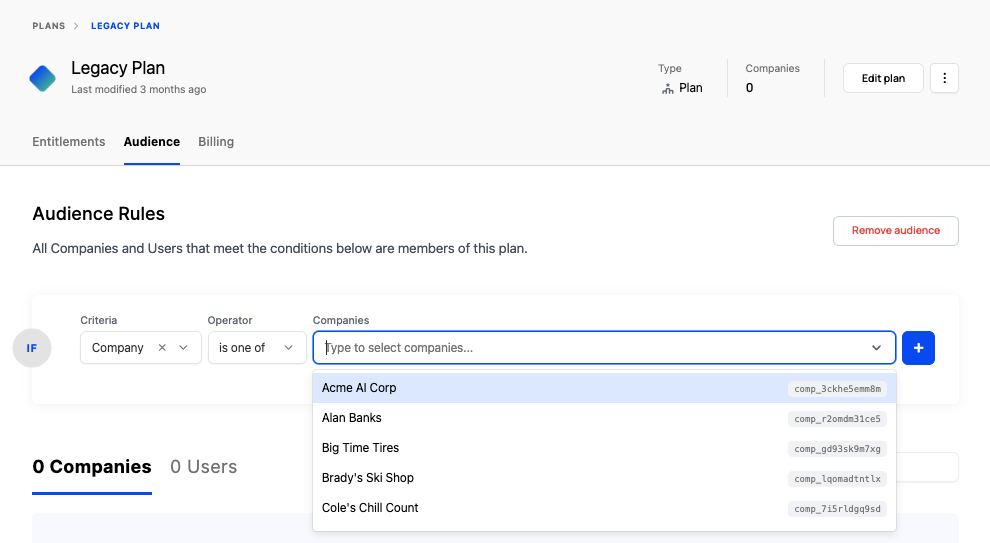
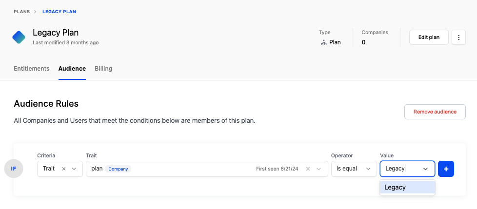

Assigning company plans in Schematic allows you to define the features, limits, and pricing available to each of your customers. 

This doc covers
- [Company initiated plan changes](#company-initiated-plan-changes)
- [Automatically assigning plans to companies](#ways-to-assign-plans-to-companies)
- [Manually changing a company's plan](#changing-plans)

## Company initiated plan changes

When a company changes plans, whether an upgrade or a downgrade, Schematic automatically updates the company's entitlements, usage limits, and billing status in Stripe (if applicable). Downgrades can be applied immediately or [scheduled for the end of the billing period](#scheduled-downgrades). Plan changes can occur from a few different sources -- in all cases, the steps Schematic takes are the same. The possible reasons for a plan change are:

- The customer goes through a checkout flow via the Schematic Customer Portal Component
- You update a company's plan via the Schematic App using the "Manage Plan" button
- A customer's trial period ends, and they are converted to the default plan
- A customer fails to pay their bill, their subscription is marked `unpaid` in Stripe, and they are downgraded to the default plan

### Plan Change Basics

Whenever a plan changes, Schematic will automatically update the company's entitlements and usage limits. Accrued usage is fully preserved. All company overrides are preserved and re-applied. If a company override is less generous than the current plan entitlement, the more generous amount will be applied. 

Schematic prevents companies from downgrading to a plan if they will be over the usage limits of the new plan. 

Using the "Manage Plan" button in the Schematic App, you are able to downgrade a company to a plan even if they are over the usage limits of the new plan. This will display a warning:

### Stripe-Linked Plans

Stripe-linked plans have additional considerations concerning how usage based charges are synced to Stripe. 

### Upgrade vs. Downgrades

For Stripe-linked plans, Schematic handles upgrades and downgrades differently. A plan change is considered an upgrade if the new plan has a higher base price (or the same base price) as the current plan. A downgrade is considered a plan change to a plan with a lower base price.

### Upgrade/Downgrade logic

When determining if a plan change is an upgrade or downgrade, the following logic is used. Below are the steps for determining if a change is an upgrade, whereas the inverse is considered a downgrade.

1. Both plans need to be paid (otherwise it's a sunbscribe/unsubscribe)
2. If the new plan has a longer billing period (e.g. monthly -> yearly), it's an upgrade.
3. If the new plan has a higher base price, it's an upgrade.
4. If the new plan includes a new add on, it's an upgrade.
5. If the new plan includes more Pay-in-advance usage (typically representing user seats), it's an upgrade.
6. If the new plan includes the purchase of a credit bundle, it's an upgrade.

### Period Changes 

When a company upgrades to a new plan, Schematic will maintain the current billing period (e.g. if you are 15 days into your billing period, you will remain on day 15 after the upgrade). 

However, if the plan change is a downgrade, Schematic will reset the billing period (e.g. the new plan will start on day 1 of the new billing period). If [scheduled downgrades](#scheduled-downgrades) are enabled, the downgrade is deferred to the end of the current billing period and the customer retains access to their current plan until then.

### Proration

Additionally, when changing plans, Schematic will use Stripe's proration logic to refund the remaining **base** cost of the current plan and the **base** cost of the new plan. These costs are presented to the user during the checkout flow or to you while using the "Manage Plan" button in the Schematic App.

For usage-based features, Schematic will carry over usage from the current plan to the new plan.

### Preventing Downgrades

Schematic allows you to prevent customers from downgrading to a plan if they are over the usage limits of the new plan. This is configured in the Catalog configuration tab and is turned on by default.

Additionally, you can require customers reach out to you before they can downgrade to a plan (preventing self-service downgrades). This is configured in the Catalog configuration tab and is turned off by default.

### Scheduled Downgrades

If this setting is selected, when a customer downgrades their plan, the downgrade is scheduled for the end of the current billing period rather than applied immediately. The customer retains full access to their current plan until the billing period ends, and no proration or credits are applied.

This behavior is controlled by the setting under the **On downgrade** section of the Catalog configuration tab. The available options are:

- **Schedule downgrade for end of billing period, no credits applied**  — The downgrade takes effect at the end of the current billing period. The customer keeps their current entitlements until then.
- **Downgrade immediately, apply credit for next period** (default) — The downgrade is applied immediately and the customer receives a prorated credit for the remainder of their billing period.

Under the hood, scheduled downgrades use Stripe's [subscription schedule](https://docs.stripe.com/billing/subscriptions/subscription-schedules) phases to ensure the plan transition happens precisely at the billing period boundary.

#### Behavior while a downgrade is scheduled

While a downgrade is scheduled, the customer continues to use their current plan with full access to all entitlements. However, certain actions are blocked until the downgrade takes effect or is canceled:

- **Add-on purchases** are blocked
- **Pay-in-advance purchases** (e.g. seats) are blocked
- **Credit purchases** are blocked

These restrictions ensure the customer's subscription remains in a consistent state leading into the scheduled plan change. However, the customer can always cancel the downgrade at any time via the component and then do any action.

#### Canceling a scheduled downgrade

A scheduled downgrade can be canceled if the customer resubscribes to a paid plan or upgrades before the billing period ends. When this happens, the scheduled downgrade is removed and the customer's subscription continues as normal.

This guide walks you through the ways to assign plans to companies, manage plan changes, and ensure your customers have the right access at the right time.

## Ways to assign plans to companies

Additionally, you can control which plan a company is on directly.

### Stripe integration (recommended)

When integrated with Stripe, Schematic automatically syncs products and subscriptions for each of your customers (read more [here](/integrations/stripe)). This allows you to:
- Link Stripe subscriptions directly to Schematic plans.
- Automatically update company access based on subscription changes in Stripe.
- Use Stripe's billing capabilities while leveraging Schematic for subscription and feature management.

Simply mapping a Stripe product to a Schematic plan will ensure that those that have a subscription with the mapped product will be assigned the corresponding plan in Schematic.

### Plan audiences (advanced)

Plan audiences allow you to assign plans to companies based on specific rules. Those rules can be based on explicit targeting (e.g. a specific company) or implicit targeting (e.g. based on traits, usage, or billing products).

We offer this option if you have a billing set up that does not include Stripe, or one that includes multiple systems and more complex state management. Examples where plan audiences may be appropriate include:
- A legacy plan that is a catch-all of products.
- Offering different versions of a plan based on sales channel (e.g. sold via a reseller), geography, or other traits.
- Multiple billing or GTM systems supply subscription information

## Changing Plans

How plans are managed in Schematic depends on whether you've integrated Stripe or not.

### Using Stripe

If you've integrated Stripe, Schematic offers several ways to handle plan changes:

**On the company profile page in Schematic**

You can manage a company's plan directly on the company profile page in Schematic. These changes automatically sync with Stripe to update a company's subscsription.

<Info>If you're having trouble, see the [Stripe FAQ](/integrations/stripe-troubleshooting) for more information.</Info>

**Self-service components**

By embedding Schematic components in your application, you can allow your users to manage plans and add ons independently. Read more about components [here](/components/overview). Any changes made via a component will automatically sync with Stripe.

Components allow users to:
- Upgrade or downgrade plans
- Add or remove add ons
- Manage quantity for usage-based features

**Within Stripe**

If you prefer to make changes directly in Stripe, Schematic will automatically sync those updates and update plans, add ons, and entitlements.

### Not using Stripe

If you're not using Stripe or are otherwise using plan audiences, there are a few options.

**On the company profile page in Schematic**

You can manage a company's plan directly on the company profile page in Schematic. 

<Info>You currently are not able to move a company from a plan that is not associated with a Stripe product to a Stripe-associated plan.</Info>

**Explicit company assignment using plan audience rules**

Manually update plan audience rules to assign a new plan to a company. This is ideal for:
- Testing
- Managing exceptions or unique customer requirements

**Updating company traits to match audience rules**

You can uses traits to explicitly assign companies to plans. If you update those traits, you can add or remove a company from a plan. 

For example:
- Adding custom attributes that correspond to explicit plan assigments (e.g. a Plan trait that has values for legacy, basic, standard, and pro)
- Updating a company's usage or attributes so they move into a new plan based on that attribute (e.g. a Geography trait)
