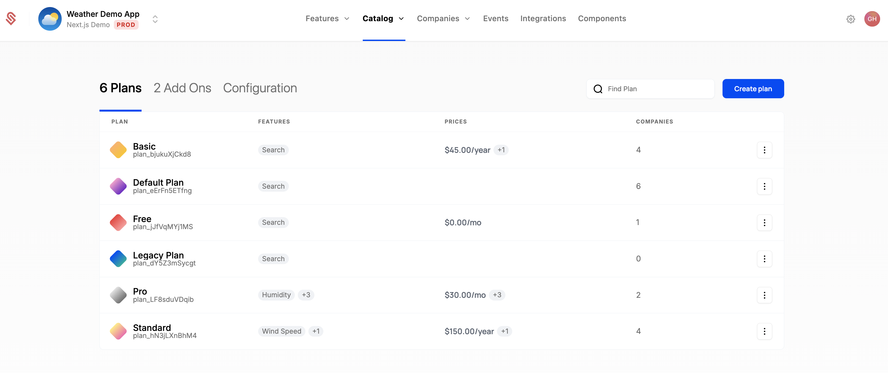

The Catalog in Schematic is where plans and add ons are defined, including their entitlements and subscription lifecycle.

You can also associate Catalog items to Stripe products directly to:
- Synchronize company subscriptions between the products
- Automatically provision entitlements in your application when a subscription is updated
- Enable billing elements in Schematic Components, including to power checkout, subscription management (invoices, payment method, upgrade, downgrade, expand), and cancellation

