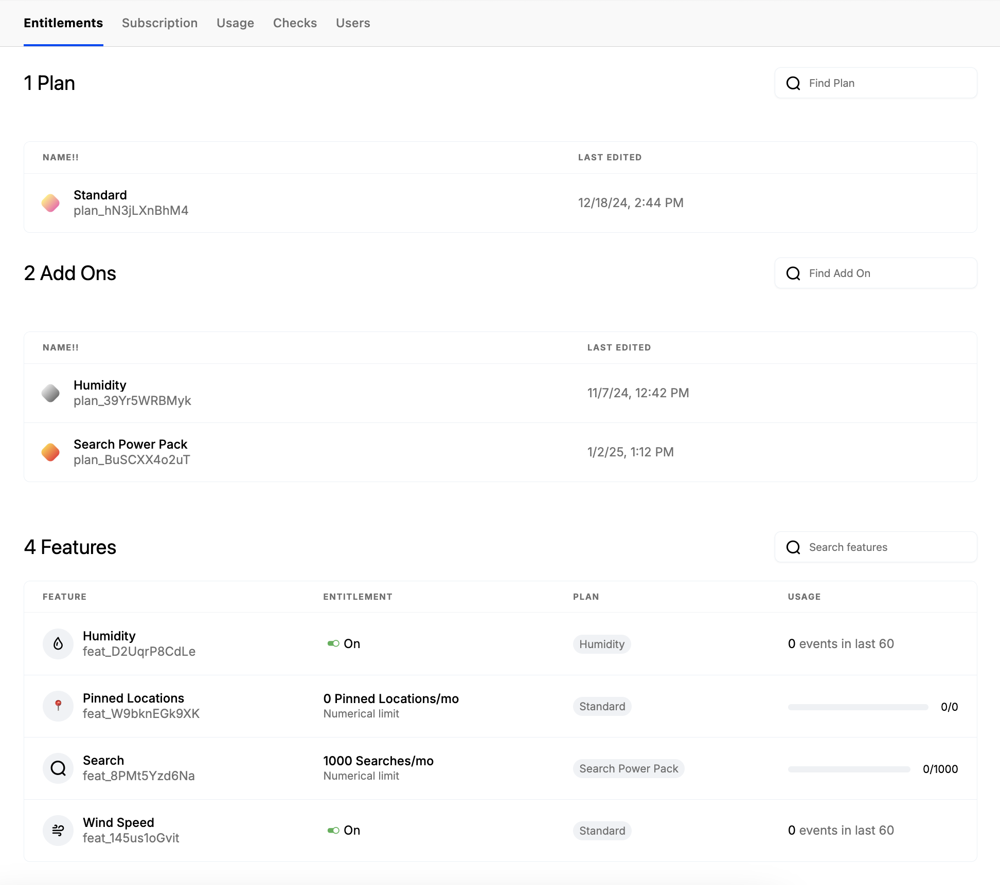
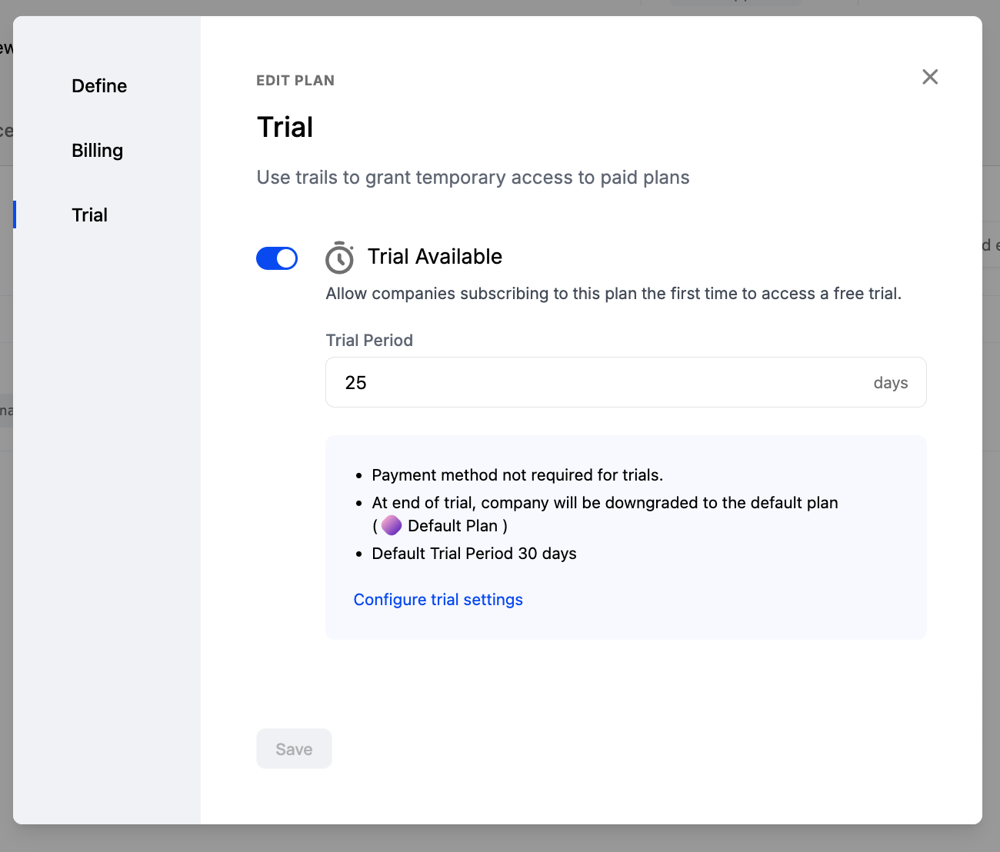

## Overview

The Catalog in Schematic is where plans and add ons are defined, including their entitlements and subscription lifecycle.

You can also associate Catalog items to Stripe products directly to:
- Synchronize company subscriptions between the products
- Automatically provision entitlements in your application when a subscription is updated
- Enable billing elements in Schematic Components, including to power checkout, subscription management (invoices, payment method, upgrade, downgrade, expand), and cancellation

## Terminology

### Plans

A plan in Schematic represents the base billing and entitlement configuration for a given company. For example, if you offer Basic, Standard, and Pro packaging, these would represent mutually exclusive Plans in Schematic.

Schematic limits companies to only 1 plan at a time.

There are two options that can be defined with each plan - billing and the trial period

**Billing**

Defining billing in Schematic functionally is mapping Stripe products to Schematic plans.

If you do define billing, those that have a Stripe subscription with the mapped product will be assigned the corresponding plan in Schematic. Moreover, if a company changes plans via Schematic (either via Schematic admin options or via in-app [components](https://docs.schematichq.com/components/overview)), the Stripe subscription will be updated accordingly.

Defining billing is optional -- you can define a plan in Schematic that is not linked to Stripe billing at all. In that case, you can indepedently manage plan membership and how companies are charged.

**Trial**

When a trial period is defined for a plan, Schematic will ensure that the company receives the corresponding entitlements for that period the first time they are assigned that plan. You can configure whether payment is required up front or not.

### Add Ons

Add Ons are additional modules or packages that can be added to a base plan. Each add on can be 

There are a number of scenarios where you may want to support an Add On, and the most common scenario is that you sell additional functionality that increases the value of your core plans (e.g. Zoom Workplace).

### Entitlements

