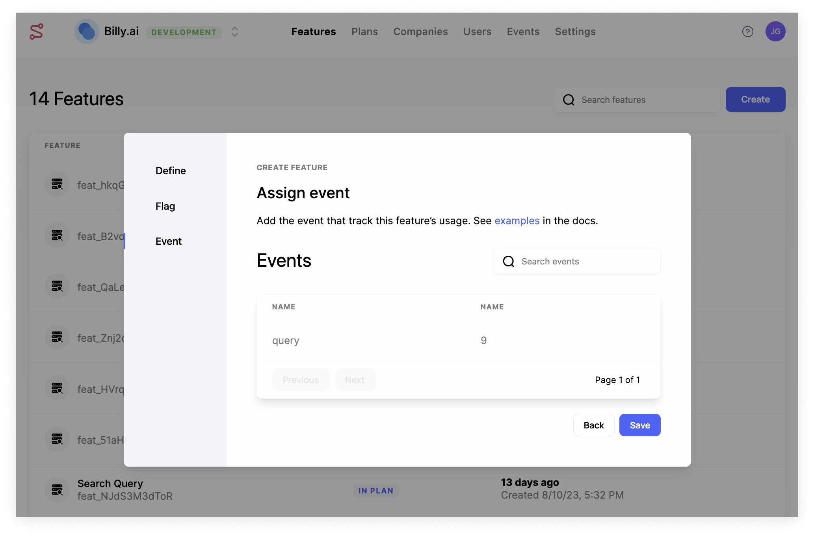
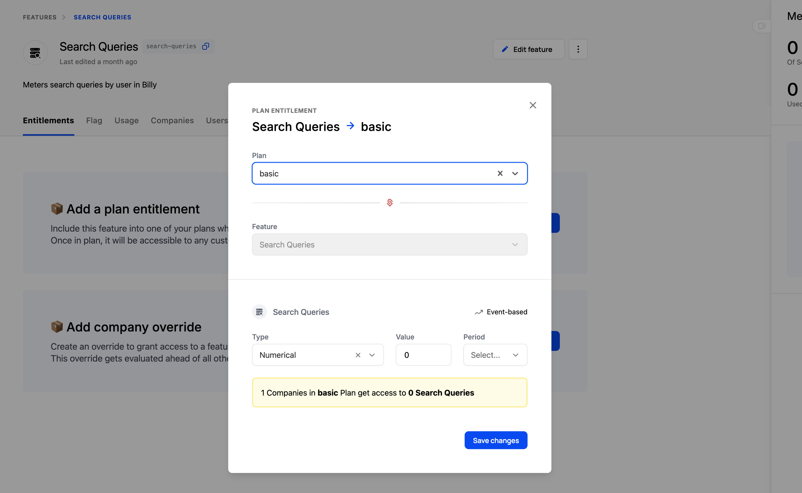

## Overview

The Catalog in Schematic includes all of the offerings in your application — including Plans and Add ons. The Catalog also enumerates entitlements for each of your offerings, including default values for limits and pricing.

Companies that are associated with any item from the Catalog will be assigned the corresponding default entitlements. 

You can also associate Catalog items to Stripe products to:
- Synchronize company subscriptions
- Automatically provision entitlements in your application when subscription is updated
- Enable billing elements in Schematic Components, including power checkout, subscription management (invoices, payment method, upgrade, downgrade, expand), and cancellation that will sync directly to Stripe to update subscriptions

## Plans vs. Add ons

Plans and Add ons are separate concepts in Schematic.

Companies can only have 1 Plan, but they can have any number of Add ons with distinct entitlements.

There are a number of scenarios where you may want to support an Add On, and the most common scenario is that you sell additional functionality that increases the value of your core plans (e.g. Zoom Workplace).

## Creating a Catalog Item

The following steps are valid for Plans and Add ons.

### Creating a Plan

1. Navigate to **Catalog** and click “Create”
2. Add name and a description

3. In the Billing step, link the Schematic Plan to a Stripe Product
    a. Select the Stripe Product that reflects the Schematic Plan. Companies that have active Stripe subscriptions with the mapped product will automatically become a member of the Schematic Plan.

4. Once the Plan is created, click the Audience tab and verify the Audience rule and corresponding Companies that have been associated to the Plan.

<Info>Linking Schematic Plans to Stripe Products is optional, but allows Schematic to ensure both products are synchronized in terms of metadata and company assignment. Alternatively, you can set up your own targeting rules based on company attributes or usage. Here’s an [**example**](https://docs.schematichq.com/playbooks/rollout).</Info>

### **Setting up Features and Entitlements**

Let’s add one feature to Schematic and entitle it to your plan.

1. Navigate to **Features** and click “Create”.
2. In the modal, add a name, description, and pick the event-based feature type. Click “Continue”.

You can choose between Boolean, Event-based, or Trait-based feature types.

3. Define a flag key.
    a. You’ll use this `key` in your application to reference this feature.

4. Attach an event to the feature. Add the `query` event to meter the feature and measure feature usage (if it doesn’t exist already, create it).

5. Once the feature is created, click ”Add plan entitlement” to add an entitlement and specify the limit for Search Query for a given plan.

<Info>Event-based features can have no limit, some numerical limit that is static within a period, or a limit that is dynamic based on traits that exist at the company level. Read more [**here**](https://docs.schematichq.com/playbooks/metering#entitlement-options).</Info>

<Info>You’ll need to make sure to send usage events to Schematic to track feature utilization as it occurs. Read more [**here**](https://docs.schematichq.com/playbooks/metering#setting-up-an-event-based-metered-feature).</Info>