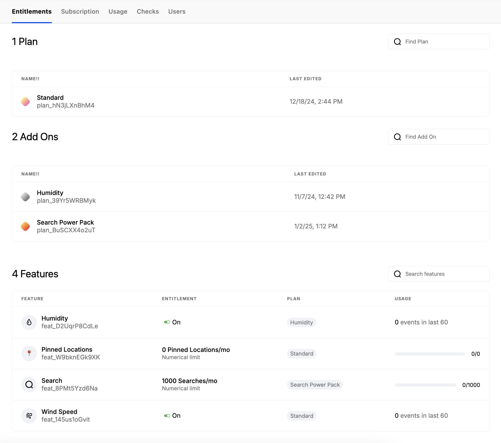
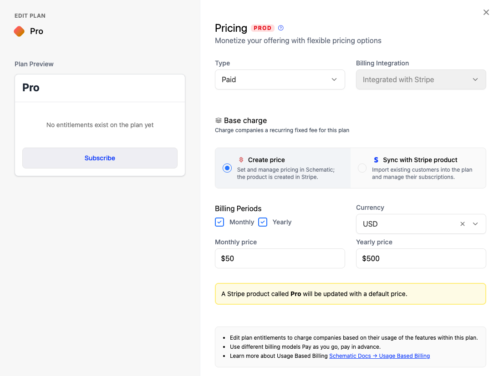
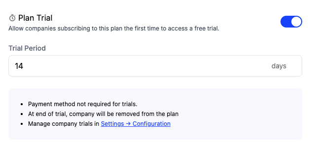
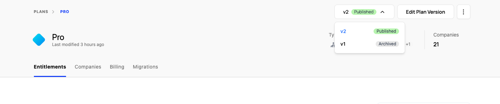
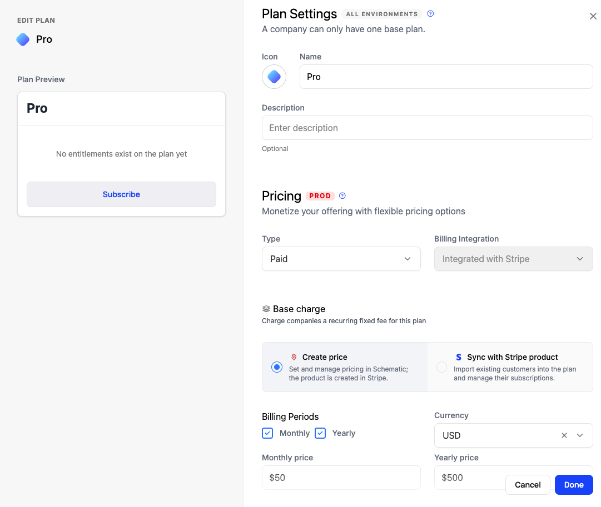
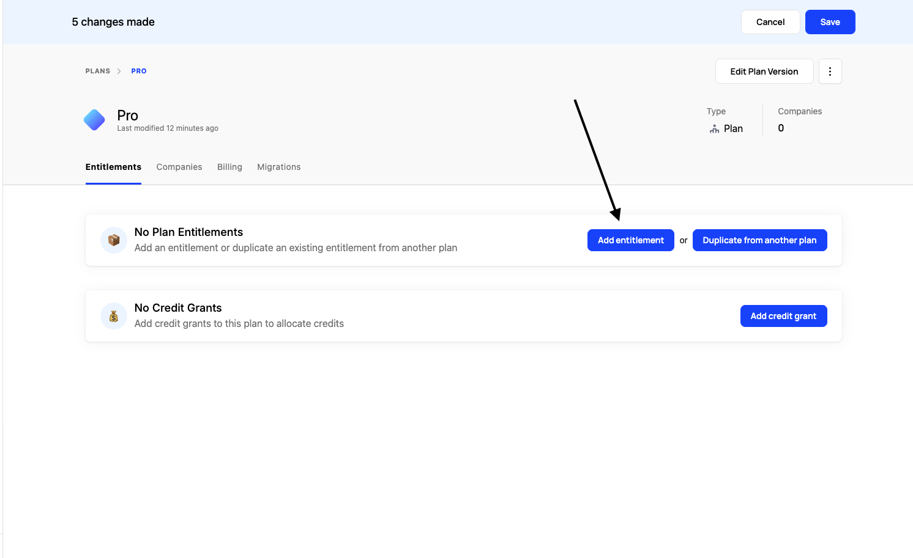
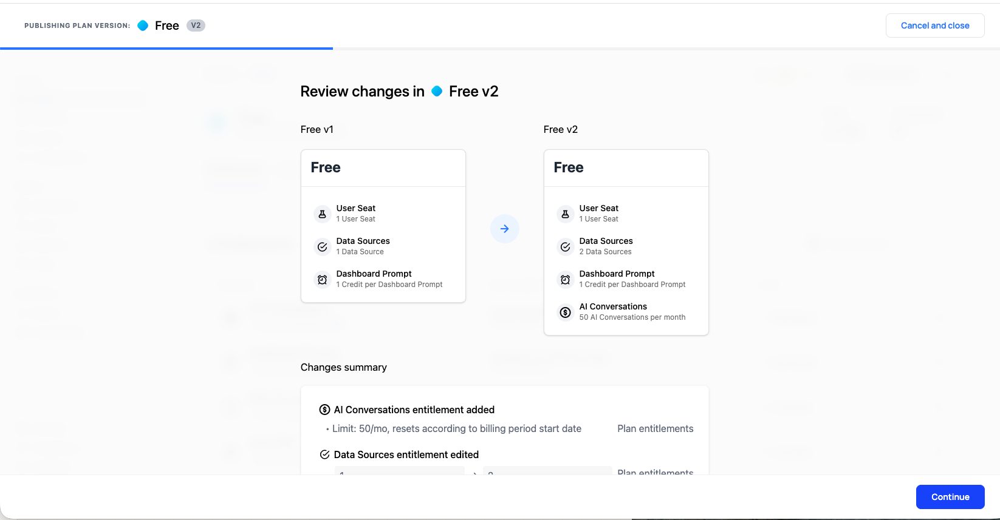
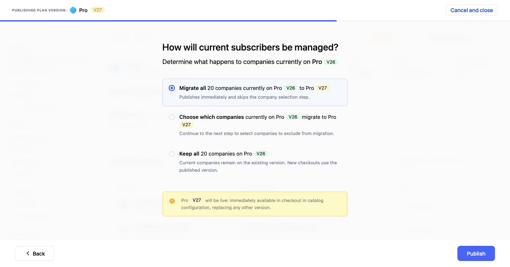
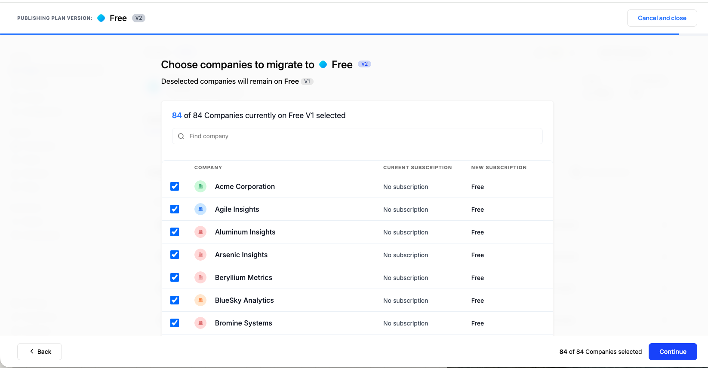
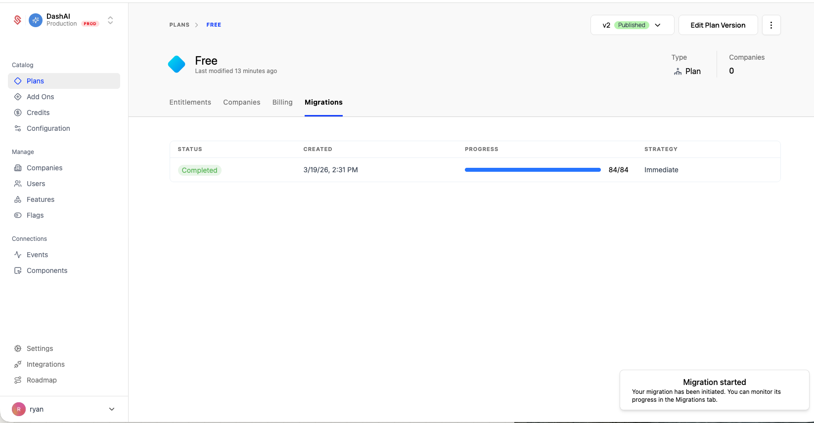

A plan in Schematic represents the base billing and entitlement configuration for a given company. For example, if you offer Basic, Standard, and Pro packaging, these would represent mutually exclusive Plans in Schematic.

Schematic limits companies to only 1 plan at a time. For a step-by-step guide about creating a plan in Schematic, click [here](/catalog/create-catalog). To learn how to assign companies to plans, click [here](/catalog/managing-company-plans)

There are two options that can be defined with each plan - billing and the trial period:

### Billing

Defining billing in Schematic functionally maps Stripe products to Schematic plans.

If you do define billing, those that have a Stripe subscription with the mapped product will be assigned the corresponding plan in Schematic. Moreover, if a company changes plans via Schematic (either via Schematic admin options or via in-app [components](https://docs.schematichq.com/components/overview)), the Stripe subscription will be updated accordingly.

Defining billing is optional -- you can define a plan in Schematic that is not linked to Stripe billing at all. In that case, you can indepedently manage plan membership and how companies are charged.

### Trial

When a trial period is defined for a plan, Schematic will ensure that the company receives the corresponding entitlements for that period the first time they are assigned that plan. You can configure whether payment is required up front or not -- if it is required, the company will convert into the corresponding paid plan automatically; if not, they will downgrade to your default plan.

### Plan Versions

Plans in Schematic are versioned to better support a range of common monetization scenarios. Plan versions make it easy to support both larger plan iterations (e.g. annual pricing changes) as well as short term pricing experiments. 

More details can be found in 

#### Plan Version Migrations

When migrating to a new plan version, you will be able to determine what happens to customers on the old verison. You can:
- Migrate all customers to the new plan version
- Leave all customers on the legacy plan version
- Migrate some customers, while leaving others on the legacy plan version

## Create a plan

1. Navigate to the Plans page and click "Create Plan" in the upper right corner
2. Add name and a description
3. In the Billing step, choose whether the plan is Free or Paid
4. Set the billing integration to be "Integrated with Stripe"

<Warning>Plans that are not integrated with Stripe are limited in many ways, such as no access to trials, limited access to usage based entitlements, and aren't supported in our checkout flow.</Warning>

5. If integrated with Stripe, you can choose to Sync with an existing Stripe product.

<Info>This is optional, but can be helpful if you have a well built plan setup in Stripe already. Companies imported from Stripe subscribed to this product will automatically be assigned this plan in Schematic.</Info>

6. Optionally, configure trial information if you choose.
7. Click "Done" in the lower righthand corner

### Adding Entitlements

Before we save our plan, let's add an entitlement. 

<Note>If you have a similar existing plan, you could instead duplicate those entitlements into this plan. You can still add new entitlements as well as edit/delete the duplicated ones to finish setting up your plan</Note>

To setup, an entitlement, you'll need to
1. Select which feature you want to use
2. Determine how you'll monetize the feature. 
3. Configure the monetization details

<Note>This will be different for each monetization type</Note>

4. Save the Entitlement. 

When you're done adding entitlements, click "Save" in the top right to finalize the plan.

## Creating a new plan version

Any edit made to a plan, whether an entitlement change or a change to the plan itself (e.g. name or price), will create a new plan version in a draft state. You can continue editing the draft until you are ready to publish. 

When you are ready to publish the new version, click the "Publish" button in the top right hand corner. From here you'll enter the publishing flow. 

### Review changes to the plan

The first step will let you review changes to the plan. First, you can see a summarized view of the entitltement changes. Then, further down you can see a full list of changes. 

Once you have published the new plan version, this will be the version shown in components for customers to purchase. It is not possible to checkout onto an old plan version (companies are allowed to remain on prior versions). 

### Subscriber Migration

The next page determines how current subscribers will be migrated. When a customer is migrated to the new plan version, their entitlement limits and plan price will be automatically updated to the new version (prorations will occur for price changes). If a company is not migrated, it will maintain it's current entitlements and prices and can be migrated at a later date (or not at all). 

If you do not want to migrate any companies to the new version, select the bottom option.

If you wish to migrate some or all companies to the new version, select the top option. This will then bring you to a screen that will let you customize which companies will be migrated to the new plan version. Non-selected companies will stay on their current plan version. 

When you're done you can check the progress of the migration on the "Migrations" tab on the plan page. 

