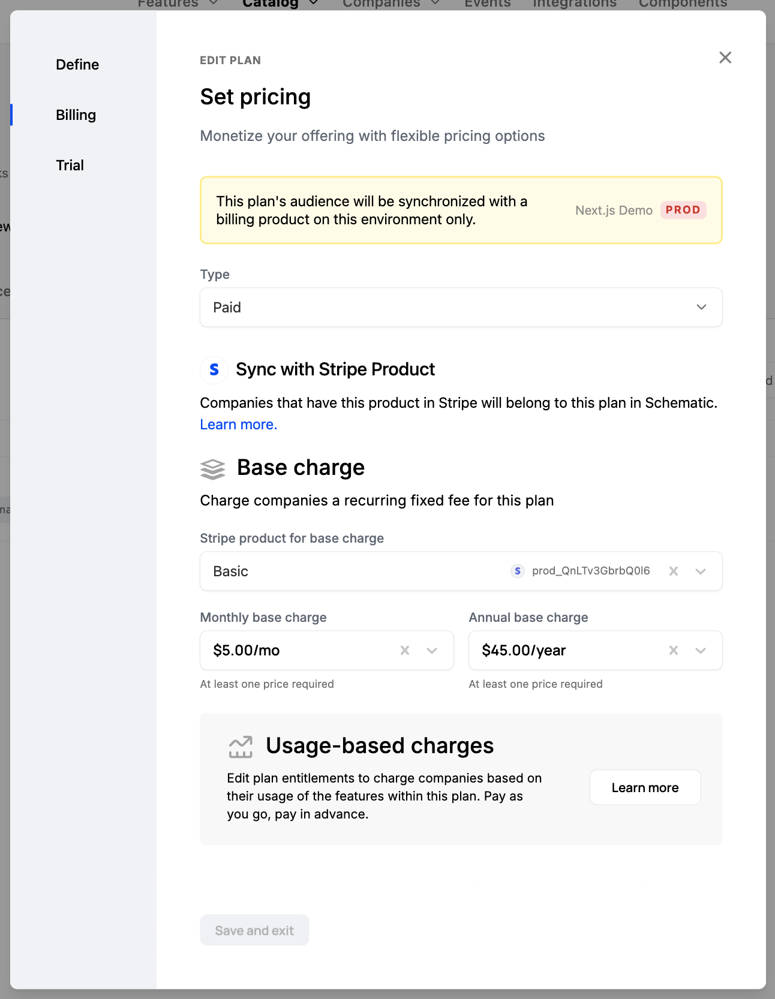

A plan in Schematic represents the base billing and entitlement configuration for a given company. For example, if you offer Basic, Standard, and Pro packaging, these would represent mutually exclusive Plans in Schematic.

Schematic limits companies to only 1 plan at a time. For a step-by-step guide about creating a plan in Schematic, click [here](/catalog/create-catalog). To learn how to assign companies to plans, click [here](/catalog/managing-company-plans)

There are two options that can be defined with each plan - billing and the trial period:

#### **Billing**

Defining billing in Schematic functionally maps Stripe products to Schematic plans.

If you do define billing, those that have a Stripe subscription with the mapped product will be assigned the corresponding plan in Schematic. Moreover, if a company changes plans via Schematic (either via Schematic admin options or via in-app [components](https://docs.schematichq.com/components/overview)), the Stripe subscription will be updated accordingly.

Defining billing is optional -- you can define a plan in Schematic that is not linked to Stripe billing at all. In that case, you can indepedently manage plan membership and how companies are charged.

#### **Trial**

When a trial period is defined for a plan, Schematic will ensure that the company receives the corresponding entitlements for that period the first time they are assigned that plan. You can configure whether payment is required up front or not -- if it is required, the company will convert into the corresponding paid plan automatically; if not, they will downgrade to your default plan.

