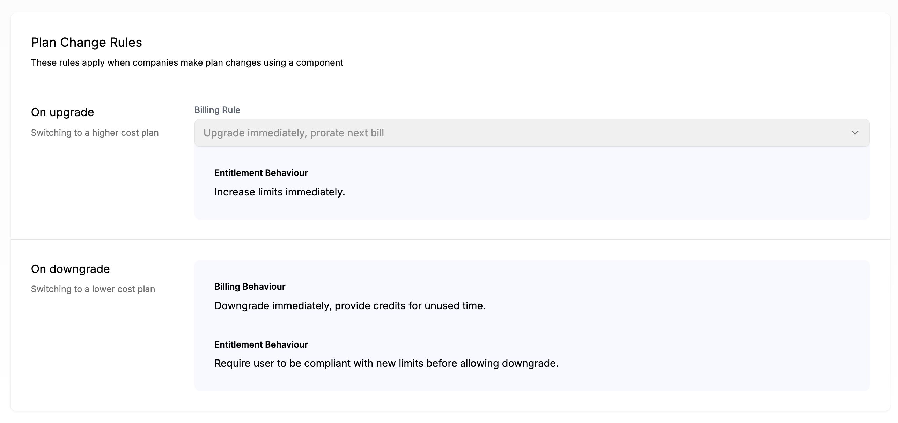

The Configuration tab in the Catalog serves two purposes:

1. To define lifecycle rules for new companies and when companies change plans or add ons
2. To define what plans or add ons should be user-facing and accessible via Schematic Components

## Glossary

- **Live Plans** - The base plans that your end users can choose to downgrade from or upgrade to
- **Live Add ons** - The add ons that your end users can select
- **Default Plan** - The plan assigned to companies that are not associated with any plans
- **Plan Change Rules** - the rules Schematic will validate company plan changes against (e.g. upgrade rules, downgrade rules)

Live Plans, Live Add Ons, and Plan Change Rules are only relevant if you are using Schematic with Stripe. In that case, selected plans and add ons will appear in Schematic Components and users will be able to manage their subscription directly. In all other cases, these sections can be skipped and user-facing components will simply reflect company state (read only) with no option to manage subscriptions.

## **Configuring the Catalog**

1. Navigate to **Catalog > Configuration**
2. Choose a default plan that all companies will be assigned if they do not currently have a subscription (optional)
3. Choose “Live Plans” and “Live Add Ons”
4. Save changes

<Info>Plans and Add Ons must be associated with Stripe Products to be added to Live Plans or Live Add Ons.</Info>

Currently, Plan Change Rules cannot be modified; however, we will be introducing more optionality here in the future.

