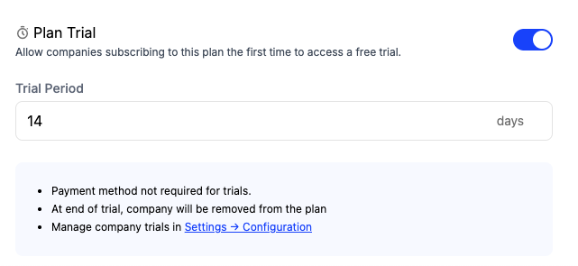

You can enable whether a plan has a trial or not when creating or editing a plan. When a trial period is defined for a plan, Schematic will ensure that the company receives the corresponding entitlements for that period the first time they are assigned that plan. 

You can configure whether payment is required up front or not in the Catalog configuration tab -- if it is required, the company will convert into the corresponding paid plan automatically; if not, they will downgrade to your default plan.

<Info>If you change trial configuration (e.g. whether a trial is a part of a plan, credit card requirement), any companies currently in a trial will be unaffected, and the new setting will apply going forward.</Info>