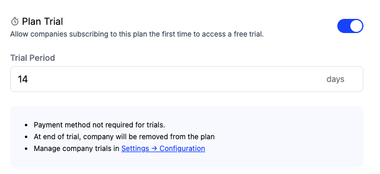

You can enable whether a plan has a trial or not when creating or editing a plan. Because editing a plan [creates a new plan version](/catalog/plans#plan-versions), trials configurations can be adjusted whenever a new plan version is published. When a trial period is defined for a plan, Schematic will ensure that the company receives the corresponding entitlements for that period the first time they are assigned that plan. 

You can configure whether payment is required up front or not in the Catalog configuration tab -- if it is required, the company will convert into the corresponding paid plan automatically; if not, they will downgrade to your default plan.

<Info>If you change trial configuration (e.g. whether a trial is a part of a plan, credit card requirement), any companies currently in a trial will be unaffected, and the new setting will apply going forward.</Info>

## Trial eligibility

Trial eligibility decides whether Schematic offers a company a trial at all, and you choose the rule under **Trial Rules** in the Catalog configuration tab.

**One trial per company** is the default. Once a company holds a subscription that charges money, Schematic stops offering it a trial on any plan from then on. A $0 subscription, such as a free plan assigned at signup, does not spend that eligibility, and neither does an abandoned checkout.

**One trial per plan** lets a company trial each plan once. A company already paying for Starter can start a trial on Pro, and a company that has trialed Pro cannot trial Pro a second time. Schematic records every plan a company trials and reads that record to answer the question. Extending, cancelling, or deleting a trial leaves the record in place, so none of those make a company eligible again for a plan it already trialed.

Choose one trial per plan when customers evaluate your plans separately, such as a core plan they buy now and a higher tier they grow into a year later. Keep the default when the trial is how a customer starts with you and each company should get exactly one.

Your pricing table and checkout read the same eligibility answer, so a trial the pricing table advertises is a trial checkout will start.

<Info>Talk to us before you switch an environment to one trial per plan. Trials that ran before Schematic began recording them per plan are reconstructed from your subscription history in a one-time backfill, and support runs that first so the new rule reads a complete record.</Info>

### Granting a trial from the dashboard

When you change a company's plan from the dashboard, Schematic tells you whether that company has already trialed the plan you selected, or is not eligible for a trial on it, before you turn the trial on.

## Rendering trial state in your app

Once trials are configured, you can surface trial state directly in your UI. Schematic's React and Vue SDKs expose the current company's plan name, trial status, and trial end date, so you can build things like plan badges, trial countdown banners, and post-trial conversion flows without any additional API calls.

For example, you can show a "Trial" chip with a countdown, prompt expired trial users to upgrade, or render a different experience for companies that converted from a trial versus those that never trialed at all.

See the [React SDK docs](/developer_resources/sdks/react#company-plan-information) or [Vue SDK docs](/developer_resources/sdks/vue#company-plan-information) for usage details.
