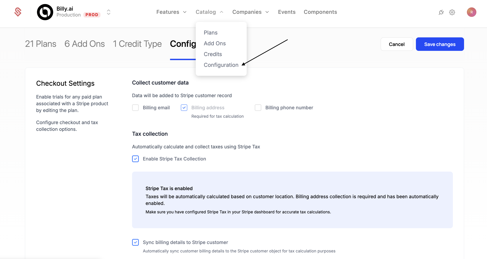
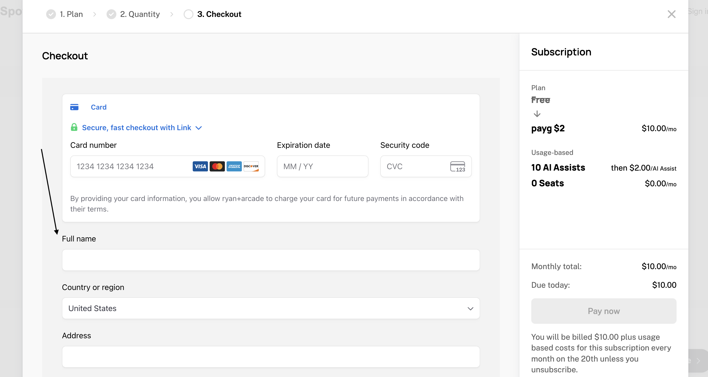
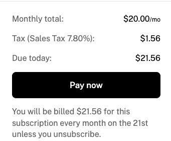
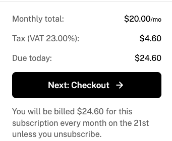
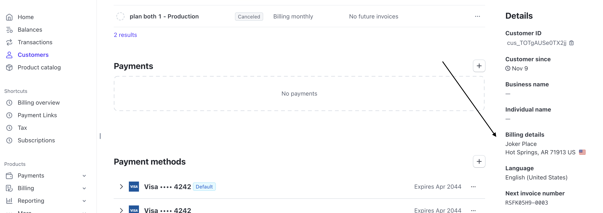

The Schematic Components library provides several advanced features for customizing and extending the default behavior.

## Launch Checkout Programmatically

<iframe
  width="100%"
  height="450px"
  src="https://www.youtube.com/embed/tXzvCcq8Yrw?si=wIuW3daxBJoyx2oU"
  frameborder="0"
  allow="accelerometer; autoplay; clipboard-write; encrypted-media; gyroscope; picture-in-picture; web-share"
  referrerpolicy="strict-origin-when-cross-origin"
  allowfullscreen
></iframe>

A common billing use case is to present a user with a paywall, and then open a checkout flow to quickly allow them to upgrade their plan.

Imagine a user is trying to create their 6th AI-generated image, but their current plan only includes 5 images per month. You can present them a paywall explaining they are at their limit and prove an "Upgrade to the Pro Plan" button. When they click the upgrade button, you can create a seamless upgrade experience by:

1. Opening the checkout flow
2. Pre-selecting the Pro plan they need to upgrade to

Here's a barebones implementation of this:

```tsx
"use client"

import { 
  CheckoutDialog,
  EmbedProvider,
  useEmbed,
} from "@schematichq/schematic-components";
import { useEffect, useState } from "react";


const PLAN_ID = ""; // plan to be preselected

function Checkout() {
  const { initializeWithPlan, layout, CheckoutDialog } = useEmbed();

  const checkout = () => {
    const response = await fetch("/api/accessToken");
    const result = await response.json();
    setAccessToken(result.accessToken);
    initializeWithPlan(PLAN_ID);
  };

  // this is necessary when launching straight to checkout
  useEffect(() => {
    if (stale) {
      hydrate();
    }
  }, [stale, hydrate]);

  return (
    <>
      <button onClick={checkout}>Upgrade to Pro</button>
      {layout === "checkout" && <CheckoutDialog />}
    </>
  )
}

export default function CustomCheckout() {
  return (
    <EmbedProvider>
      <Checkout />
    </EmbedProvider>
  );
}
```

The key element is `initializeWithPlan`, an alternate entry point to the checkout flow. Above, we pass a plan ID to the function, which will pre-select the plan in the checkout flow.

In the above example, while the plan is pre-selected, the user will still be able to navigate the full checkout flow. A common desire is to take the user directly to the payment step, and remove the options to change plan or add-on choices. To achieve this, `initializeWithPlan` can be called with an object of additional options. The full set of options are below.

```ts
const config = {
  planId: 'plan_abc123',      // pre-select a Plan
  addOnIds: ['plan_addon123'],   // pre-select 1 or more Add-ons
  skipped: {
    planStage: true,               // if true, skip Plan selection
    addOnStage: true               // if true, skip Add-on selection
  }
  hideSkipped:  true               // if true, hide skipped stages from breadcrumb navigation
};

initializeWithPlan(config);
```

### Examples

You can see a full example, including error handling and loading states in our example app. 

Check it out online: https://schematic-next-example.vercel.app/custom-checkout
See the code: https://github.com/SchematicHQ/schematic-next-example/blob/main/src/app/custom-checkout/page.tsx

## Collecting Taxes

Schematic supports Stripe Tax (and 3rd party tax providers that integrate with Stripe Tax) to simplify collecting tax and ensuring compliance with tax laws. Components can be configured to collect tax information from the user (e.g. billing address) and generate the correct taxes at checkout. 

To enable tax collection, head to "Plans > Configuration". Scroll down to find Checkout Settings. Here, Stripe Tax can be enabled and the relevant billing information can be set to be collected from the user inside the Schematic Checkout flow.



While checking out, the necessary tax information will be collected from the user while they are inputting their payment method. 



And finally, taxes will be presented on the final checkout step.

<CardGroup cols={2}>
  <Card title="US Taxes">
    
  </Card>
  <Card title="EU Taxes">
    
  </Card>
</CardGroup>


If you choose to save tax information to Stripe, it will appear on the customer details page in Stripe.


