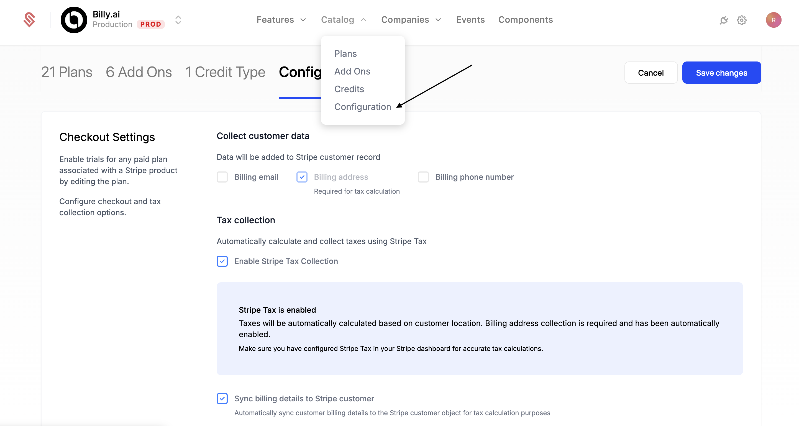
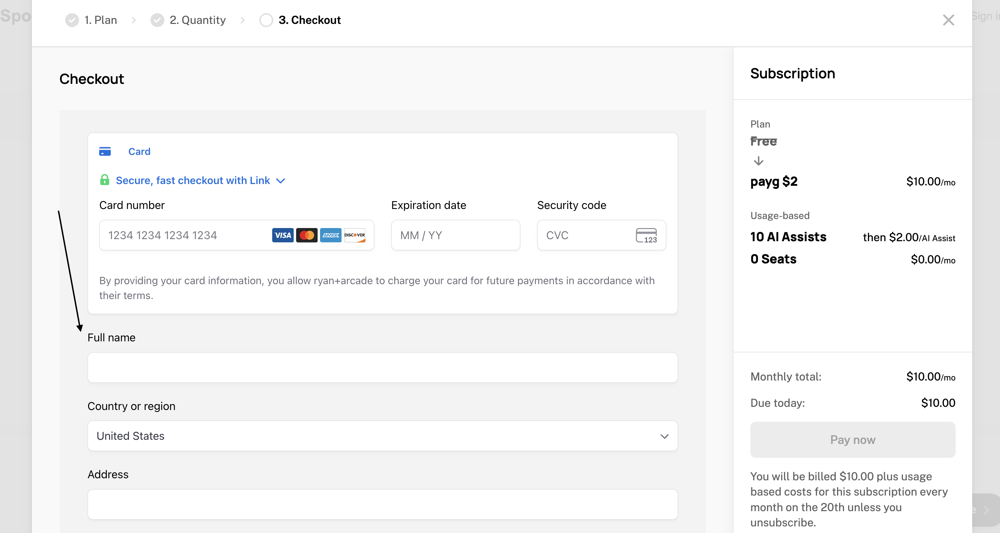
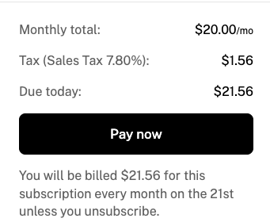
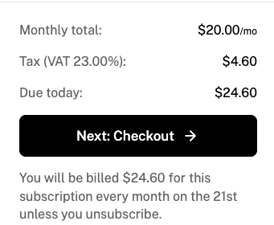
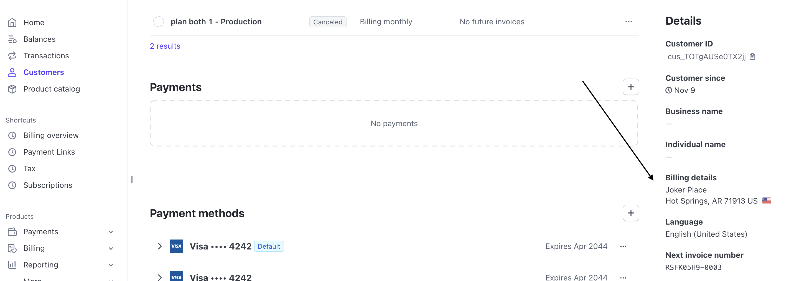

The Schematic Components library provides several advanced features for customizing and extending the default behavior.

## Launch Checkout Programmatically

<iframe
  width="100%"
  height="450px"
  src="https://www.youtube.com/embed/tXzvCcq8Yrw?si=wIuW3daxBJoyx2oU"
  frameborder="0"
  allow="accelerometer; autoplay; clipboard-write; encrypted-media; gyroscope; picture-in-picture; web-share"
  referrerpolicy="strict-origin-when-cross-origin"
  allowfullscreen
></iframe>

A common billing use case is to present a user with a paywall, and then open a checkout flow to quickly allow them to upgrade their plan. If you need to show the user's current plan name in the paywall (e.g. "You're on the Free plan"), the React and Vue SDKs provide that data directly. See the [React SDK docs](/developer_resources/sdks/react#company-plan-information) or [Vue SDK docs](/developer_resources/sdks/vue#company-plan-information) for details.

Imagine a user is trying to create their 6th AI-generated image, but their current plan only includes 5 images per month. You can present them a paywall explaining they are at their limit and prove an "Upgrade to the Pro Plan" button. When they click the upgrade button, you can create a seamless upgrade experience by:

1. Opening the checkout flow
2. Pre-selecting the Pro plan they need to upgrade to

Here's a barebones implementation of this:

```tsx
"use client"

import { 
  CheckoutDialog,
  EmbedProvider,
  useEmbed,
} from "@schematichq/schematic-components";
import { useEffect, useCallback } from "react";

const PLAN_ID = ""; // plan to be preselected

function Checkout() {
  const { initializeWithPlan, layout, setAccessToken, stale, hydrate } = useEmbed();
  const checkout = useCallback(async () => {
    const response = await fetch("/api/accessToken");
    const result = await response.json();
    setAccessToken(result.accessToken);
    initializeWithPlan({ planId: PLAN_ID });
  }, [setAccessToken, initializeWithPlan]);

  // this is necessary when launching straight to checkout
  useEffect(() => {
    if (stale) {
      hydrate();
    }
  }, [stale, hydrate]);

  return (
    <>
      <button onClick={checkout}>Upgrade to Pro</button>
      {layout === "checkout" && createPortal(<CheckoutDialog />, document.body)}    
    </>
  )
}

export default function CustomCheckout() {
  return (
    <EmbedProvider>
      <Checkout />
    </EmbedProvider>
  );
}
```

The key element is `initializeWithPlan`, an alternate entry point to the checkout flow. Above, we pass a plan ID to the function, which will pre-select the plan in the checkout flow.

In the above example, while the plan is pre-selected, the user will still be able to navigate the full checkout flow. A common desire is to take the user directly to the payment step, and remove the options to change plan or add on choices. To achieve this, `initializeWithPlan` can be called with an object of additional options. The full set of options are below.

```ts
const config = {
  planId: 'plan_abc123',           // pre-select a Plan
  addOnIds: ['plan_addon123'],     // pre-select 1 or more add ons
  skipped: {
    planStage: true,               // if true, skip plan selection
    addOnStage: true               // if true, skip add on selection
  },
  hideSkipped: true,               // if true, hide skipped stages from breadcrumb navigation
  startTrialIfAvailable: true      // if true (default), start a trial when the plan is trialable and the company is eligible
};

initializeWithPlan(config);
```

When the pre-selected plan offers a trial and the company is eligible, `initializeWithPlan` starts checkout in trial mode by default. This matches the behavior of the in-dialog "Start trial" button, so customers using the bypass flow get the same trial they would have gotten by clicking through the plan stage. Pass `startTrialIfAvailable: false` to charge immediately instead.

### Pre-filling checkout fields

If your application already knows the customer's billing email or name, you can pre-populate those fields in the checkout payment form so the user does not have to retype them. Pass a `checkoutPrefill` prop to `EmbedProvider`:

```tsx
<EmbedProvider
  checkoutPrefill={{
    billingDetails: {
      email: "ada@example.com",
      name: "Ada Lovelace",
    },
  }}
>
  <Checkout />
</EmbedProvider>
```

Pre-filled values are only applied to fields the checkout is configured to collect. The email field appears when email collection is enabled, and the name is part of the billing address form. The user can edit any pre-filled value before submitting, and their edits are never overwritten if the prefill value changes.

### Examples

You can see a full example, including error handling and loading states in our example app. 

Check it out online: https://schematic-next-example.vercel.app/custom-checkout
See the code: https://github.com/SchematicHQ/schematic-next-example/blob/main/src/app/custom-checkout/page.tsx

## Reacting to Plan Changes in the Browser

Schematic components dispatch a `plan-changed` event on the `window` when a checkout completes, so you can run your own logic after a user subscribes, upgrades, downgrades, or unsubscribes. This includes patterns like redirecting users to a cancellation feedback form after they unsubscribe. See [Checkout Flow Events](/components/customer-portal#checkout-flow-events) for the event payload and examples.

## Collecting Taxes

Schematic supports Stripe Tax (and 3rd party tax providers that integrate with Stripe Tax) to simplify collecting tax and ensuring compliance with tax laws. Components can be configured to collect tax information from the user (e.g. billing address) and generate the correct taxes at checkout. 

To enable tax collection, head to "Plans > Configuration". Scroll down to find Checkout Settings. Here, Stripe Tax can be enabled and the relevant billing information can be set to be collected from the user inside the Schematic Checkout flow.



While checking out, the necessary tax information will be collected from the user while they are inputting their payment method. 



And finally, taxes will be presented on the final checkout step.

<CardGroup cols={2}>
  <Card title="US Taxes">
    
  </Card>
  <Card title="EU Taxes">
    
  </Card>
</CardGroup>


If you choose to save tax information to Stripe, it will appear on the customer details page in Stripe.


