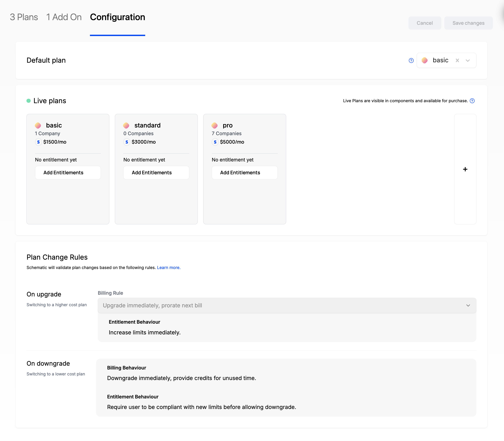
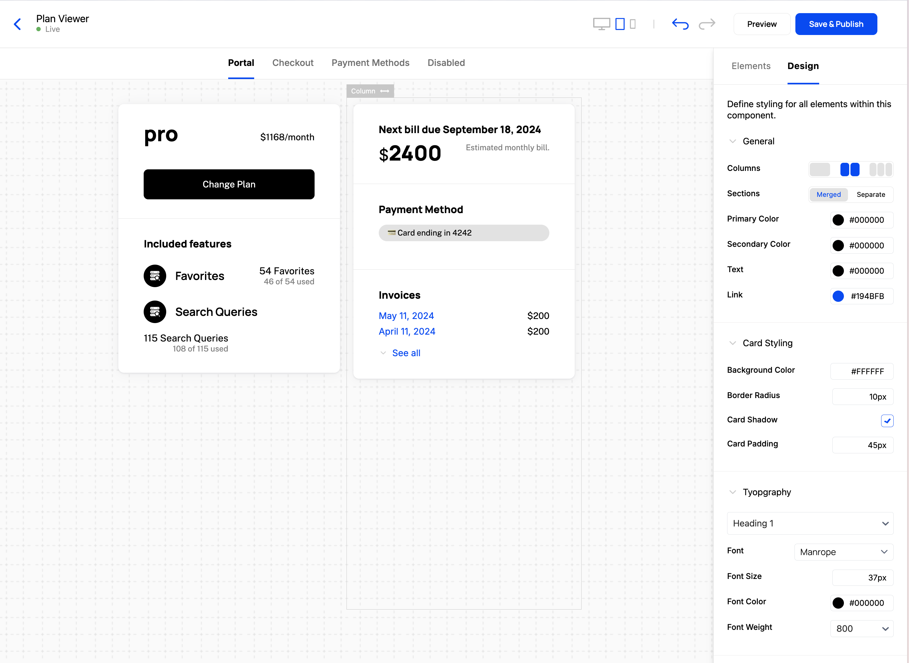
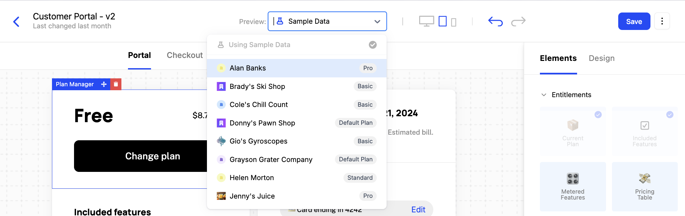

Before embedding a component in your application, you'll create and configure it in Schematic. This covers both setting up your catalog (so the component has the right plans and pricing to display) and building the component itself.

## Configuring the Catalog

1. Navigate to **Catalog > Configuration**
2. Choose a default plan that all companies will be assigned if there is no formal subscription (optional)
3. Choose "live plans" (those that your end users can choose to downgrade from or upgrade to)
4. Save changes

<Info>Plans must be associated with Stripe Products to be added to Live Plans. If you don't use Stripe, skip this section.</Info>

## Creating a New UI Component

Once you've configured your Catalog, Components will be populated with your data rather than sample data (if you skip to this section, you can simply use the sample data).

1. Navigate to **Components** in the navigation bar
2. Click **New Component** and choose "Customer Portal" as an example
3. Click into the new Component you created and you should see a rendered Customer Portal in the Schematic Component Builder
4. Press **Save & Publish** and follow the [steps to drop into your application](/components/set-up)

Components are fully customizable both in the elements they are made up of (e.g. Current Plan, Included Features, Invoices, etc.) and in how they look and feel (so it appears native to your product).

Additionally, you may preview as any company in your account using the dropdown at the top of the builder.

