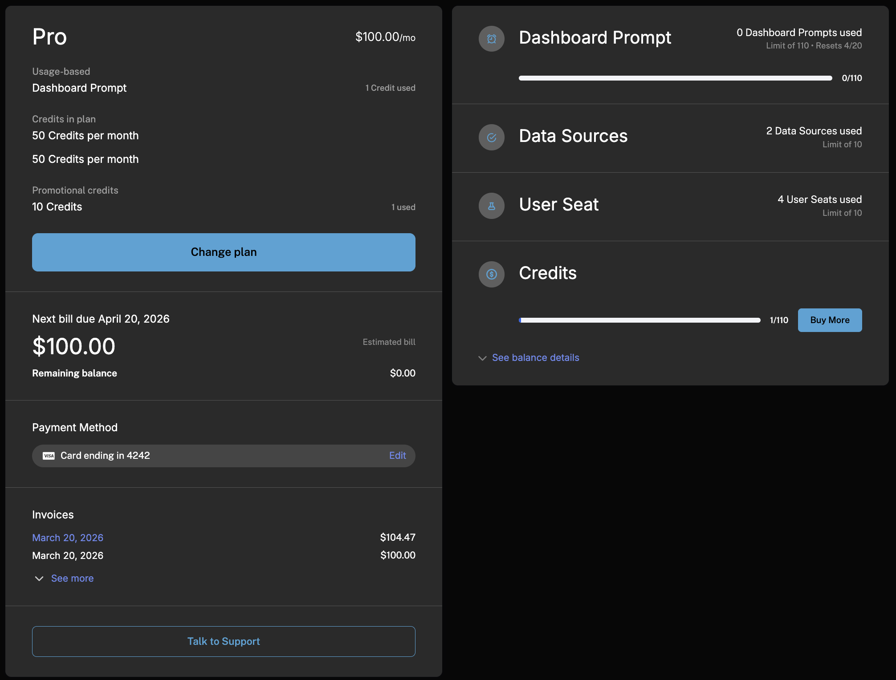

Schematic provides a customizable Customer Portal and checkout flow that allows your customers to easily complete common billing tasks like:
1. Purchasing a plan or add on
2. Upgrading, downgrading, or canceling their subscription
3. View upcoming and past invoices
4. Check current usage and entitlements

This component integrates fully with Stripe and is intended to replace Stripe's native checkout flow. Schematic components will sync any changes to the subscription to Stripe.

Additionally, Schematic provides a component builder so the content and styling of the Customer Portal can be customized to match your use case and brand. Below is the portal from one of our demo environments. 



## What Checkout Does

Schematic's checkout flow is a multi-step experience that handles the full subscription lifecycle, including subscription and plan changes. Depending on context, a customer may be:

- **Subscribing for the first time** by selecting a plan, adding optional add ons, and entering payment
- **Upgrading or downgrading** to a different plan, with proration handled automatically
- **Adding or removing add ons** to adjust their subscription without changing their base plan
- **Canceling** their subscription

The checkout flow itself walks customers through up to four steps:

1. **Choose a plan** from your available [live plans](/components/overview) (this step can be pre-selected or skipped programmatically)
2. **Select add ons** to include with the chosen plan (optional)
3. **Purchase credits** for any credit-based features included in the plan (optional)
4. **Enter or confirm a payment method** via Stripe's secure payment form
5. **Review and confirm the order** to complete the transaction

## Why Use Schematic Checkout Instead of Stripe

Stripe Checkout and Payment Links are great for one-time purchases and simple new subscriptions, but they weren't built to manage an ongoing subscription lifecycle inside a product. Schematic checkout is:

**Full lifecycle, not just first purchase.** Stripe Checkout is primarily designed for new subscriptions. Schematic checkout handles upgrades, downgrades, add on changes, and cancellations all from the same component, with no additional code.

**Entitlements provisioned automatically.** When a customer completes a Schematic checkout, their feature flags and usage limits are updated immediately. There's no need to write webhook handlers to map Stripe events back to access control in your app.

**Catalog-driven, not code-driven.** Your pricing table reflects your live plans in Schematic. When you update pricing or restructure your plans, the checkout UI updates without a deploy.

**Customizable to your brand.** The Component Builder lets you control layout, colors, fonts, and which elements appear without touching code. Schematic checkout looks like part of your product, not a third-party overlay.

**Trials, proration, and billing intervals included.** Switching from monthly to annual, handling trial-to-paid conversion, and calculating proration are all managed out of the box.

## How It Works with Stripe

Schematic checkout is built on top of Stripe. When a customer completes a checkout flow:

1. Schematic creates or updates the Stripe subscription with the correct products, prices, and quantities
2. Schematic syncs the subscription state back and immediately provisions or revokes the corresponding entitlements in your app
3. Stripe handles all downstream billing: invoicing, payment retries, and receipts

**Payment UI is rendered via Stripe Elements.** Card data is collected directly by Stripe's secure frontend library and never passes through Schematic or your servers. This means you do not need to maintain a Cardholder Data Environment (CDE) — [Stripe's PCI DSS compliance](https://stripe.com/guides/pci-compliance) covers the full payment collection flow.

Stripe remains the source of truth for billing. Schematic is the source of truth for entitlements. The two stay in sync automatically.

For more details on the Stripe integration, see the [Stripe Integration](/integrations/stripe) page.

## Configurability

Schematic checkout is configurable at several levels:

**Component Builder (no-code).** In the Schematic UI, you can choose which elements appear in your Customer Portal (Current Plan, Invoices, Payment Method, Usage Meters, and more), and fully control colors, fonts, and card styling. Changes take effect immediately without a code deploy.

**Live plans.** Within Schematic, you control which plans are available for customers to upgrade or downgrade to in Catalog > Configuration. Only plans mapped to Stripe products can be added as live plans.

**Programmatic control.** Using the `initializeWithPlan` API, you can launch checkout from anywhere in your app (e.g., a paywall), pre-select a plan and add ons, and skip stages the customer doesn't need to see. See [Advanced Usage](/components/advanced-usage) for details.

**Tax collection.** Schematic supports Stripe Tax to collect billing address information and calculate taxes at checkout. This is configured under Plans > Configuration. See [Advanced Usage](/components/advanced-usage) for details.

## Checkout Flow Events

After a customer completes a checkout flow (whether that's a new customer, upgrade, or downgrade), we post an event to the window that you can listen for. This event will include some key information, such as the `id` of the new plan.

While not strictly necessary, we recommend performing a hard refresh of the page to ensure all flag checks and usage quotas are updated.

```javascript
window.addEventListener("plan-changed", (event) => {
  window.location.reload();
});
```

Additionally, if you want to act on the plan change, the event has a `detail` property that includes information about the new plan. Specifically, it will include

A few values below are numbers that represent dates (specifically, seconds since the Unix epoch). You can convert these to a `Date` object using by `new Date(value * 1000)`:

| Field | Type | Description |
| --- | --- | --- |
| cancelAt? | `Date?` | If the subscription cancelled, the date when the plan will cancel. |
| cancelAtPeriodEnd | `boolean` | `true` if this checkout represented a cancellation. `false` otherwise. |
| companyId? | `string?` | Schematic company ID |
| createdAt | `Date` | Date when the subscription started. |
| currency | `string` | Currency the user used for the subscription. |
| customerExternalId | `string` | Stripe customer ID for the company. |
| defaultPaymentMethodId | `string` | Schematic ID for the Default payment method for the customer. |
| expiredAt? | `Date?` | Date when the subscription will be marked as expired in Stripe. |
| id | `string` | Schematic subscription ID. |
| interval | `string` | Interval of the subscription. Can be `month` or `year`. |
| metadata | `object` | Stripe metadata for the customer. |
| periodEnd | `number` | Date when the current billing period ends. |
| periodStart | `number` | Date when the current billing period starts. |
| status | `string` | Status of the subscription. Can be `active`, `canceled`, or `trialing`. |
| subscriptionExternalId | `string` | Stripe subscription ID. |
| totalPrice | `number` | The total price of the subscription in cents. (divide by 100 to get the price in $) |
| trialEnd? | `Date?` | If the subscription is a trial, the date when the trial will end. |
| trialEndSetting? | `string?` | If the subscription is a trial, the setting for when the trial will end. Can be `end_of_trial` or `end_of_billing_period`. |
