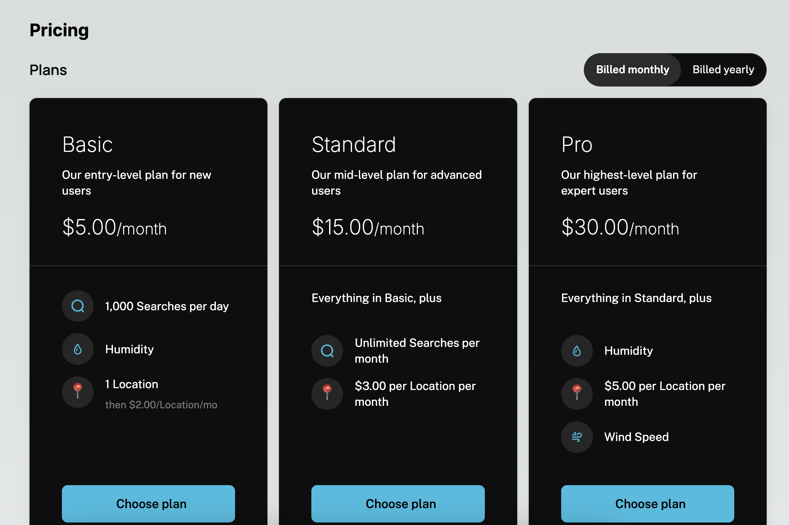

Plans and add-ons with a period toggle, a currency picker, entitlement summaries, and a select-plan action that opens [Checkout](/components/drop-in/checkout). On a public page it needs only your publishable key. Inside the portal, with a session, it marks the current plan and knows which changes are valid.



## Usage

<Tabs>
  <Tab title="Public page">
```tsx
import { SchematicProvider } from "@schematichq/schematic-react";
import { PricingTable, SchematicStyles } from "@schematichq/schematic-components/elements";

<SchematicProvider publishableKey="pk_…">
  <SchematicStyles />
  <PricingTable onSelectPlan={(plan, period) => router.push(`/signup?plan=${plan.id}&period=${period}`)} />
</SchematicProvider>
```
  </Tab>
  <Tab title="In the portal">
```tsx
// Under a provider with a session, select plan opens <Checkout/> for the company.
<PricingTable showAddOns />
```
  </Tab>
</Tabs>

## Props

| Prop | Default | Effect |
| --- | --- | --- |
| `catalogId` | the environment's default | Which catalog to show. |
| `showPeriodToggle` | `true` | Monthly and yearly toggle, when both exist. |
| `showCurrencyPicker` | `true` | Currency picker, when plans carry more than one. |
| `showAddOns` | `true` | Add-on cards under the plans. |
| `showFeatureDescriptions` | `false` | Feature descriptions under each entitlement. |
| `onSelectPlan` | opens `<Checkout/>` | Override the select-plan action. Required on a public page. |
| `className`, `locale` | | Root class; BCP 47 tag for formatting. |
| `strings` | | Copy for this card by key. |

## Public and company modes

The table follows the credential on the provider. With a publishable key alone it reads the public catalog: plans, add-ons, and prices, loaded fast and with no customer data. With a session it reads the company's view of the same catalog, which adds `current` to the plan they are on and `valid` to each change the purchase rules allow. Plans that lack the selected currency stay hidden, and the period toggle only offers periods the catalog prices.

## Markup

```html
<div class="schematic-card schematic-pricing-table" data-state="ready" data-mode="company">
  <div class="schematic-pricing-table__toggle" role="tablist">…</div>
  <div class="schematic-pricing-table__plans">
    <article class="schematic-pricing-table__plan" data-current="true" data-valid="true">
      <h3 class="schematic-pricing-table__plan-name">Starter</h3>
      <p class="schematic-pricing-table__price">$30 / month</p>
      <ul class="schematic-pricing-table__entitlements">…</ul>
      <button class="schematic-cta schematic-pricing-table__select">Current plan</button>
    </article>
  </div>
</div>
```

## Localizing it

Keys: `pricingTableMonthly`, `pricingTableYearly`, `pricingTableSavings`, `pricingTableCurrent`, `pricingTableSelect`, `pricingTableUpgrade`, `pricingTableDowngrade`, `pricingTableContactSales`, `pricingTableUsageBased`, `pricingTableFree`, `pricingTableAddOns`, `retry`.

## Build it yourself

[`useCatalog`](/components/build-your-own/hooks#usecatalog) returns the catalog in either mode; `derivePricingTable` takes your period and currency selection and returns the cards plus the valid option sets.
