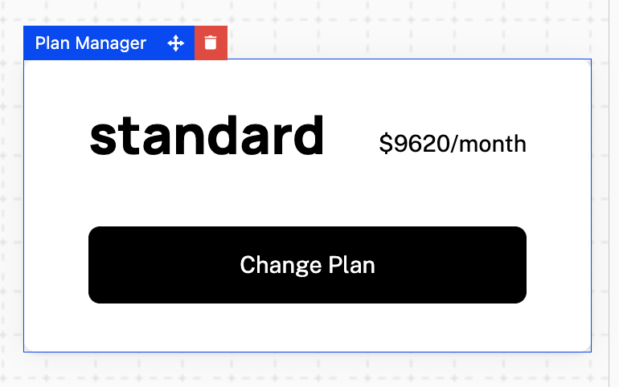
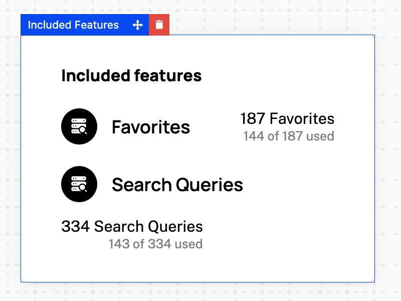
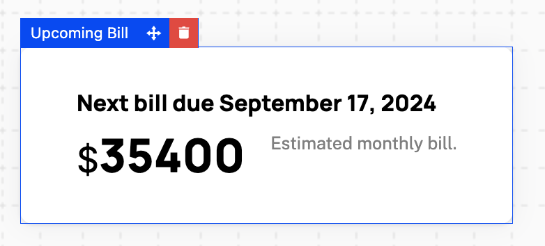
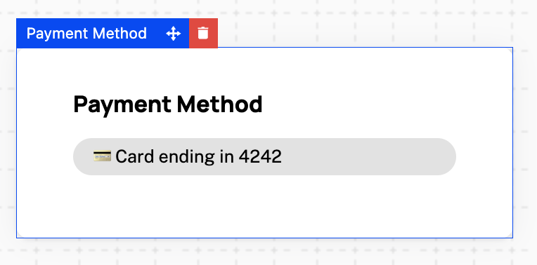
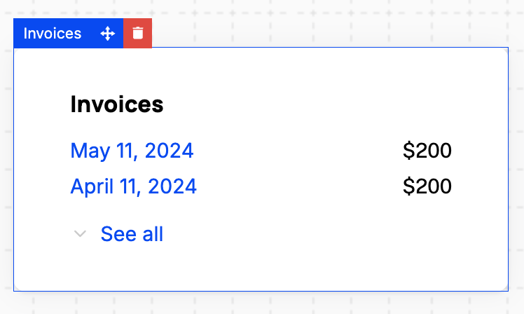
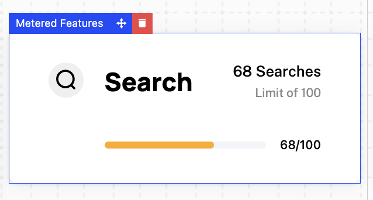
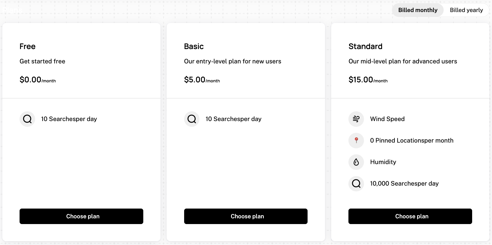

Schematic Components are made up of a number of Elements that can be optionally added in the builder. Each Element has it’s own customization options.

If Stripe is not connected to Schematic, some Elements will either be unavailable or fall back to a read only experience.

| Element | Element Type | Notes |
| --- | --- | --- |
| Current Plan | Entitlements | Partially available without Stripe connected (read only) |
| Included Features | Entitlements | Available with or without Stripe connected |
| Next Bill Due | Billing | Not available unless Stripe is connected |
| Payment Methods | Billing | Not available unless Stripe is connected |
| Invoices | Billing | Not available unless Stripe is connected |
| Metered Features | Entitlements | Available with or without Stripe connected |
| Pricing Table | Entitlements | Not available unless Stripe is connected |

Below, each Element that is currently available is highlighted (with plans for many more soon!). 

#### **Current Plan**

The Current Plan Element reflects the Schematic Plan a Company is a member of and the associated metadata. It also optionally includes a button for end users to self manage their plan. If Stripe is connected, any changes made to a Company’s plan will reflect in Schematic and Stripe; if it is not, this element is read only.

*Design options*

- Visibility of description, price, add on plans, and “Change plan” button
- Weight of plan, description, price, button

#### **Included Features**

The Included Features Element shows the entitlements, including usage and limits, granted to an individual customer based on their Plan membership.

*Design options*

- Visibility of title, feature icons, limits, and usage
- Text of title
- Weight of title, limits, and usage

#### **Next Bill Due**

The Next Bill Due Element shows the upcoming bill associated with the Company’s Stripe subscription.

*Design options*

- Visibility of header, price, contract end date
- Text of header
- Weight of header, contract end date

#### **Payment Methods**

*Design options*

- Visibility of header
- Ability for end user to edit card on file

#### **Invoices**

*Design options*

- Visibility of header, date, amount, link to see all invoices
- Number of invoices visible
- Weight of header, date, amount

#### **Metered Features**

*Design options*

- Displayed features
- Feature meter
- Visibility of description, icon, usage, and limit
- Weight of description, usage, limit

#### **Pricing Table**

*Design options*

- Visibility of plans and/or add-ons are visible
- Visibility of upgrade and downgrade buttons
- Button sizing and styling
