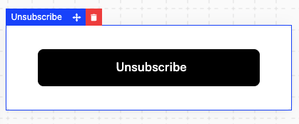
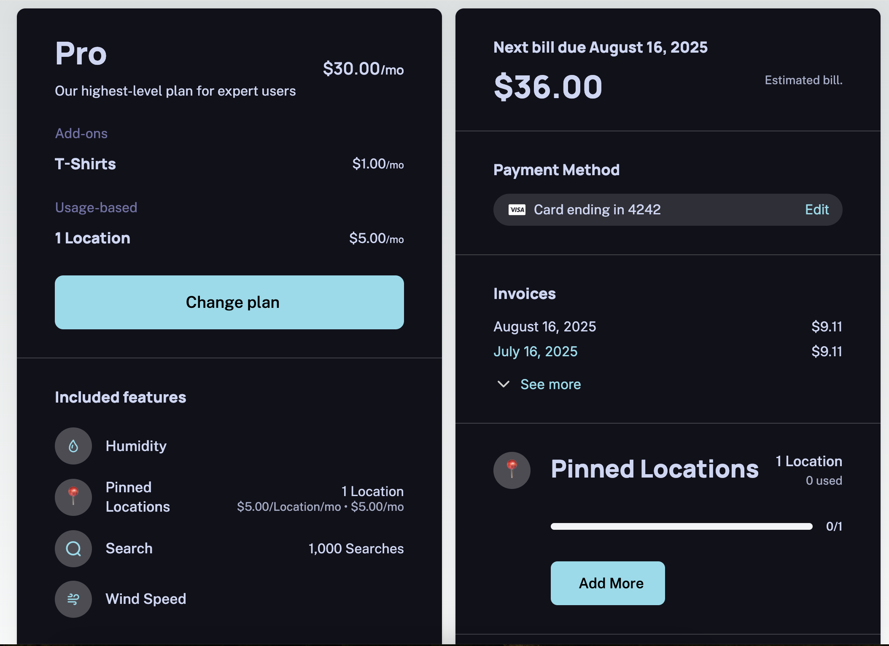

Schematic Components are made up of a number of Elements that can be optionally added in the builder. Each Element has it's own customization options.

Currently, we support the following Elements:

| Element | Included by Default | Requires Stripe Integration |
| --- | --- | --- |
| Current Plan | Yes | Readonly without Stripe |
| Included Features | Yes | No |
| Next Bill Due | Yes | Yes |
| Payment Methods | Yes | Yes |
| Invoices | No | Yes |
| Unsubscribe Button | No | No |
| Metered Features | No | No |
| Pricing Table | No | Yes |
| Text | No | No |
| Button | No | No |

If Stripe is not connected to Schematic, some Elements will either be unavailable or fall back to a read only experience.

#### Current Plan

The Current Plan Element shows the Schematic Plan the Customer is currently subscribed to. 

If Stripe is connected, it also optionally includes a button for users to self manage their plan (e.g. switch plans, add add-ons). This will open up the checkout flow to allow users to purchase a new plan or add-on.

*Note: Customers cannot cancel their subscription through this button. See the Unsubscribe Button Element for this functionality.*

**Design options**
- Visibility of description, price, and plan add-ons 
- Visibility of "Change Plan" Button

#### Included Features

The Included Features Element shows the entitlements, including usage and limits, granted to an individual customer based on their Plan. This element is available with or without Stripe connected.

**Design options**
- Text of title (e.g. "Included Features")
- For Features: visibility of title, feature icons, limits, and usage

#### Next Bill Due

The Next Bill Due Element shows the upcoming bill associated with the Company's Stripe subscription. This element requires Stripe to be connected to be available.

**Design options**
- Visibility of header, price, and contract end date
- Text of header (e.g. "Next bill due")

#### Payment Methods

The Payment Methods Element shows the payment methods associated with the Company's Stripe subscription. 

This element requires Stripe to be connected to be available. If the "Edit" button is clicked, this will open up the Payment Method step of the checkout flow.

**Design options**
- Visibility of header
- Visibility of "Edit" button to change payment method

#### Invoices

The Invoices Element shows past invoices associated with the Company's Stripe subscription. This element requires Stripe to be connected to be available.

**Design options**
- Visibility of header and link to see all invoices
- Number of invoices visible

#### Unsubscribe Button

The Unsubscribe Button Element allows users to unsubscribe from the their's Stripe subscription.

#### Pricing Table

The Pricing Table is typically used as a standalone component that can be embedded into your marketing site. If this is what you're looking for, see the [Pricing Table](/components/pricing-table) page.

The pricing table _can_ be embedded into your Customer Portal, but this is not a recommended use case.

## Styling Options

Each element in the Customer Portal can be styled to match your brand. In addition to the styling options above, all font, text color, background color, button size, and button colors can be customized. 

Here is an example of a customized portal from the [Schematic Weather Demo App](https://schematic-next-example.vercel.app/):

