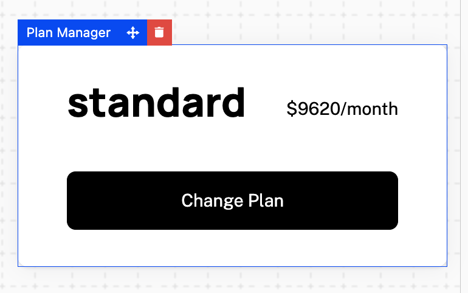
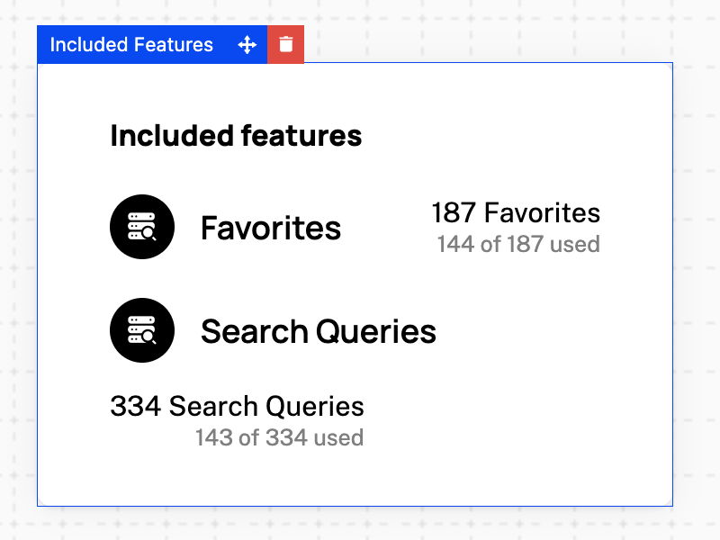
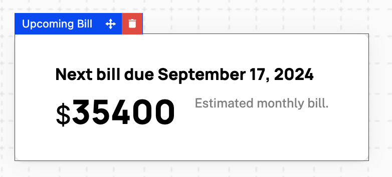
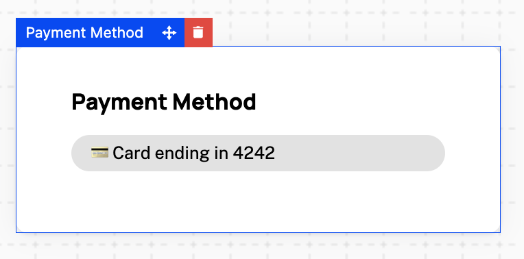
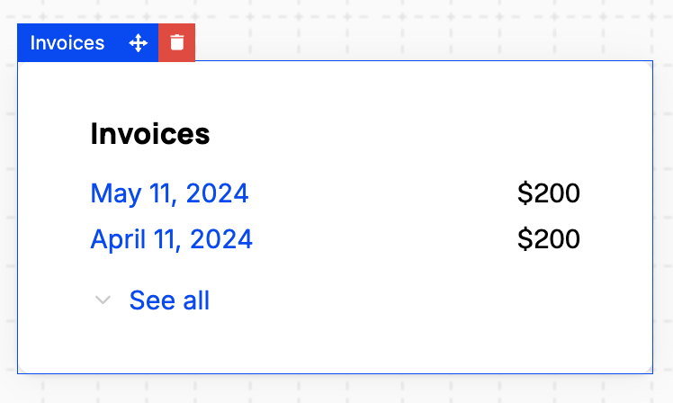
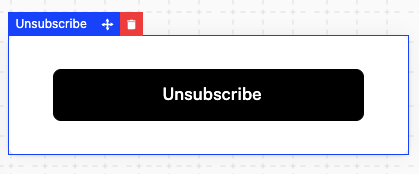
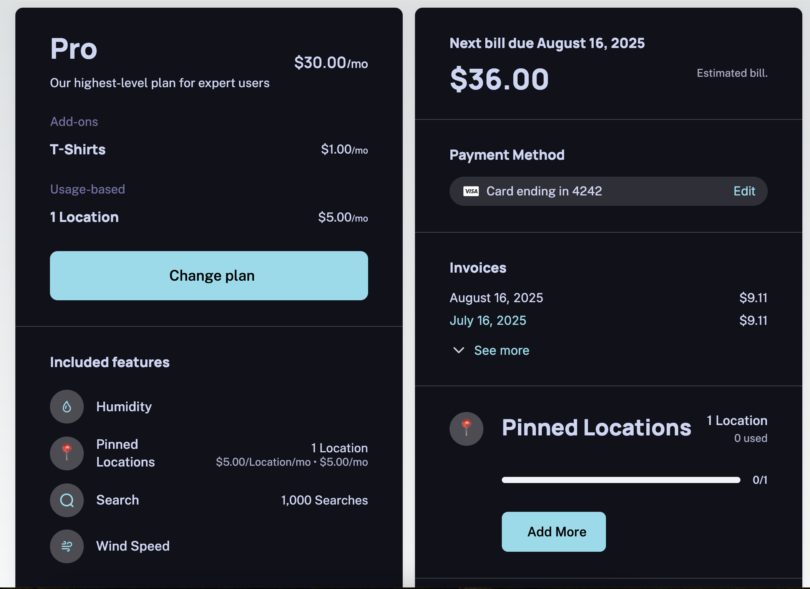

Schematic Components are made up of a number of Elements that can be optionally added in the builder. Each Element has its own customization options.

Currently, we support the following Elements:

| Element | Included by Default | Requires Stripe Integration |
| --- | --- | --- |
| Current Plan | Yes | Readonly without Stripe |
| Included Features | Yes | No |
| Next Bill Due | Yes | Yes |
| Payment Methods | Yes | Yes |
| Invoices | No | Yes |
| Unsubscribe Button | No | No |
| Metered Features | No | No |
| Pricing Table | No | Yes |
| Text | No | No |
| Button | No | No |

If Stripe is not connected to Schematic, some Elements will either be unavailable or fall back to a read only experience.

#### Current Plan

The Current Plan Element shows the Schematic Plan the Customer is currently subscribed to. 

If Stripe is connected, it also optionally includes a button for users to self manage their plan (e.g. switch plans, add add ons). This will open up the checkout flow to allow users to purchase a new plan or add on.

*Note: Customers cannot cancel their subscription through this button. See the Unsubscribe Button Element for this functionality.*

**Design options**
- Visibility of description, price, and plan add ons 
- Visibility of "Change Plan" Button

#### Included Features

The Included Features Element shows the entitlements, including usage and limits, granted to an individual customer based on their Plan. This element is available with or without Stripe connected.

Credit balances and the "Buy More" button live on the [Metered Features](#metered-features) Element instead, so a portal built from Included Features alone gives a customer no way to top up their credits.

**Design options**
- Text of title (e.g. "Included Features")
- For Features: visibility of title, feature icons, limits, and usage

#### Next Bill Due

The Next Bill Due Element shows the upcoming bill associated with the Company's Stripe subscription. This element requires Stripe to be connected to be available.

**Design options**
- Visibility of header, price, and contract end date
- Text of header (e.g. "Next bill due")

#### Payment Methods

The Payment Methods Element shows the payment methods associated with the Company's Stripe subscription. 

This element requires Stripe to be connected to be available. If the "Edit" button is clicked, this will open up the Payment Method step of the checkout flow.

**Design options**
- Visibility of header
- Visibility of "Edit" button to change payment method

#### Invoices

The Invoices Element shows past invoices associated with the Company's Stripe subscription. This element requires Stripe to be connected to be available.

**Design options**
- Visibility of header and link to see all invoices
- Number of invoices visible

#### Unsubscribe Button

The Unsubscribe Button Element allows users to unsubscribe from the their's Stripe subscription.

#### Metered Features

The Metered Features Element shows what a customer has consumed this period against each metered entitlement, and it is the only element that shows credit balances. It is off by default, so add it in the builder under the "Entitlements" category.

Each credit gets a usage bar, an expandable breakdown of the grants making up the balance, and a **Buy More** button. A customer who clicks "Buy More" lands in the checkout flow on its credits step, picks a bundle, and pays without their plan entering into it. When they already have a card on file, checkout skips the payment step too, so the purchase takes two clicks.

Four things have to be true for "Buy More" to appear next to a credit:

1. The catalog carries at least one bundle for that credit. Add bundles under Catalog > Configuration > "Credit Bundles" and press "Save Changes", as described in [step 6 of Credit Burndown](/billing/credit-burndown#6-add-the-plan-and-bundles-to-the-catalog). A bundle you created on the credit type page but never added here reaches no component at all.
2. One of those bundles is compatible with the plan the company is on. Each bundle carries a list of compatible plans, and an empty list means every plan. That list names your standard plans, so a company on a custom plan can buy from a bundle only when you leave the bundle unrestricted.
3. Checkout is available to the company, which means you have connected Stripe, the catalog has live plans, and Schematic manages the company's subscription.
4. Credits are visible. The "Hide credits" toggle in Catalog > Configuration hides balances and consumption rates across every element, including this one.

**Design options**
- Visibility of the description, feature icons, allocation, and usage
- Font style of the header, description, allocation, and usage
- Which features the element lists

#### Pricing Table

The Pricing Table is typically used as a standalone component that can be embedded into your marketing site. If this is what you're looking for, see the [Pricing Table](/components/pricing-table) page.

The pricing table _can_ be embedded into your Customer Portal, but this is not a recommended use case.

## Styling Options

Each element in the Customer Portal can be styled to match your brand. In addition to the styling options above, all font, text color, background color, button size, and button colors can be customized. 

Here is an example of a customized portal from the [Schematic Weather Demo App](https://github.com/SchematicHQ/schematic-next-example):

