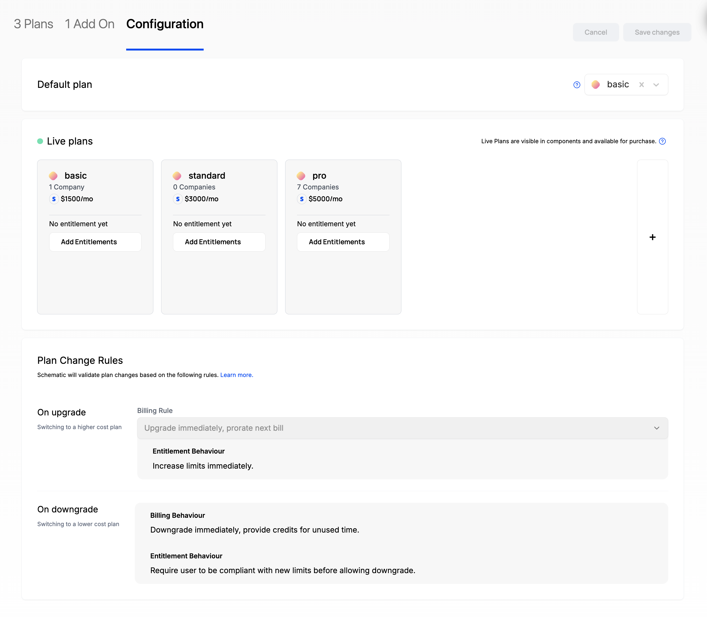
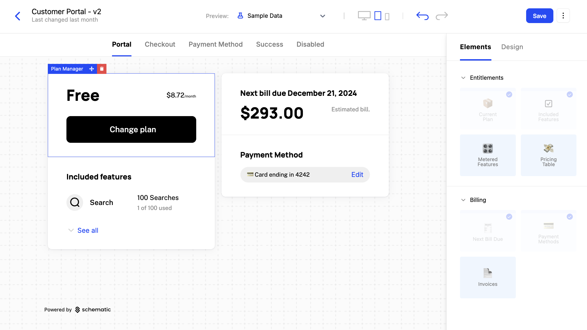
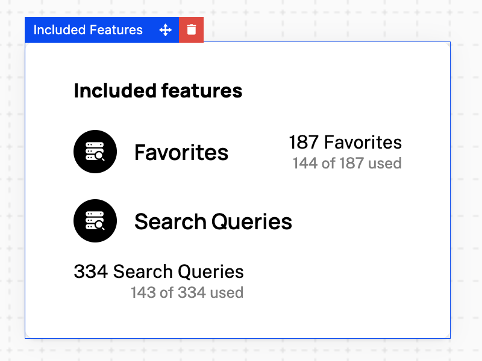

## Overview

Schematic’s embeddable UI components are designed to deliver a consumer-grade purchasing experience to all of your end users. That includes the ability to manage subscriptions, view feature-level usage, and customize plans in your app — all without requiring heavy lifting to build from scratch or maintain.

Components are drop-in components for React that can be easily configured and designed within Schematic, and quickly integrated natively into your application.

## Creating a Component

### **Configuring the Catalog**

1. Navigate to **Catalog > Configuration**
2. Choose a default plan that all companies will be assigned if there is no formal subscription (optional)
3. Choose “live plans” (those that your end users can choose to downgrade from or upgrade to)
4. Save changes

<Info>Plans must be associated with Stripe Products to be added to Live Plans. If you don’t use Stripe, skip this section.</Info>

### **Creating a new UI component**

Once you’ve configured your Catalog, Components will be populated with your data rather than sample data (if you skip to this section, you can simply use the sample data).

1. Navigate to **Components** in the navigation bar
2. Click **New Component** and choose “Customer Portal” as an example
3. Click into the new Component you created and you should see a rendered customer portal in the Schematic Component Builder
4. Press **Save & Publish** and follow the [steps to drop into your application](/components/set-up)

Components are fully customizable both in the elements they are made up of (e.g. Current Plan, Included Features, Invoices, etc.) and in how they look and feel (so it appears native to your product).

## Component Builder

Components are inherently flexible, made up of elements that can be mixed and matched based on the experience you’d like to give your end user.

Within Schematic, you have access to a Component Builder which allows for full customization both in the elements that are a part of any given Component (e.g. Current Plan, Included Features, Invoices, etc.) and in how the Component looks and feels (so it appears native to your product).

Once you design a Component to your liking, you can drop it directly into your application.

### Elements

Schematic Components are made up of a number of Elements that can be optionally added in the builder. Each Element has it’s own customization options.

If Stripe is not connected to Schematic, some Elements will either be unavailable or fall back to a read only experience.

| Element | Element Type | Notes |
| --- | --- | --- |
| Current Plan | Entitlements | Partially available without Stripe connected (read only) |
| Included Features | Entitlements | Available with or without Stripe connected |
| Next Bill Due | Billing | Not available unless Stripe is connected |
| Payment Methods | Billing | Not available unless Stripe is connected |
| Invoices | Billing | Not available unless Stripe is connected |

Below, we’ll highlight each Element that is currently available (with plans for many more soon!). 

#### **Current Plan**

The Current Plan Element reflects the Schematic Plan a Company is a member of and the associated metadata. It also optionally includes a button for end users to self manage their plan. If Stripe is connected, any changes made to a Company’s plan will reflect in Schematic and Stripe; if it is not, this element is read only.

*Design options*

- Visibility of description, price, add on plans, and “Change plan” button
- Weight of plan, description, price, button

#### **Included Features**

The Included Features Element shows the entitlements, including usage and limits, granted to an individual customer based on their Plan membership.

*Design options*

- Visibility of title, feature icons, limits, and usage
- Text of title
- Weight of title, limits, and usage

#### **Next Bill Due**

The Next Bill Due Element shows the upcoming bill associated with the Company’s Stripe subscription.

*Design options*

- Visibility of header, price, contract end date
- Text of header
- Weight of header, contract end date

#### **Payment Methods**

*Design options*

- Visibility of header
- Ability for end user to edit card on file

#### **Invoices**

*Design options*

- Visibility of header, date, amount, link to see all invoices
- Number of invoices visible
- Weight of header, date, amount