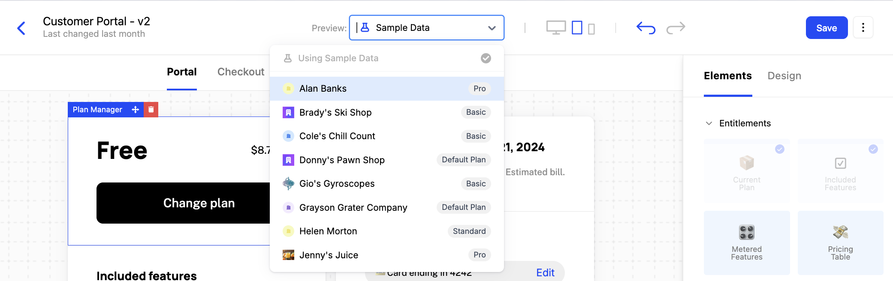

Schematic’s embeddable UI components are designed to deliver a consumer-grade purchasing experience to all of your end users. That includes the ability to manage subscriptions, view feature-level usage, and customize plans in your app — all without requiring heavy lifting to build from scratch or maintain.

Components are drop-in components for React that can be easily configured and designed within Schematic, and quickly integrated natively into your application.

## Creating a Component

### **Configuring the Catalog**

1. Navigate to **Catalog > Configuration**
2. Choose a default plan that all companies will be assigned if there is no formal subscription (optional)
3. Choose “live plans” (those that your end users can choose to downgrade from or upgrade to)
4. Save changes

<Info>Plans must be associated with Stripe Products to be added to Live Plans. If you don’t use Stripe, skip this section.</Info>

### **Creating a new UI component**

Once you’ve configured your Catalog, Components will be populated with your data rather than sample data (if you skip to this section, you can simply use the sample data).

1. Navigate to **Components** in the navigation bar
2. Click **New Component** and choose “Customer Portal” as an example
3. Click into the new Component you created and you should see a rendered customer portal in the Schematic Component Builder
4. Press **Save & Publish** and follow the [steps to drop into your application](/components/set-up)

Components are fully customizable both in the elements they are made up of (e.g. Current Plan, Included Features, Invoices, etc.) and in how they look and feel (so it appears native to your product).

Additionally, you may preview as any company in your account using the dropdown at the top of the builder.

## Component Builder

Components are inherently flexible, made up of [elements](/components/element-library) that can be mixed and matched based on the experience you’d like to give your end user.

Within Schematic, you have access to a Component Builder which allows for full customization both in the elements that are a part of any given Component (e.g. Current Plan, Included Features, Invoices, etc.) and in how the Component looks and feels (so it appears native to your product).

Once you design a Component to your liking, you can drop it directly into your application.