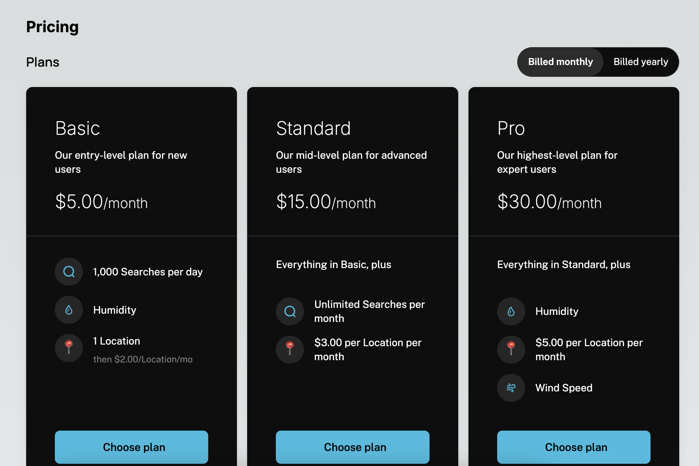

In addition to the Customer Portal and Checkout Flow, Schematic provides a standalone components that can be used through your application and other web applications.

The first standalone component we offer is a [Pricing Table](/components/pricing-table).

## Built for public facing pages

Standalone components are designed for use on your marketing site or other public-facing pages and thus load much more quickly than the Customer Portal. They load your configured plans, not customer specific data, so they operate in a much lower security context. Because of this, they only require a Schematic public key (the same one used by the React or Javascript SDK), instead of a temporary access token.

Additionally, standalone components are not configured through the Schematic component builder, but via code where they are used. This requires much less data from Schematic and supports a much more performant experience.

## Example

An example of a standalone component in use is the Pricing Table component from the [Schematic Weather Demo App](https://schematic-next-example.vercel.app/)



A sample of the Pricing Table component in use is below:

```tsx
import { EmbedProvider, PricingTable } from "@schematichq/schematic-components";

export default function Pricing() {
  const apiKey = process.env.NEXT_PUBLIC_SCHEMATIC_PUBLISHABLE_KEY;

  return (
    <EmbedProvider
      apiKey={apiKey}
      settings={{
        theme: {
          numberOfColumns: 2,
          sectionLayout: "merged",
          colorMode: "light",
          ...
        },
      }}
    >
      <h1 className="text-2xl font-bold mb-4">Pricing</h1>
      <PricingTable />
    </EmbedProvider>
  );
}
```

Details of the styling options available for the Pricing Table are available on the [Pricing Table](/components/pricing-table) page.

{/* Advanced styling notes

we've mentioned some more aggressive styling options, let's document them here*/}
