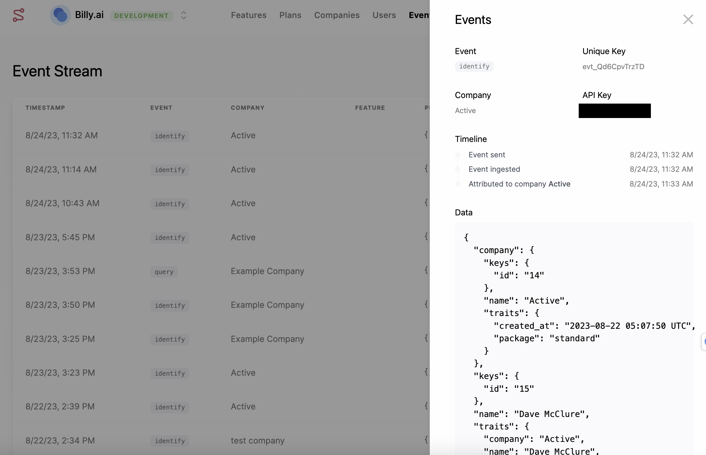
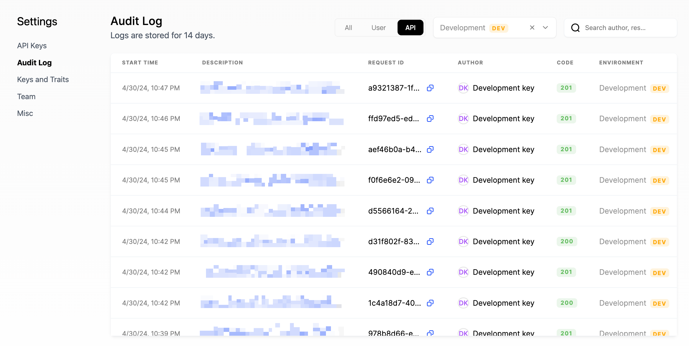

### User and company profiles

Schematic centralizes all traits and events submitted via the API or client libraries, as well as data synced from third party tools such as Stripe. You can use this data to construct rules for feature targeting within Schematic or as variables for metered features.

Because Schematic creates and updates user and company profiles by storing context and usage data from your application and business tools, it is not necessary to pass additional context at runtime when evaluating a flag.

### Keys vs. traits

Schematic uses `keys` as a unique identifier for companies and users. You can store any number of `keys`, however `keys` must be unique between each user and each company, respectively. For example, you may have a Stripe Customer ID, a Salesforce Account ID, and an application ID that correspond to an individual company. Each can be stored as separate `keys` that can be referenced by any tool interacting with Schematic.

To read more about the ideal way to manage `keys` with Schematic, click [here](/developer_resources/key_management)

**Traits** are pieces of information you may know about a user, a company, or an event. This could be metadata such as start date, renewal date, industry, employees, or role. This could also be data relevant to usage-based limits, like number of seats in use.

SDKs can reference companies or users by their Schematic ID using the `id` key or by any `key` you have defined and passed to Schematic previously.

### Flags vs. Features vs. Entitlements

**Flags** are the gate you implement in your codebase—they control whether a resource is accessible to the end user. Flags are evaluated against a set of prioritized rules and are always boolean (on/off).

**Features** are the abstraction on top of flags that the business may market or sell. At this time, flags and features are one-to-one in Schematic and share a common `key`. Features are what you create in the UI and tie to plans; when you evaluate access, you typically check at the feature level.

**Entitlements** are the link between a plan (or add-on) and a feature—they define whether and how a company has access. Entitlements can be boolean, trait-based (based on usage you report to Schematic), or event-based (metered based on events you send to Schematic). When you call the [check flag endpoint](/api-reference/features/check-flag) (or use an SDK to check a feature), Schematic evaluates the company's entitlements plus any overrides or global rules to return a result.

Together: you define **features** (and their **entitlements** on plans), implement **flags** in code that map to those features, and at runtime the check resolves entitlements to allow or deny access.

### How entitlement checks are evaluated

When you evaluate a feature for a company, Schematic combines plan entitlements with company overrides and takes the most generous of those values. If that doesn’t resolve to a result, it falls back to global rules (e.g. trait or segment-based). If nothing matches, the check returns false and the feature is treated as disabled.

### Plans vs. Add Ons

Plans and add ons are separate concepts in Schematic.

Companies can only have 1 plan, but they can have any number of add ons with distinct entitlements.

There are a number of scenarios where you may want to support an add on, and the most common scenario is that you sell additional functionality that increases the value of your core plans (e.g. Zoom Workplace).

### Components

Schematic components are out of the box UI elements that can be embedded directly in your application to provide complete plan management UI to end users. Components are React-based, and you can read more about them [here](/components/overview)

### Verifying events

You can use the [Events](https://app.schematichq.com/events) tab to verify identify and track requests are getting to Schematic and that they are being properly associated with users, companies, and features. This is also possible in the company and user profile views.

### Verifying API requests

You can view the Audit Log within Settings to see both successful and unsuccessful requests. Within each request, you can view detail describing the response code, request ID, start/end times, the API key used, the method, the URL path, and the request & response payloads.

