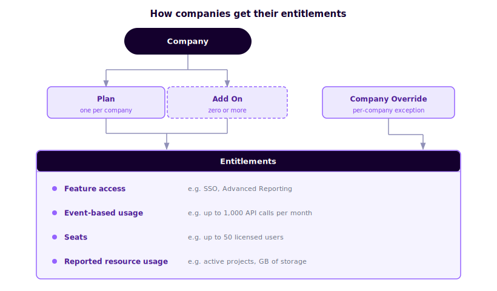
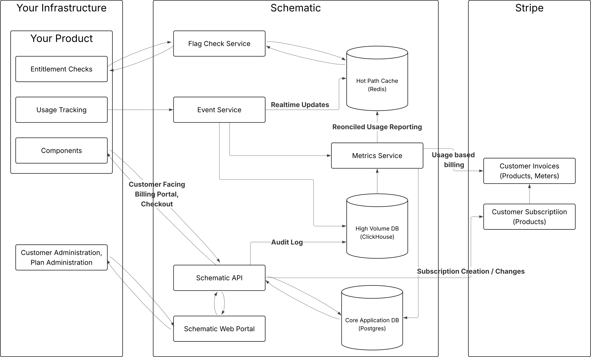

This page covers Schematic's core concepts and how you interact with them via the API and SDKs.

### User and company profiles

Schematic centralizes all traits and events submitted via the API or client libraries, as well as data synced from third-party tools such as Stripe. You can use this data to construct rules for feature targeting within Schematic or as variables for metered features.

Because Schematic creates and updates profiles by storing context and usage data from your application and business tools, it is not necessary to pass additional context at runtime when evaluating a flag.

### Keys vs. traits

Schematic uses `keys` as a unique identifier for companies and users. You can store any number of `keys`; however, keys must be unique between each user and each company respectively. For example, you may have a Stripe Customer ID, a Salesforce Account ID, and an internal application ID that all correspond to a single company—each can be stored as a separate key and referenced by any system interacting with Schematic.

SDKs can reference companies or users by their Schematic ID using the `id` key, or by any `key` you have previously passed to Schematic.

To read more about managing `keys`, see [Key Management](/developer_resources/key_management).

**Traits** are pieces of metadata you know about a user, company, or event—such as start date, renewal date, industry, employee count, role, or number of seats in use. Traits are used for flag targeting rules and as variables in trait-based (limited) entitlements.

### Flags vs. Features vs. Entitlements

**Flags** are the gate you implement in your codebase—they control whether a resource is accessible to the end user. Flags are evaluated against a set of prioritized rules and are always boolean (on/off).

**Features** are the abstraction on top of flags that the business may market or sell. At this time, flags and features are one-to-one in Schematic and share a common `key`. Features are what you create in the UI and tie to plans; when you evaluate access, you typically check at the feature level.

**Entitlements** are the link between a plan (or add-on) and a feature—they define whether and how a company has access. When you call the [check flag endpoint](/api-reference/features/check-flag) (or use an SDK to check a feature), Schematic evaluates the company's entitlements plus any overrides or global rules to return a result.

Together: you define **features** (and their **entitlements** on plans), implement **flags** in code that map to those features, and at runtime the check resolves entitlements to allow or deny access.

### Entitlements in depth

An entitlement defines what a plan or add-on grants for a specific feature. Schematic supports 3 types of entitlements that cover the vast variety of use cases for B2B and B2C Saas and AI applications. Those are:

- **Boolean** - boolean entitlements control access to a feature, such as whether a company has access to SSO, advanced reporting, or a specific AI model. 
- **Event-based** - Usage-based billing is most often implemented through events, in which each time a user takes an action, the usage is reported to Schematic and Schematic handles aggregating the usage to determine if limits have been hit. Events can represent different quantities of usage and be used to track credit burndown models (both common for AI Applications). Common examples include granting 1,000 API calls a month and burning credits against a pre-paid credit balance.
- **Trait-based** - Trait based entitlements are made to track usage of resources outside of Schematic on which you wish to enforce limits. The most common example is user seats, where users can be added or removed from your product, and you notify Schematic each time. For trait-based entitlements, usage can increase or decrease over time based on user actions. Another example is a project management software that allows a limited number of active projects at one time (e.g. 2 on the Free tier). 

### How entitlement checks are evaluated

When you evaluate a feature for a company, Schematic combines plan entitlements with company overrides and takes the most generous of those values. If that doesn’t resolve to a result, it falls back to global rules (e.g. trait or segment-based). If nothing matches, the check returns false and the feature is treated as disabled.

### Plans vs. add ons

Plans and add ons are separate concepts in Schematic.

Companies can only have **one plan** at a time, but they can have **any number of add ons** with distinct entitlements. Add ons are most commonly used to sell additional functionality on top of a base plan (e.g., a premium analytics module on top of a Pro plan).

Plans and add ons can both be tied to a Stripe billing product, enabling Schematic to automatically assign the correct plan when a subscription changes.

### Subscription

A subscription represents a company's current plan (and add ons), typically synced from Stripe. When a Stripe subscription changes, Schematic automatically updates the company's plan assignment.

### Usage

Usage is event-based or trait-based consumption tracked against a feature. It powers metered entitlements and usage-based billing, and is the basis for enforcement (e.g., blocking access after a limit is reached).

Usage events are sent via `track` calls and attributed to companies, users, and features.

### Data flows

The diagram below shows how the key flows — subscribing to a plan, checking entitlements, and tracking usage — work end to end across your app, Schematic, and Stripe.

### Components

Schematic Components are prebuilt React UI elements you can embed directly in your application to give end users self-service plan management. They include pricing tables, upgrade/downgrade flows, customer portals, and usage meters.

Read more in the [Components overview](/components/overview).

### Verifying events

Use the [Events](https://app.schematichq.com/events) tab to verify that `identify` and `track` requests are reaching Schematic and being properly associated with users, companies, and features. This is also visible in the company and user profile views.

### Verifying API requests

The Audit Log (under **Settings → Audit Log**) shows both successful and failed API requests. Each entry includes the response code, request ID, start/end times, API key used, HTTP method, URL path, and full request/response payloads.

