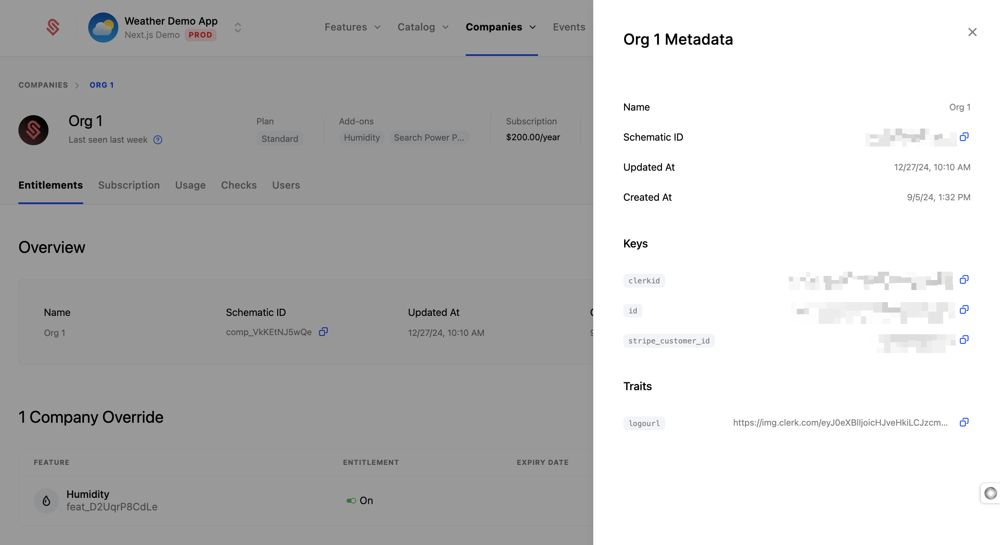
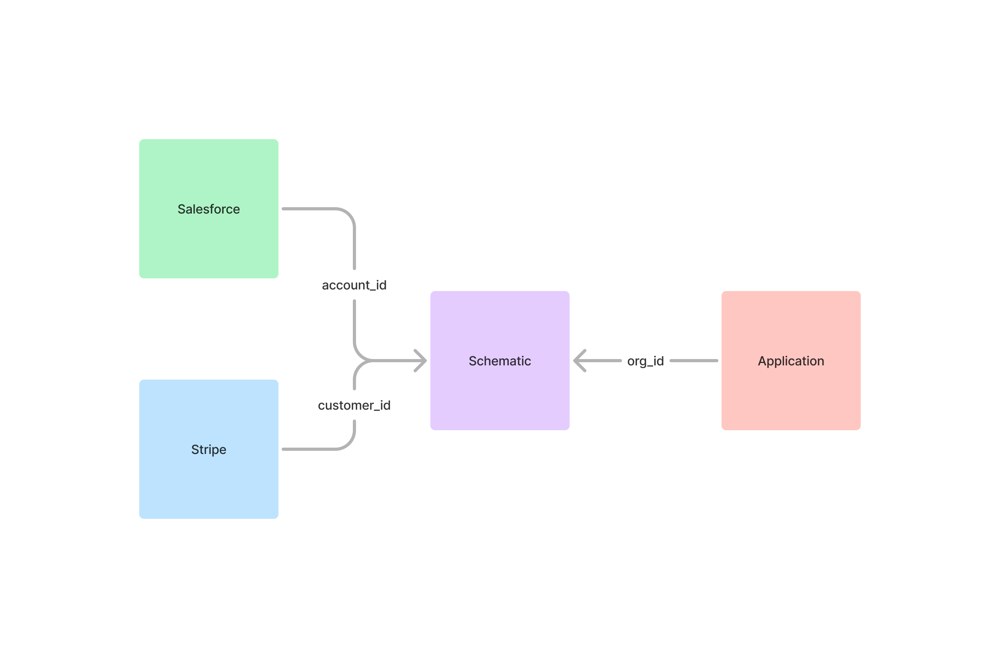

Managing IDs across systems can be challenging, especially when integrating tools like Schematic, Stripe, your application, and GTM tools. This guide outlines how we think about ID management (which we call `keys` in Schematic) and how we recommend our customers approach it to ensure a smooth implementation of Schematic.

Where we refer to "entities" below, we are referring to companies and users, which are each an entity type within Schematic.

## How does Schematic handle `keys`?



Whenever you create a new entity in Schematic, you submit `keys` that are used to uniquely identify the entity via the Schematic app or API. For example, you may have a Stripe Customer ID, a Salesforce Account ID, and an application ID that correspond to an individual company -- each can be stored as separate `keys` that independently and uniquely identify the company.

```python
client.companies.lookup_company(
    keys={"keys": {"key": "value"}},
)
```

This design effectively allows you to use Schematic to resolve `keys` between your systems. The benefit is that there is no need to persist an ID from your application to Stripe or vice-versa -- Schematic can maintain that mapping for you, and you can use whichever `key` is convenient in any given context to submit requests to Schematic.



With all that said, this type of flexibility means that properly setting up Schematic is crucial to avoid unecessary rework and bad data. Moreover, in many cases, persisting at least one `key` may simplify ongoing maintenance.

## Where are `keys` used?

`Keys` are used in a few important places:
- When checking a flag, you will use a `key` to establish context (e.g. which entity are you checking a flag for?)
- Updating or retrieving information about users or companies
- Sending identify or track events
- Retrieving feature usage data
- Searching for entities within the Schematic app

## Key management best practices

`Keys` can be added when creating or updating entities. Schematic will enforce a uniqueness constraint to prevent companies or users from having the same `key` (e.g. the same Stripe Customer ID).

Whenever you introduce a new `key` to an existing entity (company or user) using the API, you will need to ensure an existing `key` is present in addition to the new `key` to avoid entity duplication.

### Use Stripe's `customer_id` as a common key (recommended)

When setting up Schematic, you can import your customers directly from Stripe. This makes set up quick and easy, and Schematic will store Stripe's `customer_id` as a key, `stripe_customer_id`, on each company. We recommend persisting this `key` in your application and using it alongside an UUID from your application when making requests to Schematic.

By using both, you'll ensure Schematic (and anyone using Schematic) knows that your UUID and the Stripe `customer_id` refer to the same company.

### More advanced use cases

If you do not plan to use Stripe with Schematic or would like to use another `key` as a common key (e.g. from your authentication provider, or your appliation), you can simply create companies with that `key`.

When making requests to Schematic, ensure the `key` is available or that you've provided Schematic with a mapping to other `keys` you may use in requests.

One common scenario is using a UUID from your application because often other systems map to those UUIDs in service of additional automation.

## Other tips

### Choose a primary `key` to persist

Primary `key` in this context refers to an entity's first `key`. Your primary `key` should be accessible across systems or a `key` you can map across systems without too much trouble to avoid entity duplication. For some, this is the `stripe_customer_id`; for others, this might be the UUID used for organizations in your application.

By committing to a primary `key` from the outset, you'll avoid the mental gymnastics of having to reconcile multiple IDs across different contexts and simplify your archiecture.

<Info>While Schematic generates IDs for users, customers, and other objects, these are meant for internal system operations or specific requests. Only use these IDs when necessary (e.g. some Schematic endpoints require them).</Info>

### Lean into using Schematic as a `key` map

Whenever creating or updating an entity in Schematic, be liberal about submitting `keys`. This will give you flexibility in the future to use the most convenient `key` when submitting requests to Schematic, and avoid duplicate entities from being created from integrations.

### Identify entities often to update context

Schematic offers an asynchronous endpoint to [identify](/api-reference/events/create-event) users and companies. 

You should submit an identify call in the following situations:
- When you first create a user or company in your application
- When a user or company logs in
- When a user or company changes information

In each situation, be sure to submit any additional `keys`.