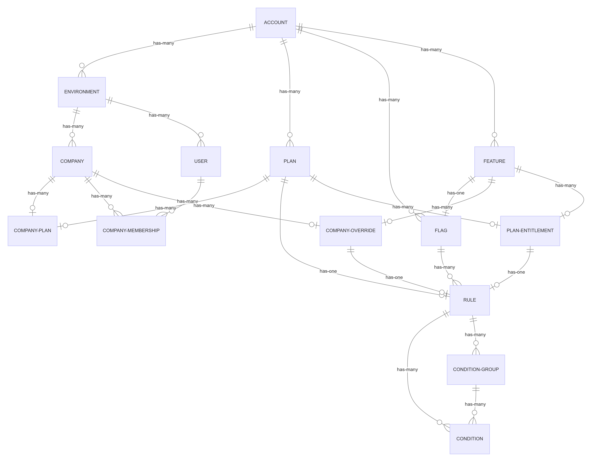

This is a non-comprehensive diagram of the relationships between the most important resources within Schematic. This diagram refers to these resources as abstract concepts, rather than as they exist specifically.

Resources in Schematic are predominately environment-scoped within an account, but some are available account-wide (regardless of the selected environment). More detail [here](/developer_resources/environments).

