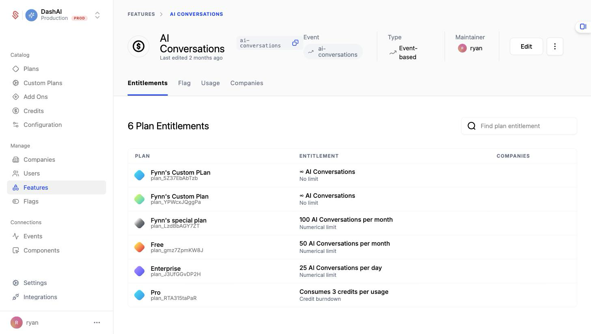
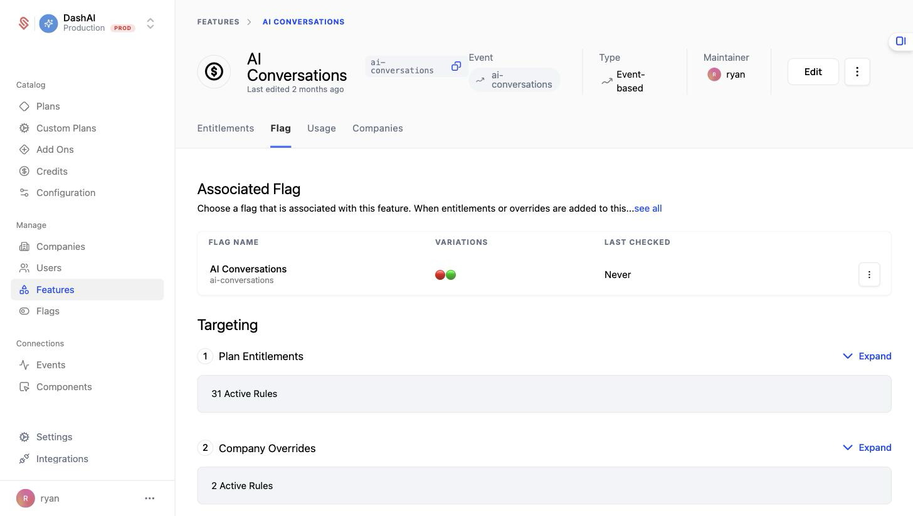
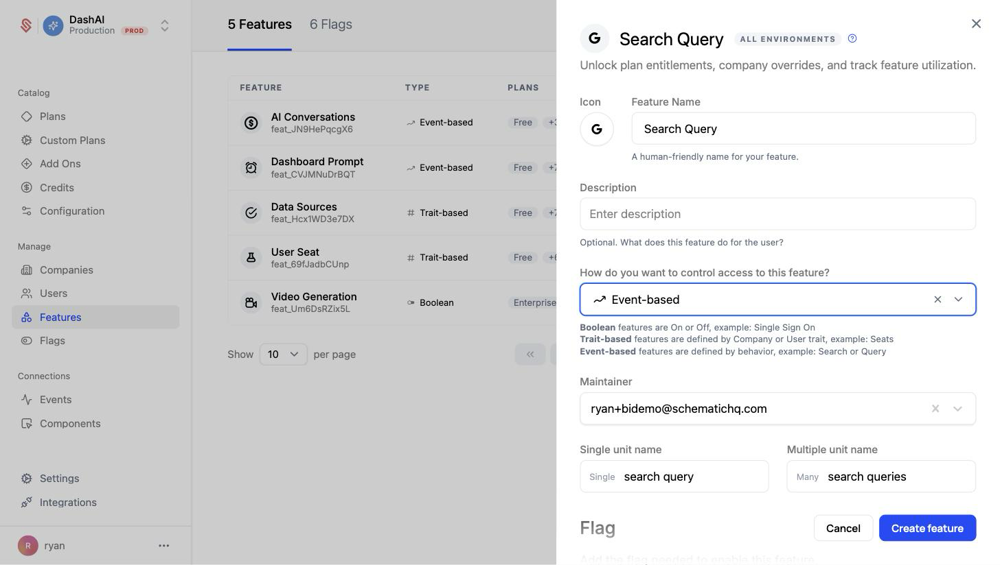
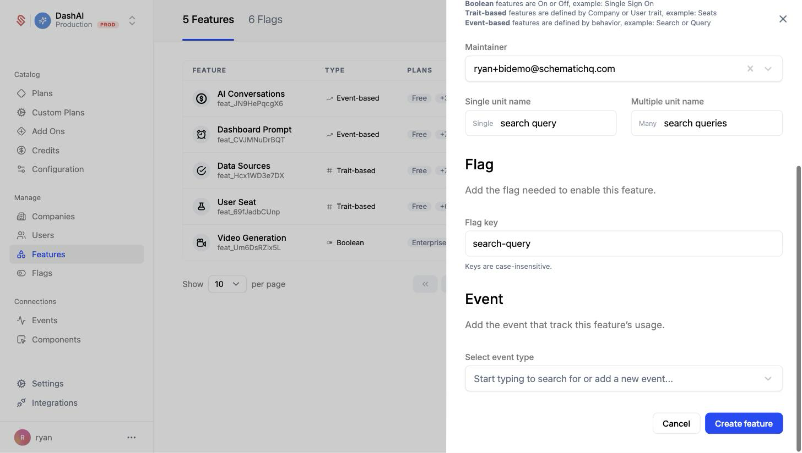
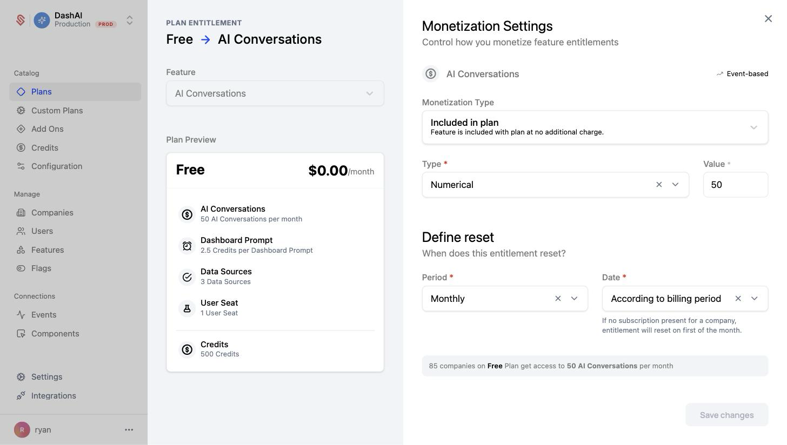

As noted in the overview, features are an abstraction on top of flags in Schematic used primarily to allow Schematic users to explicitly assign features to companies and set up entitlement-level policy. They can be on/off or metered (trait-based or event-based).

<Info>You can read more about setting up a metered feature [here](/playbooks/metering)</Info>

Ultimately, features should represent functionality that the business may market or sell.

All policy created at the feature level is reflected in the corresponding flag. You can see the associated flag and derived rules using the Flag tab within a Feature.

Currently, features and flags are one-to-one, but in the future more than one flag may be represented by one feature.

### Setting up Features

Let's add one feature to Schematic and entitle it to a plan.

1. Navigate to **Features** and click “Create”.
2. In the panel that opens, add a name and an optional description, then choose how you want to control access to the feature. For a metered feature like this one, pick **Event-based**.

<Info>You can choose between Boolean, Event-based, or Trait-based feature types. The feature type can't be changed after the feature is created.</Info>

3. Under **Flag**, set the flag key you'll use in your application to reference this feature. Then, under **Event**, select or create the event that meters the feature's usage (for example, a `query` event). Click **Create feature** to finish.

4. Open the new feature and click a plan (or **Add plan entitlement**) to set the limit for that plan, along with the period the entitlement resets on.

<Info>Event-based features can have no limit, some numerical limit that is static within a period, or a limit that is dynamic based on traits that exist at the company level. Read more [here](https://docs.schematichq.com/playbooks/metering#entitlement-options).</Info>

<Info>You'll need to make sure to send usage events to Schematic to track feature utilization as it occurs. Read more [here](https://docs.schematichq.com/playbooks/metering#setting-up-an-event-based-metered-feature).</Info>