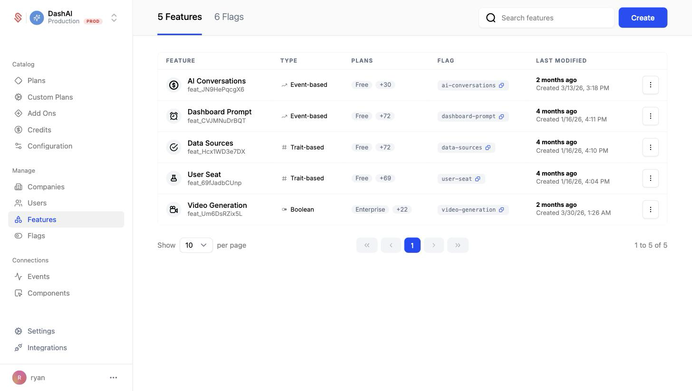
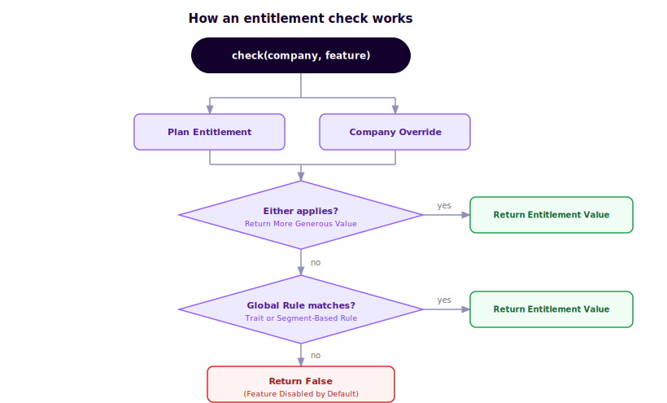

Feature Management in Schematic enables you to control how product features are rolled out, accessed by end customers, and monetized. Unlike traditional feature management tools, Schematic is purpose-built with billing in mind, so feature access can be tied directly to a company’s plan and any other policy set up in Schematic (e.g. add ons, overrides, or individual targeting).

An **entitlement** is the right to use a feature—defined by the relationship between a plan (or add on) and that feature. When you check whether a company has access to a feature, you’re evaluating their entitlements (and any overrides or targeting rules). Entitlements can be boolean (on/off), limited by traits, or metered by usage.

## How entitlement checks work

When your app calls `check(company, feature)` (via the API or an SDK), Schematic combines the company’s plan entitlement with any company-specific overrides and takes the most generous of those values. If that doesn’t resolve to a result, it falls back to global rules (e.g. trait or segment-based). If nothing matches, the feature is disabled by default. The diagram below shows this flow.

## Use cases
- **Rollout new features**: Rollout gradually to a small cohort to mitigate risk or to gather feedback.
- **Line up access with subscriptions**: Ensure customers only see features tied to their subscription plans or usage limits.
- **Manage exceptions**: Selectively enable or disable features for individual customers.
- **Drive upgrades and renewals**: Enable feature trials or time-limited overrides.
- **Simplify billing implementation**: Eliminate the need for custom code by linking feature flags directly to billing.

## How can teams use Schematic feature management
- **Engineers**: Replace homegrown feature flag or metering logic and get an out of the box admin panel to manage them.
- **Product Managers**: Get fine-grained control over how much and which features are available to different customer segments.
- **GTM Teams**: Grant plan and feature trials to close deals and drive upsell.