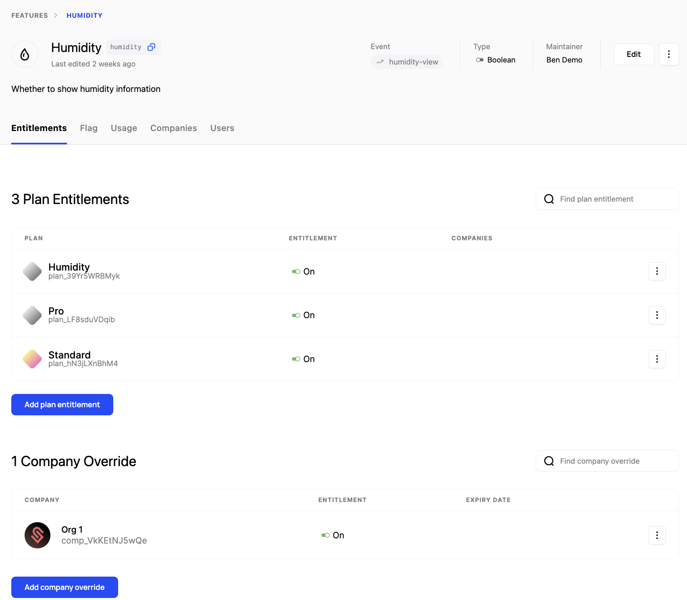
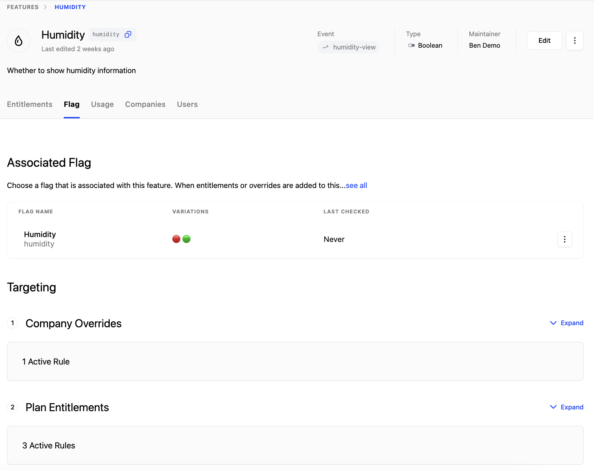

## Flags

Flags allow you to toggle functionality on or off based on conditions such as company, plan, traits, usage, or groups. They can be evaluated against a set of prioritized rules defined within each flag.

A significant difference between Schematic and other tools that offer flags is that context does not need to be provided at runtime. Schematic can store company and user context, such as plan, traits, allocation, usage, and more, and those values will be used to evaluate flag rules.

For example, if a company is a part of a beta cohort, you can asynchronously update their profile in Schematic and that context will be used when the flag is evaluated. The full example is [here](/playbooks/rollout), and demonstrates how to check flags in your codebase.

## Features

As noted in the overview, features are an abstraction on top of flags in Schematic used primarily to allow Schematic users to explicitly assign features to companies and set up entitlement-level policy. They can be on/off or metered (trait-based or event-based).

<Info>You can read more about setting up a metered feature [here](/playbooks/metering)</Info>

Ultimately, features should represent functionality that the business may market or sell.

All policy created at the feature level is reflected in the corresponding flag. You can see the associated flag and derived rules using the Flag tab within a Feature.

Currently, features and flags are one-to-one, but in the future more than one flag may be represented by one feature.

### Setting up Features

Let’s add one feature to Schematic and entitle it to a plan.

1. Navigate to **Features** and click “Create”.
2. In the modal, add a name, description, and pick the event-based feature type. Click “Continue”.

<Info>You can choose between Boolean, Event-based, or Trait-based feature types.</Info>

3. Define a flag key. 
    1. You’ll use this `key` in your application to reference this feature.

4. Attach an event to the feature. Add the `query` event to meter the feature and measure feature usage (if it doesn’t exist already, create it).

5. Once the feature is created, click ”Add plan entitlement” to add an entitlement and specify the limit for Search Query for a given plan.

<Info>Event-based features can have no limit, some numerical limit that is static within a period, or a limit that is dynamic based on traits that exist at the company level. Read more [here](https://docs.schematichq.com/playbooks/metering#entitlement-options).</Info>

<Info>You’ll need to make sure to send usage events to Schematic to track feature utilization as it occurs. Read more [here](https://docs.schematichq.com/playbooks/metering#setting-up-an-event-based-metered-feature).</Info>