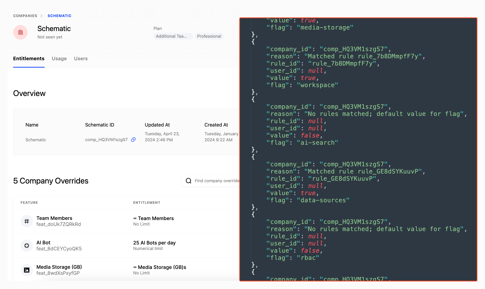

Flags allow you to toggle functionality on or off based on conditions such as company, plan, traits, usage, or groups. They can be evaluated against a set of prioritized rules defined within each flag.

A significant difference between Schematic and other tools that offer flags is that context does not need to be provided at runtime. Schematic can store company and user context, such as plan, traits, allocation, usage, and more, and those values will be used to evaluate flag rules.

For example, if a company is a part of a beta cohort, you can asynchronously update their profile in Schematic and that context will be used when the flag is evaluated. The full example is [here](/playbooks/rollout), and demonstrates how to check flags in your codebase.

