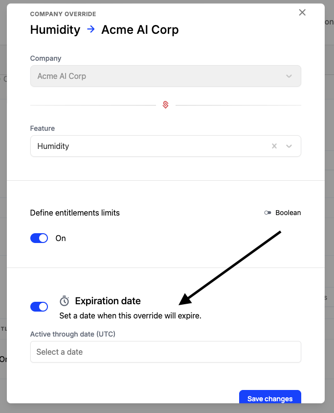

## What are overrides?

In many scenarios customers might need features that don't come standard in a pre-baked package, such as:
- A sales-led deal that doesn't fit perfectly into the good-better-best packages that are on your pricing page
- Feature trials
- Testing 

In Schematic, we call these "Company Overrides", and they can be applied individually to any company, or programatically via our API. We'll cover both scenarios below.

## Applying an override in the Schematic UI

1. Navigate to a company profile.
2. Click add override and choose a feature.

<iframe
  width="560"
  height="400"
  src="https://schematichq-1.wistia.com/embed/iframe/uaavkg9bwn"
  title="Company Override"
  frameBorder="0"
  allow="accelerometer; autoplay; clipboard-write; encrypted-media; gyroscope; picture-in-picture"
  allowFullScreen
></iframe>

### Time-limited overrides

While creating an override in the UI, you can also set an expiration date. This is useful for allowing a customer to try a feature for a limited time, often as part of a presale or upgrade motion. Additionally, this can help ease the burden of a pricing migration in which a customer may be losing a access to a feature they priorily had access to.



<Note>If you grant a additional access to a numeric feature (e.g. seats), when the override expires, the customer will retain their additional usage, but will not be able to add more until they drop below their default plan limit.</Note>

## Applying an override programatically

In situations where you may allow the user to enable an individual feature themselves in your application (e.g. trying a specific within their account) or otherwise manage exceptions outside of Schematic (e.g. in Hubspot or your own admin layer), you can use our API to apply the override by using the `/company-overrides` endpoint.

Here's an example:

```python
from schematic import Schematic

# initialize the client
client = Schematic(
    api_key = "your-api-key"
)

# create company override in Schematic
response = client.entitlements.create_company_override(
    company_id= "comp_3bTKVfV6GD1",
    feature_id= "feat_FbseajjPuA6",
    value_type= "numeric",
    value_numeric= 10
)
```

Once the override is applied via the API, it will also appear in the UI and can be managed within Schematic like other overrides.

## Most Generous Policy

In the case that an override provides _less_ quota than a plan entitlement, users will receive the more generous amount. 

For example, if a company has a plan entitlement of 1000 API calls, and an override of 500 API calls, the company will receive 1000 API calls.