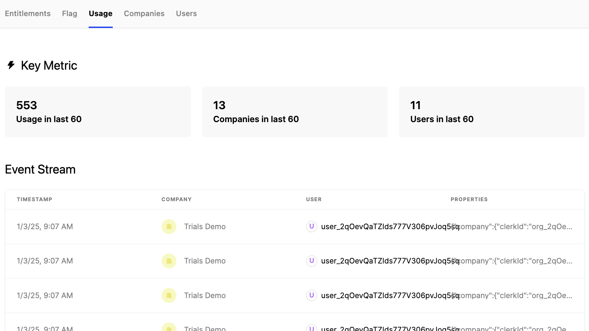
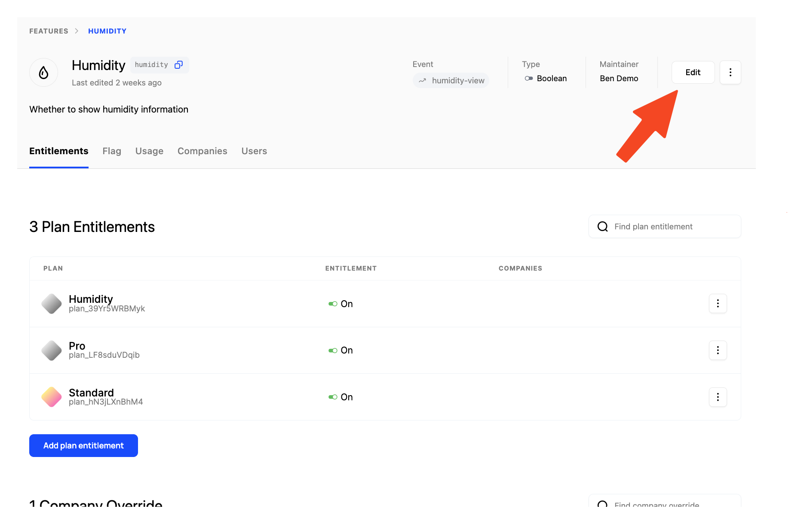
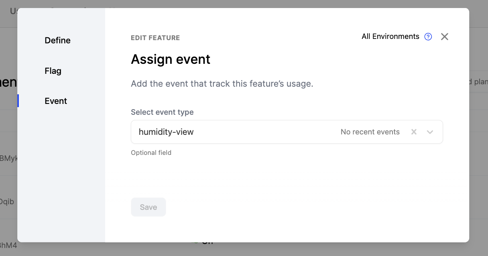

One unique aspect of Schematic is the ability to monitor feature usage to inform decision making. 

You can add a usage event corresponding to when a feature is used in your product. When you send track events to Schematic using the [/events endpoint](/api-reference/events/create-event), we will handle attribution to the respective company and feature, and reflect usage in the feature's Usage tab.

You can add a usage event to any feature regardless of feature type by following the instructions below.

1. Navigate to a feature you've created in Schematic
2. Click "Edit" in the top right of the screen

3. Click on "Event" and select or create an event.

When you send track events to Schematic using that event name, they will now be associated with the feature.