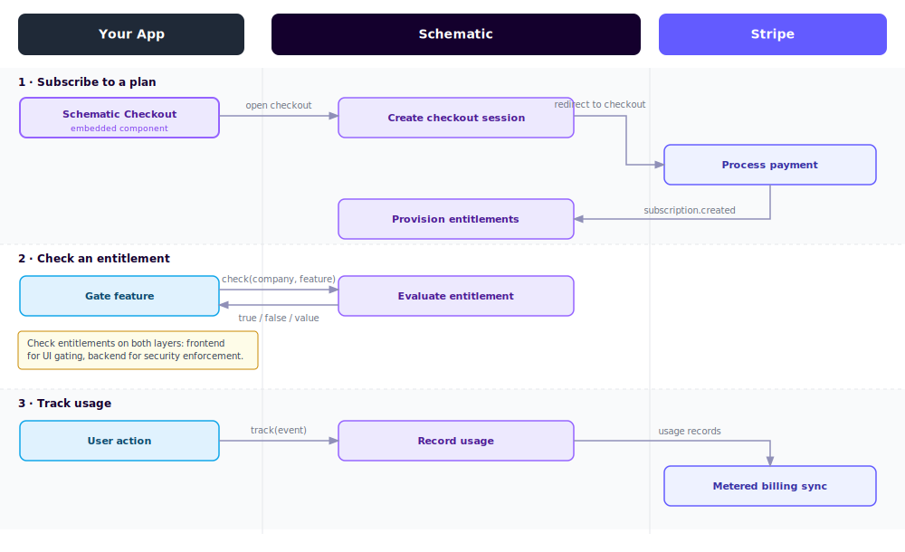

This page explains the core concepts in Schematic.

## Features

A **feature** is a capability your product offers that you want to gate, meter, or track—for example, "SSO," "Advanced Reporting," or "API calls."

Features are the central building block in Schematic. Every plan entitlement, usage limit, and access rule is attached to a feature.

Features come in three types:

| Type | What it does |
|---|---|
| **Boolean** | Simple on/off access (e.g., "SSO is enabled or not") |
| **Event-based** | Metered by usage (e.g., "up to 1,000 API calls per month") |
| **Trait-based** | Limited by a stored attribute (e.g., "up to the number of licensed seats") |

## Flags

A **flag** is the on/off control mechanism behind a feature. It determines who gets access, when, and under what conditions—based on targeting rules you define.

Every feature in Schematic has a corresponding flag. When your application checks whether a user or company can access a feature, the flag evaluates their plan, traits, and any overrides, then returns a yes or no.

Flags support plan-based rules (automatically on for companies on a given plan), manual targeting (on for specific customers), and trait-based conditions (on when a stored attribute meets a certain value).

## Entitlements

An **entitlement** is what a plan (or add on) grants for a specific feature. It's the link between "what a customer is paying for" and "what they can do."

Entitlements can grant simple on/off access, limit a feature to a stored value (like seat count), or meter it against tracked usage (like API calls per month). When a company is on multiple plans or add ons, the most permissive entitlement across all of them applies.

## Plans

A **plan** is the bundle of features and limits you assign to a company. Plans typically correspond to the tiers you sell—Free, Starter, Pro, Enterprise, and so on.

Each company has exactly one plan at a time. Plans are often linked to a billing product in Stripe so that plan assignment updates automatically when a subscription changes.

### Plan Versions

In Schematic, plans are versioned automatically, and updating an existing plan with subscribers will create a new version instead. Only the newest version of a plan is available to be subscribed to customers. This allows plans to be iterated on without effecting existing subscribers. This can be used for pricing changes and experiments. 

When a new plan version is created, you can migrate all, some, or none of the current subscribers to the new version.

## Add Ons

An **add on** is a bundle of additional features and limits that sits on top of a company's base plan. Unlike plans, a company can have any number of add ons.

Add ons are used to sell incremental capabilities—for example, a "Premium Analytics" add on that unlocks additional features regardless of which base plan a company is on.

## Companies

A **company** is the organization you're tracking and billing in Schematic—typically a customer account. Companies are the primary entity that plans, entitlements, and usage are attached to.

Each company has a plan and optional add ons, entitlements derived from those plans, usage tracked over time, and a history of plan changes.

## Users

A **user** is a person associated with a company in Schematic. Users inherit entitlements from their company's plan, but can also have usage tracked independently—for example, per-seat consumption.

## Events

**Events** are the signals your application sends to Schematic to create profiles and track usage. There are two types:

- **Identify** – creates or updates a company or user profile with their name, traits, and keys
- **Track** – records a usage event for a company, user, and feature

Events are the primary way data flows into Schematic from your application.

## Keys

**Keys** are the identifiers your systems use to refer to a company or user in Schematic. For example, you might store a Stripe Customer ID, a Salesforce Account ID, and your own internal ID as separate keys on the same company.

Keys make it possible for multiple systems—your app, your CRM, your billing tool—to look up the same company without creating duplicates.

## Traits

**Traits** are attributes you store on companies or users—things like seat count, industry, or renewal date.

Traits serve two purposes: they can be used as conditions in flag targeting rules (e.g., "on for companies in the healthcare industry"), and they can define the limit for trait-based entitlements (e.g., "up to however many seats a company has licensed").

## Components

**Components** are prebuilt UI elements you can embed in your application to give customers self-service control over their plan—pricing tables, upgrade/downgrade flows, customer portals, and usage meters.

Components stay in sync with Schematic automatically, reflecting each company's current entitlements and subscription in real time.

## Simple data flows

