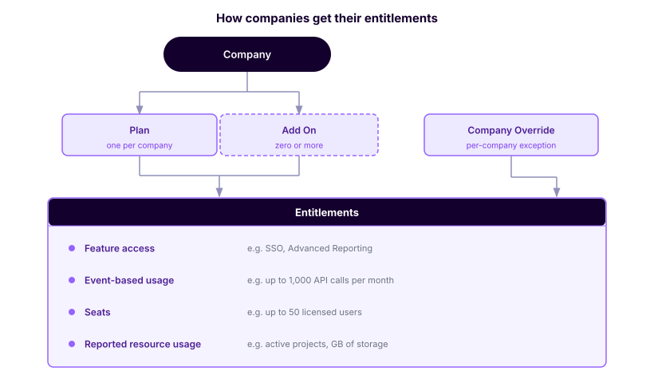
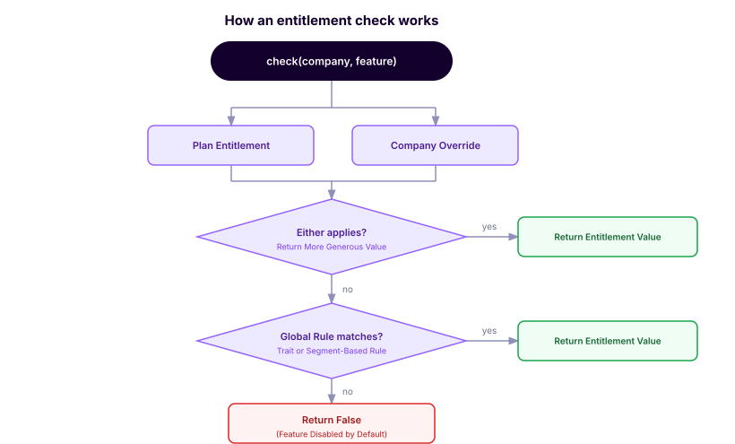
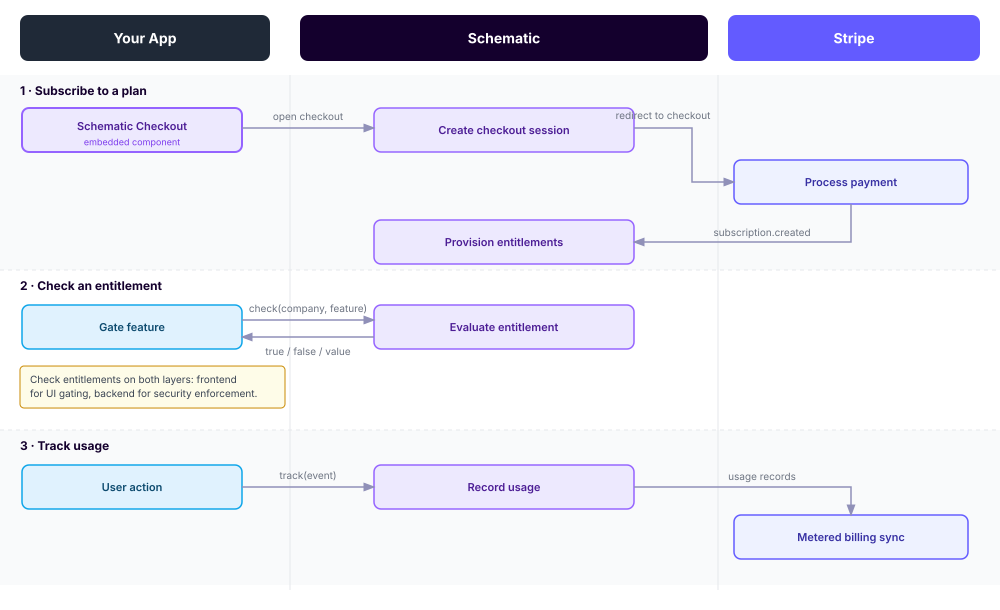
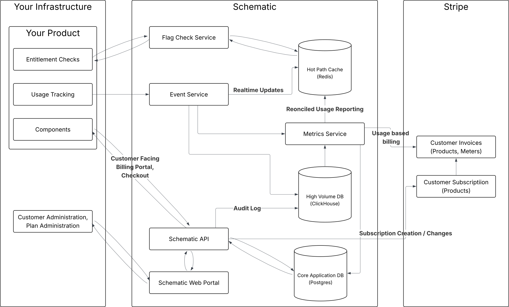
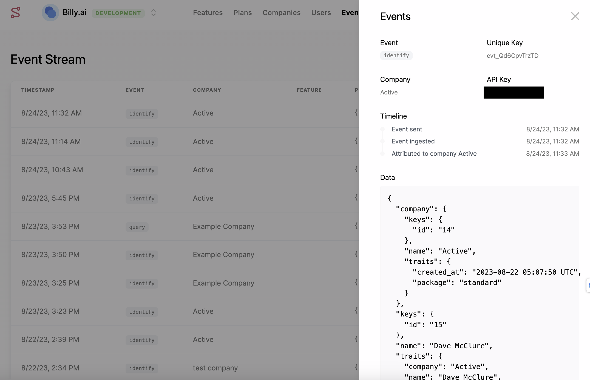
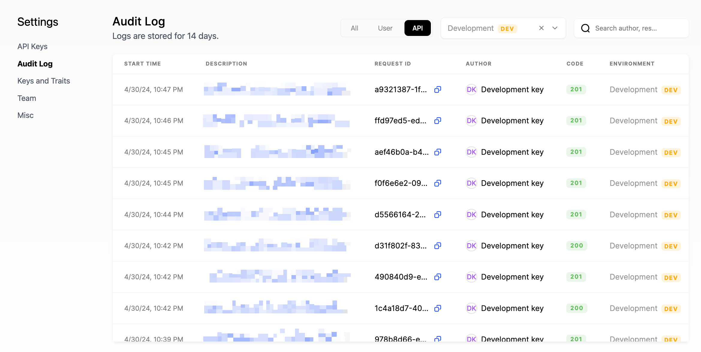

Schematic is a usage-based billing platform for AI and software companies. It runs subscriptions, metered and credit billing, and the real-time entitlement checks that enforce what each customer has paid for.

This page defines the core concepts and shows how they fit together. The first half is a glossary. The second half covers how Schematic resolves an entitlement check, how data flows between your application, Schematic, and your billing system, and how to verify that your integration is working.

## Features

A **feature** is a capability your product offers that you want to gate, meter, or track, for example "SSO," "Advanced Reporting," or "API calls."

Features are the central building block in Schematic. Every plan entitlement, usage limit, and access rule is attached to a feature.

Every feature has a type, and the type determines how it is entitled and enforced:

| Type | What it does | Typical examples |
|---|---|---|
| **Boolean** | Grants or denies access outright | SSO, advanced reporting, access to a specific AI model |
| **Event-based** | Meters usage your application reports with `track` calls | 1,000 API calls per month, credits burned down against a prepaid balance |
| **Trait-based** | Limits against an attribute you keep current on the company | Licensed seats, active projects on the Free tier |

## Flags

A **flag** is the gate you implement in your codebase. It controls whether a resource is accessible to the end user, it is evaluated against a set of prioritized rules, and it is always boolean.

Every feature in Schematic has a corresponding flag, and the two share a common `key`. Features are what you create in the dashboard and attach to plans; flags are what your code checks. When your application checks whether a user or company can access a feature, the flag evaluates their plan, traits, and any overrides, then returns a yes or no.

Flags support plan-based rules (automatically on for companies on a given plan), manual targeting (on for specific customers), and trait-based conditions (on when a stored attribute meets a certain value).

## Entitlements

An **entitlement** is what a plan or add on grants for a specific feature. It is the link between what a customer is paying for and what they can do.

Entitlements follow the type of the feature they are attached to: simple on/off access, a limit drawn from a stored trait like seat count, or a meter against tracked usage such as API calls per month. When a company is on multiple plans or add ons, the most permissive entitlement across all of them applies.

## Plans

A **plan** is the bundle of features and limits you assign to a company. Plans typically correspond to the tiers you sell, such as Free, Starter, Pro, and Enterprise.

Each company has exactly one plan at a time. Plans are often linked to a billing product in Stripe so that plan assignment updates automatically when a subscription changes.

### Plan Versions

In Schematic, plans are versioned automatically, and updating an existing plan with subscribers will create a new version instead. Only the newest version of a plan is available to be subscribed to customers. This allows plans to be iterated on without affecting existing subscribers. This can be used for pricing changes and experiments.

A plan version moves through `draft`, `published`, and `archived` states, and a company is always on one specific version. When a new plan version is created, you can migrate all, some, or none of the current subscribers to the new version.

## Add Ons

An **add on** is an optional module a company can purchase alongside its plan. A company has exactly one plan but can have any number of add ons, which are most often used to sell functionality that increases the value of a core plan.

Add ons carry their own entitlements. An add on entitlement can introduce a feature the plan doesn't include, or override a limit the plan already sets. Like plans, add ons are versioned, but they're versioned independently of the base plan, so publishing a new add on version only affects companies that have that add on.

## Subscriptions

A **subscription** represents a company's current plan and add ons, along with the billing terms attached to them. Subscriptions are created through Schematic's checkout flow or synced in from your billing system, and Schematic keeps the company's plan assignment in step with the subscription as it changes.

Plans and add ons can each be tied to a Stripe billing product, which is what lets Schematic assign the correct plan and add ons when a subscription is created or changed.

## Companies

A **company** is the organization you're tracking and billing in Schematic, typically a customer account. Companies are the primary entity that plans, entitlements, and usage are attached to.

Each company has a plan and optional add ons, entitlements derived from those plans, usage tracked over time, and a history of plan changes.

## Users

A **user** is a person associated with a company in Schematic. Users inherit entitlements from their company's plan, but can also have usage tracked independently, for example per-seat consumption.

## Events

**Events** are the signals your application sends to Schematic to create profiles and track usage. There are two types:

- **Identify** – creates or updates a company or user profile with their name, traits, and keys
- **Track** – records a usage event for a company, user, and feature

Events are the primary way data flows into Schematic from your application.

## Keys

**Keys** are the identifiers your systems use to refer to a company or user in Schematic. For example, you might store a Stripe Customer ID, a Salesforce Account ID, and your own internal ID as separate keys on the same company.

Keys make it possible for multiple systems, your app, your CRM, and your billing tool, to look up the same company without creating duplicates. You can store any number of keys, but each key must be unique across companies and across users respectively. SDKs can reference a company or user by its Schematic ID using the `id` key, or by any key you have previously sent to Schematic.

To read more about managing keys, see [Key Management](/developer_resources/key_management).

## Traits

**Traits** are attributes you store on companies or users, things like seat count, industry, renewal date, employee count, or role.

Traits serve two purposes: they can be used as conditions in flag targeting rules (e.g., "on for companies in the healthcare industry"), and they can define the limit for trait-based entitlements (e.g., "up to however many seats a company has licensed").

## Usage

**Usage** is event-based or trait-based consumption tracked against a feature. It is what metered entitlements and usage-based billing are calculated from, and it is the basis for enforcement, such as blocking access once a limit is reached.

Usage events are attributed to a company, a user, and a feature, and are most often reported with `track` calls from your application.

## Credits

**Credits** are a prepaid balance a company spends as it uses your product. You define a credit type, grant a quantity of it to a company, and set how many credits each feature consumes, which lets you price several features against one metric instead of metering each separately.

A **credit grant** is what adds credits to a company's **credit balance**. Plans grant credits each billing period, customers buy more in **credit bundles** through checkout or auto top-up, and you can issue promotional or adjustment grants through the API. Grants carry their own expiration, and **burndown** draws from the grant closest to expiring, so a company spends its period credits before the bundles it purchased.

Every grant and every draw is written to the **credit ledger**, which is transactional and updates in real time. The balance an entitlement check reads is therefore the current one, not a figure reconciled after the period closes, and the same ledger backs refunds and the balance customers see in the customer portal. See [Credit Burndown Billing Model](/billing/credit-burndown) for setup.

## Components

**Components** are prebuilt React UI elements you can embed in your application to give customers self-service control over their plan, including pricing tables, upgrade and downgrade flows, customer portals, and usage meters.

Components stay in sync with Schematic automatically, reflecting each company's current entitlements and subscription in real time. Read more in the [Components overview](/components/overview).

## How Schematic evaluates access

### User and company profiles

Schematic centralizes all traits and events submitted via the API or client libraries, as well as data synced from third-party tools such as Stripe. You can use this data to construct rules for feature targeting within Schematic or as variables for metered features.

Because Schematic creates and updates profiles by storing context and usage data from your application and business tools, it is not necessary to pass additional context at runtime when evaluating a flag.

### How entitlement checks are evaluated

You define features and their entitlements on plans and add ons, you implement flags in code that map to those features, and at runtime the check resolves entitlements into an allow or a deny.

When you call the [check flag endpoint](/api-reference/features/check-flag), or use an SDK to check a feature, Schematic combines the company's plan entitlements with any company overrides and takes the most generous of those values. If that doesn't resolve to a result, it falls back to global rules such as trait or segment-based rules. If nothing matches, the check returns false and the feature is treated as disabled.

## Data flows

### Simple data flows

The three flows you will implement most often are subscribing to a plan, checking an entitlement, and tracking usage.

### End-to-end data flows

The sequence diagram below expands those flows across your frontend, your backend, Schematic, and Stripe, from company creation through checkout, enforcement, and metered billing.

## Verifying your integration

### Verifying events

Use the [Events](https://app.schematichq.com/events) tab to verify that `identify` and `track` requests are reaching Schematic and being properly associated with users, companies, and features. This is also visible in the company and user profile views.

### Verifying API requests

The Audit Log (under **Settings → Audit Log**) shows both successful and failed API requests. Each entry includes the response code, request ID, start/end times, API key used, HTTP method, URL path, and full request/response payloads.

