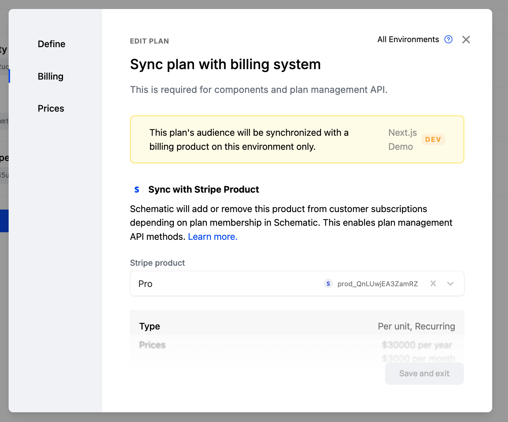

## What is Schematic?

Schematic combines feature management and subscription management into one platform, allowing product and engineering teams to quickly integrate pricing and packaging into their applications with a few lines of code. This enables teams to launch new pricing and packaging models with low overhead, to take the burden off of R&D teams, and to flexibly adjust pricing and packaging to individual customer preferences.

With Schematic, teams can ship features faster, delight customers, and get out of billing projects forever.

## What can I do with Schematic?

Our platform integrates bi-directionally with Stripe to facilitate billing while adding powerful capabilities on top of it such as embeddable UI components, internal admin dashboards, feature flags to power entitlements, and usage-based metering. This means you can manage your entire pricing and packaging surface area — from how you charge your customers to how they experience your product — without the need for brittle, homegrown solutions that tightly couple pricing and packaging logic into application code.

With Schematic, you can:

- **Embed Powerful UI Components**: Add drop-in purchasing components beyond basic checkout, such as upgrade/downgrade, customer portals, pricing tables, and usage meters. Power internal workflows for sales and account management.
- **Control Access with Feature Flags**: Manage which customers have access to which features without needing to touch your application code.
- **Usage-Based Metering**: Easily track customer usage and bill accordingly, supporting modern, flexible pricing models.
- **Manage Plans with Ease**: Update plans, bundle & unbundle features, offer add-ons, support custom configuration, and handle exceptions — all with minimal code changes.
- **Get a 360-Degree View of Your Customers**: Combine account, usage, and billing data into a single, easy-to-access profile, giving your team the insights they need.

## Major concepts

There are several major concepts built into Schematic that you can read about in more depth in other sections of our documentation.

### **Catalog**

The Catalog describes a company’s Plans and Add Ons and associated Entitlements. The definition of an Entitlement within a Plan or Add On includes default values for allocations or limits, and pricing.

If a Company is a part of a Plan, access can be gated in your application based on associated Entitlements with Flags.

### **Company Profiles**

The Company Profile is a centralized record of company information, aggregating all relevant company keys, traits, subscription details, and usage data into a single profile that can be leveraged across tools.

The profile is `key`-based and `key` uniqueness is enforced across profiles to prevent duplicates. Profiles can have multiple keys so any one `key` does not need to be persisted across systems.

Profiles and profile traits can be referenced in flag targeting and plan audiences.

### **Metering**

Metering is crucial for supporting usage-based models. Metered properties can be monetized or un-monetized (tracked for telemetry or enforcing a packaged limit).

A usage event can be attributed to companies, users, and features within Schematic, forming the basis for enforcement and insights into customer behavior.

### **Subscriptions**

Subscriptions from Stripe are automatically linked to Company Profiles.

Companies can then be assigned membership in Schematic Plans based on those Subscriptions, or by creating explicit audiences based on Company attributes.

A company may have membership in more than one Plan or Add On in the Catalog at any given time, which would result in the most permissive entitlements among them.

### **Feature Flags**

Flags dictate who gets access to what features or services based on their context, and how much of a particular feature they get. This ensures companies can access only the features they should have access to, which is important for trials, tiered services, and premium offerings.

Company access is informed by the parameters of a company’s subscription and other policies set up in Schematic.